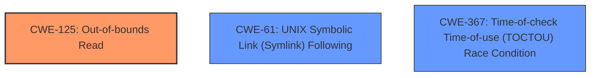

# Analysis Report for CVE-2024-50301

# Vulnerability Analysis Report: CVE-2024-50301

## Description

In the Linux kernel, the following vulnerability has been resolved security/keys fix **slab-out-of-bounds** in key_task_permission KASAN reports an out of bounds read BUG KASAN **slab-out-of-bounds** in __kuid_val include/linux/uidgid.h36 BUG KASAN **slab-out-of-bounds** in uid_eq include/linux/uidgid.h63 [inline] BUG KASAN **slab-out-of-bounds** in key_task_permission+0x394/0x410 security/keys/permission.c54 Read of size 4 at addr ffff88813c3ab618 by task stress-ng/4362 CPU 2 PID 4362 Comm stress-ng Not tainted 5.10.0-14930-gafbffd6c3ede #15 Call Trace __dump_stack lib/dump_stack.c82 [inline] dump_stack+0x107/0x167 lib/dump_stack.c123 print_address_description.constprop.0+0x19/0x170 mm/kasan/report.c400 __kasan_report.cold+0x6c/0x84 mm/kasan/report.c560 kasan_report+0x3a/0x50 mm/kasan/report.c585 __kuid_val include/linux/uidgid.h36 [inline] uid_eq include/linux/uidgid.h63 [inline] key_task_permission+0x394/0x410 security/keys/permission.c54 search_nested_keyrings+0x90e/0xe90 security/keys/keyring.c793 This issue was also reported by syzbot. It can be reproduced by following these steps(more details [1]) 1. Obtain more than 32 inputs that have similar hashes, which ends with the pattern 0xxxxxxxe6. 2. Reboot and add the keys obtained in step 1. The reproducer demonstrates how this issue happened 1. In the search_nested_keyrings function, when it iterates through the slots in a node(below tag ascend_to_node), if the slot pointer is meta and node->back_pointer != NULL(it means a root), it will proceed to descend_to_node. However, there is an exception. If node is the root, and one of the slots points to a shortcut, it will be treated as a keyring. 2. Whether the ptr is keyring decided by keyring_ptr_is_keyring function. However, KEYRING_PTR_SUBTYPE is 0x2UL, the same as ASSOC_ARRAY_PTR_SUBTYPE_MASK. 3. When 32 keys with the similar hashes are added to the tree, the ROOT has keys with hashes that are not similar (e.g. slot 0) and it splits NODE A without using a shortcut. When NODE A is filled with keys that all hashes are xxe6, the keys are similar, NODE A will split with a shortcut. Finally, it forms the tree as shown below, where slot 6 points to a shortcut. NODE A +------>+---+ ROOT | | 0 | xxe6 +---+ | +---+ xxxx | 0 | shortcut xxe6 +---+ | +---+ xxe6 | | | xxe6 +---+ | +---+ | 6 |---+ xxe6 +---+ +---+ xxe6 | f | xxe6 +---+ +---+ xxe6 | f | +---+ 4. As mentioned above, If a slot(slot 6) of the root points to a shortcut, **it may be mistakenly transferred to a key***, **leading to a read **out-of-bounds read**.** To fix this issue, one should jump to descend_to_node if the ptr is a shortcut, regardless of whether the node is root or not. [1] https//lore.kernel.org/linux-kernel/1cfa878e-8c7b-4570-8606-21daf5e13ce7@huaweicloud.com/ [jarkko tweaked the commit message a bit to have an appropriate closes tag.]

## Vulnerability Description Key Phrases

- **Rootcause:** ['When a slot of the root points to a shortcut', 'it may be mistakenly transferred to a key*', 'leading to a read out-of-bounds read.']
- **Weakness:** ['Incorrect handling of shortcut pointers in the keyring search function', 'out-of-bounds read', 'slab-out-of-bounds', 'specifically when the root node contains a shortcut.']
- **Impact:** ['Out-of-bounds read', 'potentially leading to system instability or crashes.']
- **Vector:** Exploiting a specific sequence of key creation and deletion to create a keyring structure with a shortcut pointer in the root node.
- **Attacker:** An attacker with the ability to create and manage keys.
- **Product:** Linux Kernel
- **Version:** 5.10.0-14930-gafbffd6c3ede
- **Component:** security/keys

## Analysis (with Relationship Data)

# Summary

| CWE ID   | CWE Name                                                                       | Confidence | CWE Abstraction Level | CWE Vulnerability Mapping Label | CWE-Vulnerability Mapping Notes |
| :------- | :----------------------------------------------------------------------------- | :--------- | :---------------------- | :------------------------------ | :------------------------------ |
| CWE-125  | Out-of-bounds Read                                                             | 1.0        | Base                    | Primary CWE                     | Allowed                       |
| CWE-61   | UNIX Symbolic Link (Symlink) Following                                         | 0.6        | Compound                  | Secondary Candidate             | Allowed                       |
| CWE-367  | Time-of-check Time-of-use (TOCTOU) Race Condition                               | 0.5        | Base                    | Secondary Candidate             | Allowed                       |

## Evidence and Confidence

*   **Confidence Score:** 0.9
*   **Evidence Strength:** HIGH

## Relationship Analysis

The primary weakness is an **out-of-bounds read**, represented by CWE-125. This is a **Base** level CWE and accurately reflects the **root cause** of the vulnerability, where a read operation accesses memory outside the intended boundaries.

CWE-61 (UNIX Symbolic Link (Symlink) Following) is considered a secondary candidate because the vulnerability involves a shortcut pointer which is similar to a symbolic link, but the description focuses more on the **incorrect handling** of this pointer leading to the out-of-bounds read rather than the symbolic link aspect itself.

CWE-367 (Time-of-check Time-of-use (TOCTOU) Race Condition) is also a secondary candidate, as the creation of the specific tree structure involves timing.



## Vulnerability Chain

1.  **Root Cause:** **Incorrect handling of shortcut pointers** in the keyring search function, leading to misidentification of the pointer type.
2.  **Weakness:** When a slot of the root points to a shortcut, **it may be mistakenly transferred to a key**.
3.  **Impact:** This leads to a read **out-of-bounds read**.

The chain starts with the **improper handling** of the shortcut pointer, resulting in the **out-of-bounds read**.

## Summary of Analysis

The initial assessment strongly points towards CWE-125 (Out-of-bounds Read) as the primary CWE. The vulnerability description includes key phrases such as "**slab-out-of-bounds**" and "**out-of-bounds read**", providing direct evidence. The **root cause** is the incorrect handling of shortcut pointers in the keyring search function, which leads to the **out-of-bounds read**.

The graph relationships and retriever scores support this selection, with CWE-125 consistently being the top match for various key phrases like "out-of-bounds read" and "slab-out-of-bounds".

CWE-125 is at the optimal level of specificity because it directly describes the **root cause** of the vulnerability - the **out-of-bounds read**.

Relevant CWE Information:

*   **CWE-125: Out-of-bounds Read:** The product reads data past the end, or before the beginning, of the intended buffer. This aligns perfectly with the vulnerability description, where a shortcut pointer is mistakenly treated as a key, leading to a read operation outside the valid memory region.
*   **CWE-61: UNIX Symbolic Link (Symlink) Following:** The product, when opening a file or directory, does not sufficiently account for when the file is a symbolic link that resolves to a target outside of the intended control sphere. This is related because the shortcut pointer can be seen as a type of symbolic link, but is less specific than CWE-125.
*   **CWE-367: Time-of-check Time-of-use (TOCTOU) Race Condition:** The product checks the state of a resource before using that resource, but the resource's state can change between the check and the use in a way that invalidates the results of the check. The race condition is related to how the keys are generated.


## CWE Relationship Analysis

Current CWEs represent these abstraction levels: .


### Vulnerability Chain Analysis

**Chain starting from CWE-367:**
- 367 (Time-of-check Time-of-use (TOCTOU) Race Condition) - ROOT


**Chain starting from CWE-61:**
- 61 (UNIX Symbolic Link (Symlink) Following) - ROOT


### CWE Relationship Diagram

```mermaid
graph TD
    classDef primary fill:#f96,stroke:#333,stroke-width:2px
    classDef secondary fill:#69f,stroke:#333
    classDef tertiary fill:#9e9,stroke:#333
```


*Report generated on 2025-07-13 20:00:50*
