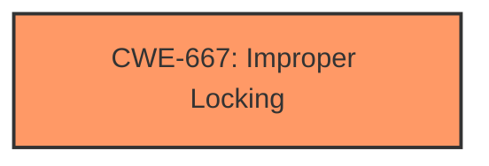

# Analysis Report for CVE-2024-50304

# Vulnerability Analysis Report: CVE-2024-50304

## Description

In the Linux kernel, the following vulnerability has been resolved ipv4 ip_tunnel Fix suspicious RCU usage warning in ip_tunnel_find() The per-netns IP tunnel hash table is protected by the RTNL mutex and ip_tunnel_find() is only called from the control path where the mutex is taken. Add a lockdep expression to hlist_for_each_entry_rcu() in ip_tunnel_find() in order to validate that the mutex is held and to silence the suspicious RCU usage warning [1]. [1] WARNING suspicious RCU usage 6.12.0-rc3-custom-gd95d9a31aceb #139 Not tainted ----------------------------- net/ipv4/ip_tunnel.c221 RCU-list traversed in non-reader section!! other info that might help us debug this rcu_scheduler_active = 2, debug_locks = 1 1 lock held by ip/362 #0 ffffffff86fc7cb0 (rtnl_mutex){+.+.}-{33}, at rtnetlink_rcv_msg+0x377/0xf60 stack backtrace CPU 12 UID 0 PID 362 Comm ip Not tainted 6.12.0-rc3-custom-gd95d9a31aceb #139 Hardware name Bochs Bochs, BIOS Bochs 01/01/2011 Call Trace dump_stack_lvl+0xba/0x110 lockdep_rcu_suspicious.cold+0x4f/0xd6 ip_tunnel_find+0x435/0x4d0 ip_tunnel_newlink+0x517/0x7a0 ipgre_newlink+0x14c/0x170 __rtnl_newlink+0x1173/0x19c0 rtnl_newlink+0x6c/0xa0 rtnetlink_rcv_msg+0x3cc/0xf60 netlink_rcv_skb+0x171/0x450 netlink_unicast+0x539/0x7f0 netlink_sendmsg+0x8c1/0xd80 ____sys_sendmsg+0x8f9/0xc20 ___sys_sendmsg+0x197/0x1e0 __sys_sendmsg+0x122/0x1f0 do_syscall_64+0xbb/0x1d0 entry_SYSCALL_64_after_hwframe+0x77/0x7f

## Vulnerability Description Key Phrases

- **Rootcause:** The per-netns IP tunnel hash table is protected by the RTNL mutex but hlist_for_each_entry_rcu() in ip_tunnel_find() was not validating that the mutex was held, leading to a suspicious RCU usage warning.
- **Weakness:** The code was missing a lockdep expression to validate the RTNL mutex is held before using hlist_for_each_entry_rcu().
- **Impact:** A suspicious RCU usage warning was triggered.
- **Vector:** The vulnerability was triggered in the control path when calling ip_tunnel_find() without proper validation that the RTNL mutex was held.
- **Product:** Linux Kernel
- **Version:** 6.12.0-rc3
- **Component:** ipv4 ip_tunnel

## Analysis (with Relationship Data)

# Summary
| CWE ID | CWE Name | Confidence | CWE Abstraction Level | CWE Vulnerability Mapping Label | CWE-Vulnerability Mapping Notes |
|---|---|---|---|---|---|
| CWE-667 | Improper Locking | 0.75 | Class |  Primary | Allowed-with-Review |

## Evidence and Confidence

*   **Confidence Score:** 0.75
*   **Evidence Strength:** MEDIUM

## Relationship Analysis
The primary candidate is CWE-667, "Improper Locking," which is a Class-level CWE. While preferable to use Base-level CWEs, in this case, it appears to be the most fitting. The retriever results also list several other CWEs related to resource management and input validation; however, those are less directly relevant. CWE-667 does not have any specific child CWEs listed in the provided information that would be a more specific fit.



## Vulnerability Chain
The vulnerability chain starts with the **missing** lock validation, leading to a potential race condition or data corruption, and resulting in a suspicious RCU usage warning.

## Summary of Analysis
The analysis indicates a **missing** lock validation, which could lead to concurrency issues.
The primary evidence is:
- **Vulnerability Description Key Phrases:** "The per-netns IP tunnel hash table is protected by the RTNL mutex but hlist_for_each_entry_rcu() in ip_tunnel_find() was not validating that the mutex was held, leading to a suspicious RCU usage warning."
- **CVE Reference Links Content Summary:** "The code was generating a warning because `hlist_for_each_entry_rcu()` was being used without a lockdep expression, even though the function was always called from within a context where the `rtnl_mutex` was held."

Based on this, CWE-667, "Improper Locking" is the most appropriate. Although the provided information notes this was a false positive warning, it still indicates the underlying condition that triggered the warning was the **improper** locking, which is the lack of validation that the lock was held.

Relevant CWE Information:

# Enhanced Context (25 CWEs)
The following CWEs were identified as potentially relevant to this vulnerability:

## CWE-824: Access of Uninitialized Pointer
**Abstraction Level**: Base
**Similarity Score**: 0.77
**Source**: dense

**Description**:
The product accesses or uses a pointer that has not been initialized.

**Mapping Guidance**:
- Usage: Allowed
- Rationale: This CWE entry is at the Base level of abstraction, which is a preferred level of abstraction for mapping to the root causes of vulnerabilities.


## CWE-667: Improper Locking
**Abstraction Level**: Class
**Similarity Score**: 0.76
**Source**: dense

**Description**:
The product does not properly acquire or release a lock on a resource, leading to unexpected resource state changes and behaviors.

**Mapping Guidance**:
- Usage: Allowed-with-Review
- Rationale: This CWE entry is a Class and might have Base-level children that would be more appropriate


## CWE-755: Improper Handling of Exceptional Conditions
**Abstraction Level**: Class
**Similarity Score**: 0.76
**Source**: dense

**Description**:
The product does not handle or incorrectly handles an exceptional condition.

**Mapping Guidance**:
- Usage: Discouraged
- Rationale: This CWE entry is a level-1 Class (i.e., a child of a Pillar). It might have lower-level children that would be more appropriate


## CWE-476: NULL Pointer Dereference
**Abstraction Level**: Base
**Similarity Score**: 0.76
**Source**: dense

**Description**:
The product dereferences a pointer that it expects to be valid but is NULL.

**Mapping Guidance**:
- Usage: Allowed
- Rationale: This CWE entry is at the Base level of abstraction, which is a preferred level of abstraction for mapping to the root causes of vulnerabilities.


## CWE-252: Unchecked Return Value
**Abstraction Level**: Base
**Similarity Score**: 0.75
**Source**: dense

**Description**:
The product does not check the return value from a method or function, which can prevent it from detecting unexpected states and conditions.

**Mapping Guidance**:
- Usage: Allowed
- Rationale: This CWE entry is at the Base level of abstraction, which is a preferred level of abstraction for mapping to the root causes of vulnerabilities.


## CWE-191: Integer Underflow (Wrap or Wraparound)
**Abstraction Level**: Base
**Similarity Score**: 0.75
**Source**: dense

**Description**:
The product subtracts one value from another, such that the result is less than the minimum allowable integer value, which produces a value that is not equal to the correct result.

**Mapping Guidance**:
- Usage: Allowed
- Rationale: This CWE entry is at the Base level of abstraction, which is a preferred level of abstraction for mapping to the root causes of vulnerabilities.


## CWE-617: Reachable Assertion
**Abstraction Level**: Base
**Similarity Score**: 0.75
**Source**: dense

**Description**:
The product contains an assert() or similar statement that can be triggered by an attacker, which leads to an application exit or other behavior that is more severe than necessary.

**Mapping Guidance**:
- Usage: Allowed
- Rationale: This CWE entry is at the Base level of abstraction, which is a preferred level of abstraction for mapping to the root causes of vulnerabilities.


## CWE-754: Improper Check for Unusual or Exceptional Conditions
**Abstraction Level**: Class
**Similarity Score**: 0.75
**Source**: dense

**Description**:
The product does not check or incorrectly checks for unusual or exceptional conditions that are not expected to occur frequently during day to day operation of the product.

**Mapping Guidance**:
- Usage: Allowed-with-Review
- Rationale: This CWE entry is a Class and might have Base-level children that would be more appropriate


## CWE-362: Concurrent Execution using Shared Resource with Improper Synchronization ('Race Condition')
**Abstraction Level**: Class
**Similarity Score**: 0.74
**Source**: dense

**Description**:
The product contains a concurrent code sequence that requires temporary, exclusive access to a shared resource, but a timing window exists in which the shared resource can be modified by another code sequence operating concurrently.

**Mapping Guidance**:
- Usage: Allowed-with-Review
- Rationale: This CWE entry is a Class and might have Base-level children that would be more appropriate


## CWE-1286: Improper Validation of Syntactic Correctness of Input
**Abstraction Level**: Base
**Similarity Score**: 0.74
**Source**: dense

**Description**:
The product receives input that is expected to be well-formed - i.e., to comply with a certain syntax - but it does not validate or incorrectly validates that the input complies with the syntax.

**Mapping Guidance**:
- Usage: Allowed
- Rationale: This CWE entry is at the Base level of abstraction, which is a preferred level of abstraction for mapping to the root causes of vulnerabilities.


## CWE-835: Loop with Unreachable Exit Condition ('Infinite Loop')
**Abstraction Level**: Base
**Similarity Score**: 797.21
**Source**: sparse

**Description**:
The product contains an iteration or loop with an exit condition that cannot be reached, i.e., an infinite loop.

**Mapping Guidance**:
- Usage: Allowed
- Rationale: This CWE entry is at the Base level of abstraction, which is a preferred level of abstraction for mapping to the root causes of vulnerabilities.


## CWE-1284: Improper Validation of Specified Quantity in Input
**Abstraction Level**: Base
**Similarity Score**: 794.72
**Source**: sparse

**Description**:
The product receives input that is expected to specify a quantity (such as size or length), but it does not validate or incorrectly validates that the quantity has the required properties.

**Mapping Guidance**:
- Usage: Allowed
- Rationale: This CWE entry is at the Base level of abstraction, which is a preferred level of abstraction for mapping to the root causes of vulnerabilities.


## CWE-667: Improper Locking
**Abstraction Level**: Class
**Similarity Score**: 789.08
**Source**: sparse

**Description**:
The product does not properly acquire or release a lock on a resource, leading to unexpected resource state changes and behaviors.

**Mapping Guidance**:
- Usage: Allowed-with-Review
- Rationale: This CWE entry is a Class and might have Base-level children that would be more appropriate


## CWE-923: Improper Restriction of Communication Channel to Intended Endpoints
**Abstraction Level**: Class
**Similarity Score**: 778.13
**Source**: sparse

**Description**:
The product establishes a communication channel to (or from) an endpoint for privileged or protected operations, but it does not properly ensure that it is communicating with the correct endpoint.

**Mapping Guidance**:
- Usage: Allowed-with-Review
- Rationale: This CWE entry is a Class and might


## CWE Relationship Analysis

Current CWEs represent these abstraction levels: .


### Vulnerability Chain Analysis

**Chain starting from CWE-1284:**
- 1284 (Improper Validation of Specified Quantity in Input) - ROOT


**Chain starting from CWE-476:**
- 476 (NULL Pointer Dereference) - ROOT


### CWE Relationship Diagram

```mermaid
graph TD
    classDef primary fill:#f96,stroke:#333,stroke-width:2px
    classDef secondary fill:#69f,stroke:#333
    classDef tertiary fill:#9e9,stroke:#333
```


*Report generated on 2025-07-13 20:01:13*
