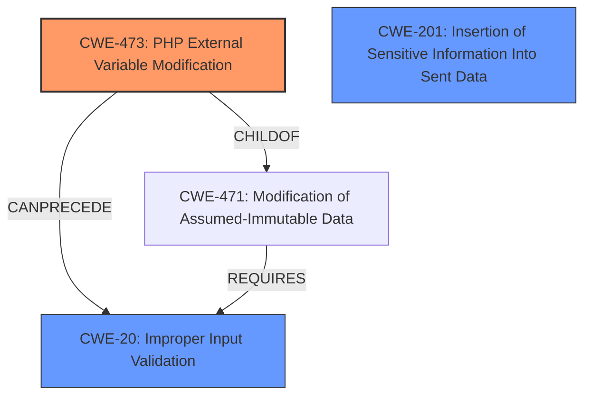

# Analysis Report for CVE-2024-50340

# Vulnerability Analysis Report: CVE-2024-50340

## Description

symfony/runtime is a module for the Symphony PHP framework which enables decoupling PHP applications from global state. When the `register_argv_argc` php directive is set to `on` , and users call any URL with a special crafted query string, they are able to change the environment or debug mode used by the kernel when handling the request. As of versions 5.4.46, 6.4.14, and 7.1.7 the `SymfonyRuntime` now ignores the `argv` values for non-SAPI PHP runtimes. All users are advised to upgrade. There are no known workarounds for this vulnerability.

## Vulnerability Description Key Phrases

- **Impact:** change the environment or debug mode used by the kernel
- **Vector:** special crafted query string
- **Product:** symfony/runtime
- **Version:** 5.4.46, 6.4.14, and 7.1.7

## Analysis (with Relationship Data)

# Summary

| CWE ID | CWE Name | Confidence | CWE Abstraction Level | CWE Vulnerability Mapping Label | CWE-Vulnerability Mapping Notes |
|---|---|---|---|---|---|
| CWE-473 | PHP External Variable Modification | 0.8 | Variant | Allowed | Primary CWE - Root Cause  |
| CWE-20 | Improper Input Validation | 0.6 | Class | Allowed | Secondary Candidate - Input Validation |
| CWE-201 | Insertion of Sensitive Information Into Sent Data | 0.5 | Base | Allowed | Secondary Candidate - Impact |

## Evidence and Confidence

*   **Confidence Score:** 0.7
*   **Evidence Strength:** MEDIUM

## Relationship Analysis
The primary CWE, CWE-473 (PHP External Variable Modification), is a variant of CWE-471 (Modification of Assumed-Immutable Data). The attack involves modifying external variables, which leads to the program behaving unexpectedly. The secondary CWE, CWE-20 (Improper Input Validation), is a parent of CWE-473, indicating a lack of proper validation on the external variable being modified. CWE-201 (Insertion of Sensitive Information Into Sent Data) is a potential impact, as modifying the environment or debug mode can lead to sensitive information being exposed. The abstraction levels guided the selection, focusing on the most specific (Variant) for the root cause and broader (Class, Base) for related weaknesses and potential impact.



## Vulnerability Chain
The vulnerability chain begins with the **improper use of external variables** (CWE-473), where a specially crafted query string is used to modify the environment or debug mode of the kernel. A prerequisite to this is **improper input validation** (CWE-20) of these external variables from the HTTP request. The modification can then lead to **insertion of sensitive information into sent data** (CWE-201), as changing the debug mode might expose sensitive information.

## Summary of Analysis
The analysis is primarily based on the provided evidence, which clearly points to the modification of external PHP variables via a crafted query string. The core issue is that the `SymfonyRuntime` component incorrectly uses command-line arguments (`argv`) in non-CLI SAPI environments when the `register_argc_argv` PHP directive is enabled, leading to the ability to manipulate the environment or debug mode.

The graph relationships helped to identify potential related weaknesses. CWE-473 is a variant of CWE-471, further emphasizing the modification aspect. CWE-20 was considered due to the **lack of input validation** on the external variables.

CWE-473 is the optimal level of specificity, as it directly describes the **PHP external variable modification** vulnerability. Other considered CWEs, such as CWE-79 (Cross-site Scripting) and CWE-78 (OS Command Injection), were deemed less relevant because the vulnerability does not involve direct injection of code or scripting in the traditional sense. The vulnerability is about manipulating PHP variables that influence the application's behavior.

Relevant CWE Information:

# Enhanced Context (25 CWEs)
The following CWEs were identified as potentially relevant to this vulnerability:

## CWE-88: Improper Neutralization of Argument Delimiters in a Command ('Argument Injection')
**Abstraction Level**: Base
**Similarity Score**: 0.74
**Source**: dense
**Description**:
The product constructs a string for a command to be executed by a separate component
in another control sphere, but it does not properly delimit the
intended arguments, options, or switches within that command string.
**Mapping Guidance**:
- Usage: Allowed
- Rationale: This CWE entry is at the Base level of abstraction, which is a preferred level of abstraction for mapping to the root causes of vulnerabilities.

## CWE-918: Server-Side Request Forgery (SSRF)
**Abstraction Level**: Base
**Similarity Score**: 0.73
**Source**: dense
**Description**:
The web server receives a URL or similar request from an upstream component and retrieves the contents of this URL, but it does not sufficiently ensure that the request is being sent to the expected destination.
**Mapping Guidance**:
- Usage: Allowed
- Rationale: This CWE entry is at the Base level of abstraction, which is a preferred level of abstraction for mapping to the root causes of vulnerabilities.

## CWE-74: Improper Neutralization of Special Elements in Output Used by a Downstream Component ('Injection')
**Abstraction Level**: Class
**Similarity Score**: 0.73
**Source**: dense
**Description**:
The product constructs all or part of a command, data structure, or record using externally-influenced input from an upstream component, but it does not neutralize or incorrectly neutralizes special elements that could modify how it is parsed or interpreted when it is sent to a downstream component.
**Mapping Guidance**:
- Usage: Discouraged
- Rationale: CWE-74 is high-level and often misused when lower-level weaknesses are more appropriate.

## CWE-116: Improper Encoding or Escaping of Output
**Abstraction Level**: Class
**Similarity Score**: 0.73
**Source**: dense
**Description**:
The product prepares a structured message for communication with another component, but encoding or escaping of the data is either missing or done incorrectly. As a result, the intended structure of the message is not preserved.
**Mapping Guidance**:
- Usage: Allowed-with-Review
- Rationale: This CWE entry is a Class and might have Base-level children that would be more appropriate

## CWE-138: Improper Neutralization of Special Elements
**Abstraction Level**: Class
**Similarity Score**: 0.73
**Source**: dense
**Description**:
The product receives input from an upstream component, but it does not neutralize or incorrectly neutralizes special elements that could be interpreted as control elements or syntactic markers when they are sent to a downstream component.
**Mapping Guidance**:
- Usage: Discouraged
- Rationale: This CWE entry is a level-1 Class (i.e., a child of a Pillar). It might have lower-level children that would be more appropriate

## CWE-502: Deserialization of Untrusted Data
**Abstraction Level**: Base
**Similarity Score**: 0.72
**Source**: dense
**Description**:
The product deserializes untrusted data without sufficiently ensuring that the resulting data will be valid.
**Mapping Guidance**:
- Usage: Allowed
- Rationale: This CWE entry is at the Base level of abstraction, which is a preferred level of abstraction for mapping to the root causes of vulnerabilities.

## CWE-425: Direct Request ('Forced Browsing')
**Abstraction Level**: Base
**Similarity Score**: 0.72
**Source**: dense
**Description**:
The web application does not adequately enforce appropriate authorization on all restricted URLs, scripts, or files.
**Mapping Guidance**:
- Usage: Allowed
- Rationale: This CWE entry is at the Base level of abstraction, which is a preferred level of abstraction for mapping to the root causes of vulnerabilities.

## CWE-212: Improper Removal of Sensitive Information Before Storage or Transfer
**Abstraction Level**: Base
**Similarity Score**: 0.72
**Source**: dense
**Description**:
The product stores, transfers, or shares a resource that contains sensitive information, but it does not properly remove that information before the product makes the resource available to unauthorized actors.
**Mapping Guidance**:
- Usage: Allowed
- Rationale: This CWE entry is at the Base level of abstraction, which is a preferred level of abstraction for mapping to the root causes of vulnerabilities.

## CWE-472: External Control of Assumed-Immutable Web Parameter
**Abstraction Level**: Base
**Similarity Score**: 0.72
**Source**: dense
**Description**:
The web application does not sufficiently verify inputs that are assumed to be immutable but are actually externally controllable, such as hidden form fields.
**Mapping Guidance**:
- Usage: Allowed
- Rationale: This CWE entry is at the Base level of abstraction, which is a preferred level of abstraction for mapping to the root causes of vulnerabilities.

## CWE-1286: Improper Validation of Syntactic Correctness of Input
**Abstraction Level**: Base
**Similarity Score**: 0.72
**Source**: dense
**Description**:
The product receives input that is expected to be well-formed - i.e., to comply with a certain syntax - but it does not validate or incorrectly validates that the input complies


## CWE Relationship Analysis

Current CWEs represent these abstraction levels: .


### Vulnerability Chain Analysis

**Chain starting from CWE-471:**
- 471 (Modification of Assumed-Immutable Data (MAID)) - ROOT


**Chain starting from CWE-502:**
- 502 (Deserialization of Untrusted Data) - ROOT


### CWE Relationship Diagram

```mermaid
graph TD
    classDef primary fill:#f96,stroke:#333,stroke-width:2px
    classDef secondary fill:#69f,stroke:#333
    classDef tertiary fill:#9e9,stroke:#333
```


*Report generated on 2025-07-13 20:03:34*
