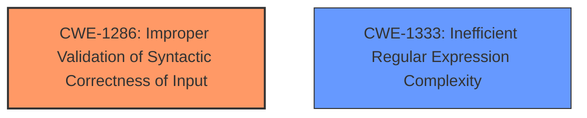

# Analysis Report for CVE-2024-50343

# Vulnerability Analysis Report: CVE-2024-50343

## Description

symfony/validator is a module for the Symphony PHP framework which provides tools to validate values. It is possible to trick a `Validator` configured with a regular expression using the `$` metacharacters, with an input ending with `\n`. Symfony as of versions 5.4.43, 6.4.11, and 7.1.4 now uses the `D` regex modifier to match the entire input. Users are advised to upgrade. There are no known workarounds for this vulnerability.

## Vulnerability Description Key Phrases

- **Product:** Symfony
- **Version:** 5.4.43, 6.4.11, and 7.1.4
- **Component:** symfony/validator

## Analysis (with Relationship Data)

# Summary
| CWE ID | CWE Name | Confidence | CWE Abstraction Level | CWE Vulnerability Mapping Label | CWE-Vulnerability Mapping Notes |
|---|---|---|---|---|---|
| CWE-1286 | Improper Validation of Syntactic Correctness of Input | 0.8 | Base | Primary | Allowed |
| CWE-1333 | Inefficient Regular Expression Complexity | 0.5 | Base | Secondary Candidate | Allowed |

## Evidence and Confidence

*   **Confidence Score:** 0.8
*   **Evidence Strength:** MEDIUM

## Relationship Analysis
The primary relationship considered was that of abstraction levels, favoring the most specific **Base** level CWE. While CWE-1333 was a top retriever result, it represents a potential performance impact rather than the core validation issue. CWE-1286 directly addresses the **improper validation** of the input's syntax, making it a more fitting primary CWE.



## Vulnerability Chain
The vulnerability chain starts with the **improper validation** due to the incorrect regular expression usage. This leads to the bypass of validation, allowing invalid input to be accepted. The root cause is the failure to properly validate the syntactic correctness of the input, and a possible secondary weakness is inefficient regex complexity.

## Summary of Analysis
The initial analysis focused on the fact that the regular expression validator was not properly accounting for the end of line character. The description indicates that the validator did not account for a newline character, leading to the bypass. The introduction of the `D` regex modifier confirms this. While CWE-1333 (Inefficient Regular Expression Complexity) was a high-ranking result from the retriever, it describes a different type of issue (performance) than the core problem, which is a validation bypass. CWE-1286 (Improper Validation of Syntactic Correctness of Input) more accurately captures the root cause. This assessment is primarily based on the CVE Reference Links Content Summary, which clearly states that the vulnerability stems from **incorrect regular expression usage**, leading to a **bypass of validation**.

Relevant CWE Information:

# Enhanced Context (25 CWEs)
The following CWEs were identified as potentially relevant to this vulnerability:

## CWE-1286: Improper Validation of Syntactic Correctness of Input
**Abstraction Level**: Base
**Similarity Score**: 0.72
**Source**: dense

**Description**:
The product receives input that is expected to be well-formed - i.e., to comply with a certain syntax - but it does not validate or incorrectly validates that the input complies with the syntax.

**Mapping Guidance**:
- Usage: Allowed
- Rationale: This CWE entry is at the Base level of abstraction, which is a preferred level of abstraction for mapping to the root causes of vulnerabilities.

**Technical Explanation for CWE-1286:**

The vulnerability in Symfony's validator component arises because the regular expressions used for validation **do not properly validate** the syntactic correctness of the input, specifically when the input ends with a newline character (`\n`). The `$` metacharacter in the regex matches the end of a line, but without the `D` modifier, it doesn't treat the entire input as a single line. This allows an attacker to bypass the validation by appending `\n` to the input, as the regex matches up to the newline, effectively ignoring the rest of the input.

*   **Security Implications:** This can lead to the acceptance of invalid data, potentially causing further issues depending on how the data is used downstream.
*   **Potential Impact:** The impact is rated as low severity, with the primary concern being the acceptance of invalid input.
*   **Relationships:** No direct parent-child or chain relationships are explicitly relevant here.
*   **Primary/Secondary:** This is the primary weakness, as it directly describes the root cause of the vulnerability.
*   **Mapping Guidance:** The MITRE mapping guidance recommends this CWE.

**Technical Explanation for CWE-1333:**

While Inefficient Regular Expression Complexity (CWE-1333) could be considered, the primary issue isn't the computational complexity of the regex, but rather its incorrect logic in handling newline characters. The fix involves adding the `D` modifier, which doesn't directly address efficiency but correctness.

*   **Security Implications:** If the regex was inefficient, it could lead to a denial of service due to excessive CPU consumption.
*   **Potential Impact:** In this case, the impact is more related to incorrect validation than performance.
*   **Relationships:** No direct parent-child or chain relationships are explicitly relevant here.
*   **Primary/Secondary:** This is a secondary concern at best, as the main issue is the validation bypass.
*   **Mapping Guidance:** The MITRE mapping guidance recommends this CWE.

**CWEs Considered but Not Used:**

*   CWE-22 (Improper Limitation of a Pathname to a Restricted Directory ('Path Traversal')), CWE-73 (External Control of File Name or Path): These are related to file path manipulation, which is not relevant to this vulnerability.
*   CWE-94 (Improper Control of Generation of Code ('Code Injection')): This is related to code injection, which is also not relevant.
*   CWE-117 (Improper Output Neutralization for Logs): This is related to logging, which is not relevant.
*   CWE-347 (Improper Verification of Cryptographic Signature): This is related to crypto, which is not relevant.
*   CWE-1336 (Improper Neutralization of Special Elements Used in a Template Engine): This is related to template engines, which is not relevant.
*   CWE-770 (Allocation of Resources Without Limits or Throttling): This relates to resource exhaustion, which is not relevant.
*   CWE-863 (Incorrect Authorization) and CWE-1390 (Weak Authentication): These relate to authentication/authorization bypass, but the vulnerability occurs after authentication, so these are not relevant.


## CWE Relationship Analysis

Current CWEs represent these abstraction levels: .


### Vulnerability Chain Analysis

**Chain starting from CWE-1390:**
- 1390 (Weak Authentication) - ROOT


**Chain starting from CWE-863:**
- 863 (Incorrect Authorization) - ROOT


### CWE Relationship Diagram

```mermaid
graph TD
    classDef primary fill:#f96,stroke:#333,stroke-width:2px
    classDef secondary fill:#69f,stroke:#333
    classDef tertiary fill:#9e9,stroke:#333
```


*Report generated on 2025-07-13 20:04:35*
