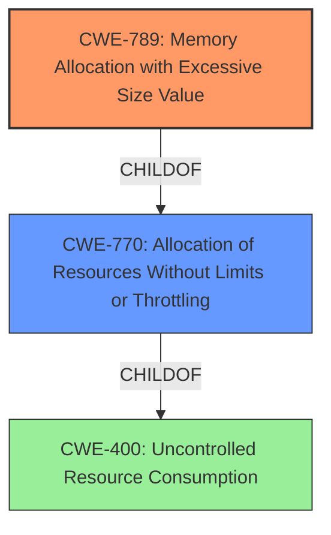

# Analysis Report for CVE-2024-50354

# Vulnerability Analysis Report: CVE-2024-50354

## Description

gnark is a fast zk-SNARK library that offers a high-level API to design circuits. In gnark 0.11.0 and earlier, **deserialization of Groth16 verification keys allocate excessive memory**, consuming a lot of resources and triggering a crash with the error fatal error runtime out of memory.

## Vulnerability Description Key Phrases

- **Weakness:** deserialization of Groth16 verification keys allocate excessive memory
- **Impact:** crash
- **Product:** gnark
- **Version:** 0.11.0 and earlier

## Analysis (with Relationship Data)

# Summary
| CWE ID | CWE Name | Confidence | CWE Abstraction Level | CWE Vulnerability Mapping Label | CWE-Vulnerability Mapping Notes |
|---|---|---|---|---|---|
| CWE-789 | Memory Allocation with Excessive Size Value | 0.9 | Variant | Allowed | Primary CWE: The vulnerability stems from allocating memory based on an untrusted, large size value without proper validation. |
| CWE-770 | Allocation of Resources Without Limits or Throttling | 0.7 | Base | Allowed | Secondary CWE: The system allocates resources without any limits on the number of resources that can be allocated, exacerbating the issue. |
| CWE-400 | Uncontrolled Resource Consumption | 0.6 | Class | Discouraged | Secondary CWE: The vulnerability leads to uncontrolled consumption of memory resources, causing a denial-of-service condition. |

## Evidence and Confidence

*   **Confidence Score:** 0.8
*   **Evidence Strength:** HIGH

## Relationship Analysis
The primary weakness is **CWE-789: Memory Allocation with Excessive Size Value**, where the program allocates memory based on an untrusted size. This is related to **CWE-770: Allocation of Resources Without Limits or Throttling**, as the allocation happens without proper limits, which in turn can lead to **CWE-400: Uncontrolled Resource Consumption** causing a denial-of-service. CWE-789 is a child of CWE-770. CWE-400 is a parent of CWE-770. Selecting the variant level CWE-789 provides a more specific identification of the weakness than the base or class level CWEs.



## Vulnerability Chain
1.  The initial flaw is the **lack of validation** of the `nbCommitments` value read from the input file.
2.  This leads to **CWE-789: Memory Allocation with Excessive Size Value**, where the code attempts to allocate an excessive amount of memory based on the unvalidated input.
3.  Since the allocation is done without any limits or throttling (**CWE-770: Allocation of Resources Without Limits or Throttling**), the excessive memory allocation leads to **CWE-400: Uncontrolled Resource Consumption**.
4.  The ultimate impact is a **crash** due to an out-of-memory error, resulting in a denial of service.

## Summary of Analysis
The analysis indicates that the primary vulnerability is due to the **deserialization of Groth16 verification keys allocating excessive memory**. The root cause is the **lack of validation of the `nbCommitments` value**, which is then used to allocate memory. The evidence from the CVE Reference Links Content Summary clearly states that the `nbCommitments` value is read from the input file without any validation or bounds checking, leading to an unbounded memory allocation. This directly aligns with the description of **CWE-789: Memory Allocation with Excessive Size Value**, making it the most appropriate primary CWE. The lack of limits on resource allocation contributes to **CWE-770: Allocation of Resources Without Limits or Throttling**. The resulting uncontrolled resource consumption and crash align with **CWE-400: Uncontrolled Resource Consumption**, making it a secondary candidate.

The retriever results also support the selection of CWE-789, CWE-770, and CWE-400, further strengthening the confidence in this assessment.

Other CWEs Considered but Not Used:

*   **CWE-502: Deserialization of Untrusted Data:** While deserialization is involved, the core issue is the excessive memory allocation based on an unvalidated size, making CWE-789 more specific.
*   **CWE-1284: Improper Validation of Specified Quantity in Input:** While there's improper validation, the direct consequence is excessive memory allocation, making CWE-789 more relevant as the primary cause.
*   **CWE-125: Out-of-bounds Read:** This is not applicable as the issue is with memory allocation size, not reading out of bounds.
*   **CWE-190: Integer Overflow or Wraparound:** This is not applicable because there is no integer overflow mentioned in the description.
*   **CWE-131: Incorrect Calculation of Buffer Size:** This is not applicable as the issue is with the size value received from the input, not the calculation of the buffer itself.


## CWE Relationship Analysis

Current CWEs represent these abstraction levels: .


### Vulnerability Chain Analysis

**Chain starting from CWE-502:**
- 502 (Deserialization of Untrusted Data) - ROOT


**Chain starting from CWE-1284:**
- 1284 (Improper Validation of Specified Quantity in Input) - ROOT


### CWE Relationship Diagram

```mermaid
graph TD
    classDef primary fill:#f96,stroke:#333,stroke-width:2px
    classDef secondary fill:#69f,stroke:#333
    classDef tertiary fill:#9e9,stroke:#333
```


*Report generated on 2025-07-13 20:05:33*
