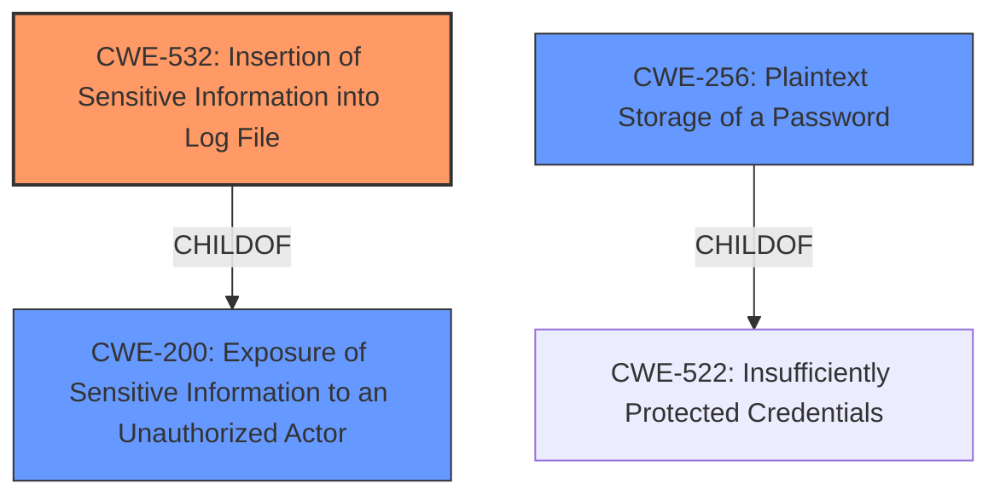

# Analysis Report for CVE-2024-50378

# Vulnerability Analysis Report: CVE-2024-50378

## Description

Airflow versions before 2.10.3 have a vulnerability that allows authenticated users with audit log access to see sensitive values in audit logs which they should not see.When sensitive variables were set via airflow CLI, values of those variables appeared in the audit log and were stored unencrypted in the Airflow database. While this risk is limited to users with audit log access, it is recommended to upgrade to Airflow 2.10.3 or a later version, which addresses this issue. Users who previously used the CLI to set secret variables should manually delete entries with those variables from the log table.

## Vulnerability Description Key Phrases

- **Weakness:** information disclosure
- **Impact:** see sensitive values in audit logs
- **Vector:** setting sensitive variables via airflow CLI
- **Attacker:** authenticated users with audit log access
- **Product:** Airflow
- **Version:** before 2.10.3

## Analysis (with Relationship Data)

# Summary
| CWE ID | CWE Name | Confidence | CWE Abstraction Level | CWE Vulnerability Mapping Label | CWE-Vulnerability Mapping Notes |
|---|---|---|---|---|---|
| CWE-532 | Insertion of Sensitive Information into Log File | 1.0 | Base | Allowed | Primary CWE |
| CWE-256 | Plaintext Storage of a Password | 0.8 | Base | Allowed | Secondary Candidate |
| CWE-200 | Exposure of Sensitive Information to an Unauthorized Actor | 0.6 | Class | Discouraged | Secondary Candidate |

## Evidence and Confidence

*   **Confidence Score:** 0.8
*   **Evidence Strength:** HIGH

## Relationship Analysis
The primary relationship that influenced the CWE selection was the parent-child relationship, particularly how CWE-532 relates to CWE-200. While CWE-200 is a broader category, CWE-532 specifically addresses the **insertion of sensitive information into log files**, which is precisely what the vulnerability description details. This specific focus makes CWE-532 a more accurate and granular representation of the **root cause**.



## Vulnerability Chain
The vulnerability chain starts with the **improper handling of sensitive variables** via the Airflow CLI. This leads directly to **CWE-532 (Insertion of Sensitive Information into Log File)**, as the sensitive data is written to the audit logs. The data is also stored unencrypted. The final impact is the **exposure of this sensitive information to unauthorized actors** with access to the audit logs.

## Summary of Analysis
The initial analysis identified several candidate CWEs based on the vulnerability description. After careful review, **CWE-532 (Insertion of Sensitive Information into Log File)** was selected as the primary CWE because it best represents the **root cause** of the vulnerability. The vulnerability description clearly states that sensitive variables, when set via the Airflow CLI, are written to the audit log. The evidence includes: "values of those variables appeared in the audit log and were stored unencrypted in the Airflow database." This directly aligns with the CWE-532 description: "The product writes sensitive information to a log file."

CWE-200 (Exposure of Sensitive Information to an Unauthorized Actor) was considered, and while it accurately describes the impact of the vulnerability, it is a more general CWE. The mapping guidance for CWE-200 discourages its use as a primary CWE, as it represents the technical impact rather than the root cause.

CWE-256 (Plaintext Storage of a Password) was also considered, given the unencrypted storage of the variables in the Airflow database. While this is a contributing factor, the immediate cause of the vulnerability is the logging of sensitive information.

Ultimately, **CWE-532** was chosen as the primary CWE due to its specific match with the vulnerability's root cause, its appropriate level of abstraction (Base), and its allowed usage according to MITRE mapping guidance.

Relevant CWE Information:

**CWE-532: Insertion of Sensitive Information into Log File**

*   **Technical Explanation:** The Airflow application logs sensitive variables without proper sanitization or masking. This means that when sensitive data is set via the CLI, the actual values are recorded in the audit logs.
*   **Security Implications:** Unauthorized users with access to the audit logs can view sensitive information, such as passwords, API keys, or other confidential data.
*   **Relationship Analysis:** This CWE is a child of CWE-200 (Exposure of Sensitive Information to an Unauthorized Actor).
*   **Mapping Guidance:** The usage is "Allowed," and the rationale states that this CWE is at the Base level of abstraction, which is preferred for mapping root causes.
*   **Justification:** The vulnerability description explicitly mentions the logging of sensitive variables, directly matching the CWE description.

**CWE-256: Plaintext Storage of a Password**

*   **Technical Explanation:** The sensitive variables are stored unencrypted in the Airflow database.
*   **Security Implications:** If the database is compromised, the sensitive variables will be exposed.
*   **Relationship Analysis:** This CWE is a child of CWE-522 (Insufficiently Protected Credentials).
*   **Mapping Guidance:** The usage is "Allowed," and the rationale states that this CWE is at the Base level of abstraction, which is preferred for mapping root causes.
*   **Justification:** The vulnerability description explicitly mentions "stored unencrypted in the Airflow database."

**CWE-200: Exposure of Sensitive Information to an Unauthorized Actor**

*   **Technical Explanation:** The vulnerability results in the exposure of sensitive variable values to unauthorized users who have access to the audit logs.
*   **Security Implications:** Sensitive information can be accessed by unintended parties, leading to potential data breaches or misuse of credentials.
*   **Relationship Analysis:** This CWE is a parent of many CWEs, including CWE-532.
*   **Mapping Guidance:** The usage is "Discouraged" because it represents the impact rather than the root cause.
*   **Justification:** While the vulnerability does lead to the exposure of sensitive information, this CWE is too high-level to represent the specific weakness.


## CWE Relationship Analysis

Current CWEs represent these abstraction levels: .


### Vulnerability Chain Analysis

**Chain starting from CWE-522:**
- 522 (Insufficiently Protected Credentials) - ROOT


**Chain starting from CWE-200:**
- 200 (Exposure of Sensitive Information to an Unauthorized Actor) - ROOT


### CWE Relationship Diagram

```mermaid
graph TD
    classDef primary fill:#f96,stroke:#333,stroke-width:2px
    classDef secondary fill:#69f,stroke:#333
    classDef tertiary fill:#9e9,stroke:#333
```


*Report generated on 2025-07-13 20:06:51*
