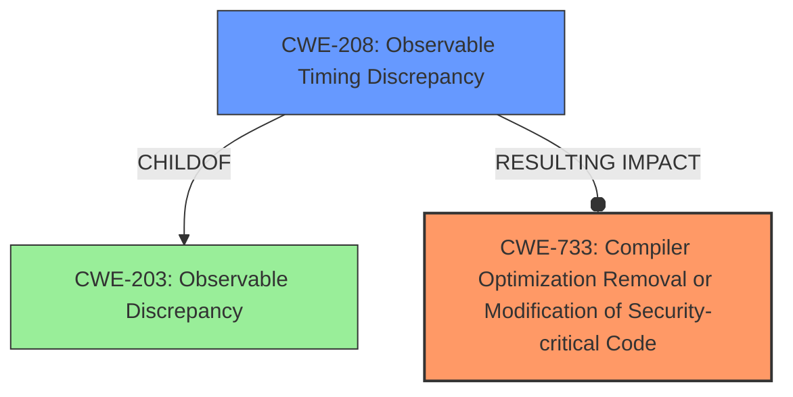

# Raw Analyzer Response for CVE-2024-50382

# Summary
| CWE ID | CWE Name | Confidence | CWE Abstraction Level | CWE Vulnerability Mapping Label | CWE-Vulnerability Mapping Notes |
|---|---|---|---|---|---|
| CWE-733 | Compiler Optimization Removal or Modification of Security-critical Code | 0.9 | Base | Allowed | Primary CWE: The root cause is a compiler optimization that removes or modifies security-critical code, specifically code intended to be constant-time.|
| CWE-208 | Observable Timing Discrepancy | 0.8 | Base | Allowed | Secondary CWE: The compiler-induced changes lead to timing discrepancies that can be observed by an attacker.|

## Evidence and Confidence

*   **Confidence Score:** 0.85
*   **Evidence Strength:** HIGH

## Relationship Analysis
The primary CWE is CWE-733, which is a Base level CWE that directly addresses the issue of compiler optimization removing or modifying security-critical code. CWE-208 is a related vulnerability as the compiler-induced changes lead to observable timing discrepancies that can be exploited. CWE-208 is a parent of other timing related issues but the vulnerability description does not give sufficient detail to go to a more specific timing related CWE.

## Vulnerability Chain
The vulnerability chain starts with the use of constant-time code in Botan (Intended Mitigation) -> Compiler Optimization (CWE-733, Root Cause) -> Secret-Dependent Control Flow -> Observable Timing Discrepancy (CWE-208, Impact).

## Summary of Analysis
The primary weakness is the **compiler-induced secret-dependent control flow**, which directly relates to the compiler's optimization process. The vulnerability description indicates that the compiler transforms constant-time code into code that exhibits secret-dependent behavior, leading to timing side-channel vulnerabilities. This aligns well with CWE-733 (Compiler Optimization Removal or Modification of Security-critical Code), as the compiler's actions directly compromise the intended security properties of the code. The resulting impact is an observable timing discrepancy, making CWE-208 (Observable Timing Discrepancy) a relevant secondary CWE.

The evidence provided in the "CVE Reference Links Content Summary" reinforces this assessment. It highlights how compilers can aggressively optimize code, introducing branches or memory accesses based on secret data, thus breaking constant-time guarantees. The summary specifically mentions that defensive programming techniques are insufficient, incomplete, and fragile against modern compilers.

The retriever results also support these findings, with CWE-733 and CWE-208 appearing as relevant candidates.

Other CWEs considered but not used:

*   CWE-321 (Use of Hard-coded Cryptographic Key), CWE-259 (Use of Hard-coded Password), CWE-798 (Use of Hard-coded Credentials): These are related to credential management, which is not relevant to this compiler optimization vulnerability.
*   CWE-330 (Use of Insufficiently Random Values), CWE-1204 (Generation of Weak Initialization Vector (IV)): These are related to randomness issues, which are not relevant in this context.
*   CWE-327 (Use of a Broken or Risky Cryptographic Algorithm): This is related to using weak algorithms, but the issue is with compiler optimization, not the algorithm itself.
*   CWE-1333 (Inefficient Regular Expression Complexity), CWE-407 (Inefficient Algorithmic Complexity): These are related to performance issues, not compiler breaking constant time properties.
*   CWE-125 (Out-of-bounds Read): There is no mention of this in the vulnerability description.
*   CWE-252 (Unchecked Return Value): There is no mention of this in the vulnerability description.
*   CWE-319 (Cleartext Transmission of Sensitive Information): There is no mention of this in the vulnerability description.
*   CWE-1286 (Improper Validation of Syntactic Correctness of Input): There is no mention of this in the vulnerability description.
*   CWE-201 (Insertion of Sensitive Information Into Sent Data), CWE-226 (Sensitive Information in Resource Not Removed Before Reuse): There is no mention of this in the vulnerability description.