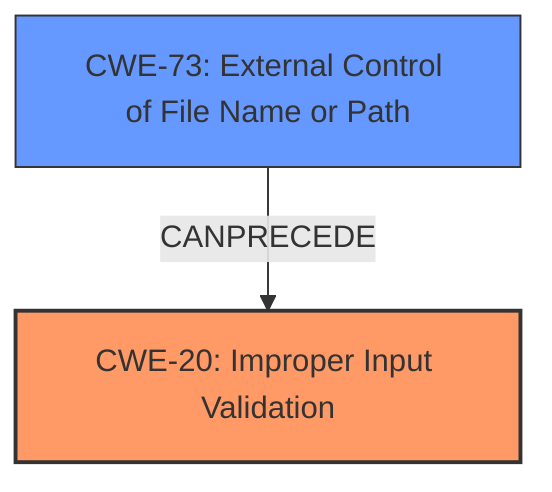

# Analysis Report for CVE-2024-50386

# Vulnerability Analysis Report: CVE-2024-50386

## Description

Account users in Apache CloudStack by default are allowed to register templates to be downloaded directly to the primary storage for deploying instances. Due to **missing validation checks** for KVM-compatible templates in CloudStack 4.0.0 through 4.18.2.4 and 4.19.0.0 through 4.19.1.2, an attacker that can register templates, can use them to deploy malicious instances on KVM-based environments and exploit this to gain access to the host filesystems that could result in the compromise of resource integrity and confidentiality, data loss, denial of service, and availability of KVM-based infrastructure managed by CloudStack. Users are recommended to upgrade to Apache CloudStack 4.18.2.5 or 4.19.1.3, or later, which addresses this issue. Additionally, all user-registered KVM-compatible templates can be scanned and checked that they are flat files that should not be using any additional or unnecessary features. For example, operators can run the following command on their file-based primary storage(s) and inspect the output. An empty output for the disk being validated means it has no references to the host filesystems on the other hand, if the output for the disk being validated is not empty, it might indicate a compromised disk. However, bear in mind that (i) volumes created from templates will have references for the templates at first and (ii) volumes can be consolidated while migrating, losing their references to the templates. Therefore, the command execution for the primary storages can show both false positives and false negatives. for file in $(find /path/to/storage/ -type f -regex [a-f0-9\-]*.*) do echo Retrieving file [$file] info. If the output is not empty, that might indicate a compromised disk check it carefully. qemu-img info -U $file | grep file printf \n\n done For checking the whole template/volume features of each disk, operators can run the following command for file in $(find /path/to/storage/ -type f -regex [a-f0-9\-]*.*) do echo Retrieving file [$file] info. qemu-img info -U $file printf \n\n done

## Vulnerability Description Key Phrases

- **Rootcause:** missing validation checks
- **Impact:** ['availability of KVM-based infrastructure', 'command execution', 'compromise of resource integrity and confidentiality', 'data loss', 'denial of service', 'deploy instances on KVM-based environments', 'exploit to gain access to the host filesystems', 'malicious instances']
- **Vector:** register templates
- **Product:** Apache CloudStack
- **Version:** 4.0.0 through 4.18.2.4 and 4.19.0.0 through 4.19.1.2

## Analysis (with Relationship Data)

# Summary

| CWE ID  | CWE Name                                                                                                                               | Confidence | CWE Abstraction Level | CWE Vulnerability Mapping Label | CWE-Vulnerability Mapping Notes |
| :-------- | :--------------------------------------------------------------------------------------------------------------------------------------- | :--------- | :---------------------- | :------------------------------ | :------------------------------ |
| CWE-20    | Improper Input Validation                                                                                                             | 0.95       | Class                   | Primary                         | Discouraged                     |
| CWE-73 | External Control of File Name or Path | 0.75 | Base | Secondary | Allowed |

## Evidence and Confidence

*   **Confidence Score:** 0.9
*   **Evidence Strength:** HIGH

## Relationship Analysis

The primary CWE is CWE-20 Improper Input Validation, which is a class-level CWE. CWE-73 External Control of File Name or Path is a related base-level CWE. CWE-20 is a parent of many input validation related CWEs. The relationships show that input validation is a broad category, and this vulnerability falls under it.



## Vulnerability Chain

The vulnerability chain starts with the **missing validation checks** on KVM-compatible templates. This **improper input validation** allows an attacker to register a malicious template. The system then downloads the template to the primary storage, and the attacker deploys an instance using the malicious template, leading to the compromise of the host filesystem. This can then lead to resource integrity compromise, data loss, denial of service and overall compromise of KVM-based infrastructure.

## Summary of Analysis

The initial analysis focused on identifying the root cause of the vulnerability. The vulnerability description explicitly states the root cause: "**missing validation checks**". This indicates a failure in input validation. The primary CWE, therefore, should reflect this **missing validation**.

CWE-20 (Improper Input Validation) is a strong candidate, as it directly addresses the **lack of validation checks**. The retriever results also list CWE-20, but discourage its usage because it is a class and not a base level. However, it is the best fit. The description matches the vulnerability well: the system receives input (templates) but does not validate it, leading to potential exploitation.

CWE-73 (External Control of File Name or Path) is another possible candidate, it is a base level CWE, but it describes a specific type of improper input validation. The overall vulnerability is more general, because it is not limited to filenames or paths. It is related to the vulnerability, because the crafted images are using host file system references to access files.

The final decision is to assign CWE-20 as the primary CWE and CWE-73 as a secondary CWE. This provides a balance between identifying the general root cause and acknowledging a specific aspect of the vulnerability.

Relevant CWE Information:

# Enhanced Context (25 CWEs)
The following CWEs were identified as potentially relevant to this vulnerability:

## CWE-1336: Improper Neutralization of Special Elements Used in a Template Engine
**Abstraction Level**: Base
**Similarity Score**: 0.74
**Source**: dense

**Description**:
The product uses a template engine to insert or process externally-influenced input, but it does not neutralize or incorrectly neutralizes special elements or syntax that can be interpreted as template expressions or other code directives when processed by the engine.

**Mapping Guidance**:
- Usage: Allowed
- Rationale: This CWE entry is at the Base level of abstraction, which is a preferred level of abstraction for mapping to the root causes of vulnerabilities.

**Why not selected:** This is not related to template engines. The KVM images that are registered are not templates in this context.

## CWE-212: Improper Removal of Sensitive Information Before Storage or Transfer
**Abstraction Level**: Base
**Similarity Score**: 0.71
**Source**: dense

**Description**:
The product stores, transfers, or shares a resource that contains sensitive information, but it does not properly remove that information before the product makes the resource available to unauthorized actors.

**Mapping Guidance**:
- Usage: Allowed
- Rationale: This CWE entry is at the Base level of abstraction, which is a preferred level of abstraction for mapping to the root causes of vulnerabilities.

**Why not selected:** This vulnerability is about failing to validate input, and not about sensitive information.

## CWE-116: Improper Encoding or Escaping of Output
**Abstraction Level**: Class
**Similarity Score**: 0.71
**Source**: dense

**Description**:
The product prepares a structured message for communication with another component, but encoding or escaping of the data is either missing or done incorrectly. As a result, the intended structure of the message is not preserved.

**Mapping Guidance**:
- Usage: Allowed-with-Review
- Rationale: This CWE entry is a Class and might have Base-level children that would be more appropriate

**Why not selected:** This vulnerability is not about encoding or escaping of output.

## CWE-1286: Improper Validation of Syntactic Correctness of Input
**Abstraction Level**: Base
**Similarity Score**: 0.71
**Source**: dense

**Description**:
The product receives input that is expected to be well-formed - i.e., to comply with a certain syntax - but it does not validate or incorrectly validates that the input complies with the syntax.

**Mapping Guidance**:
- Usage: Allowed
- Rationale: This CWE entry is at the Base level of abstraction, which is a preferred level of abstraction for mapping to the root causes of vulnerabilities.

**Why not selected:** This is about syntactic correctness. The vulnerability is about host file system references.

## CWE-755: Improper Handling of Exceptional Conditions
**Abstraction Level**: Class
**Similarity Score**: 0.71
**Source**: dense

**Description**:
The product does not handle or incorrectly handles an exceptional condition.

**Mapping Guidance**:
- Usage: Discouraged
- Rationale: This CWE entry is a level-1 Class (i.e., a child of a Pillar). It might have lower-level children that would be more appropriate

**Why not selected:** This vulnerability is not about exceptions, it is about input validation.

## CWE-923: Improper Restriction of Communication Channel to Intended Endpoints
**Abstraction Level**: Class
**Similarity Score**: 0.71
**Source**: dense

**Description**:
The product establishes a communication channel to (or from) an endpoint for privileged or protected operations, but it does not properly ensure that it is communicating with the correct endpoint.

**Mapping Guidance**:
- Usage: Allowed-with-Review
- Rationale: This CWE entry is a Class and might have Base-level children that would be more appropriate

**Why not selected:** This vulnerability is not about communication channels.

## CWE-497: Exposure of Sensitive System Information to an Unauthorized Control Sphere
**Abstraction Level**: Base
**Similarity Score**: 0.70
**Source**: dense

**Description**:
The product does not properly prevent sensitive system-level information from being accessed by unauthorized actors who do not have the same level of access to the underlying system as the product does.

**Mapping Guidance**:
- Usage: Allowed
- Rationale: This CWE entry is at the Base level of abstraction, which is a preferred level of abstraction for mapping to the root causes of vulnerabilities.

**Why not selected:** This is about a failure to validate input.

## CWE-22: Improper Limitation of a Pathname to a Restricted Directory ('Path Traversal')
**Abstraction Level**: Base
**Similarity Score**: 0.70
**Source**: dense

**Description**:
The product uses external input to construct a pathname that is intended to identify a file or directory that is located underneath a restricted parent directory, but the product does not properly neutralize special elements within the pathname that can cause the pathname to resolve to a location that is outside of the restricted directory.

**Mapping Guidance**:
- Usage: Allowed
- Rationale: This CWE entry is at the Base level of abstraction, which is a preferred level of abstraction for mapping to the root causes of vulnerabilities.

**Why not selected:** It describes a specific type of improper input validation related to pathnames. The overall vulnerability is more general.

## CWE-303: Incorrect Implementation of Authentication Algorithm
**Abstraction Level**: Base
**Similarity Score**: 0.70
**Source**: dense

**Description**:
The requirements for the product dictate the use of an established authentication algorithm, but the implementation of the algorithm is incorrect.

**Mapping Guidance**:
- Usage: Allowed
- Rationale: This CWE entry is at the Base level of abstraction, which is a preferred level of abstraction for mapping to the root causes of vulnerabilities.

**Why not selected:** This is about the implementation of an authentication algorithm. This is not relevant to the vulnerability.

## CWE-732: Incorrect Permission Assignment for Critical Resource
**Abstraction Level**: Class
**Similarity Score**: 0.70
**Source**: dense

**Description**:
The product specifies permissions for a


## CWE Relationship Analysis

Current CWEs represent these abstraction levels: .


### Vulnerability Chain Analysis

**Chain starting from CWE-116:**
- 116 (Improper Encoding or Escaping of Output) - ROOT


**Chain starting from CWE-732:**
- 732 (Incorrect Permission Assignment for Critical Resource) - ROOT


### CWE Relationship Diagram

```mermaid
graph TD
    classDef primary fill:#f96,stroke:#333,stroke-width:2px
    classDef secondary fill:#69f,stroke:#333
    classDef tertiary fill:#9e9,stroke:#333
```


*Report generated on 2025-07-13 20:07:29*
