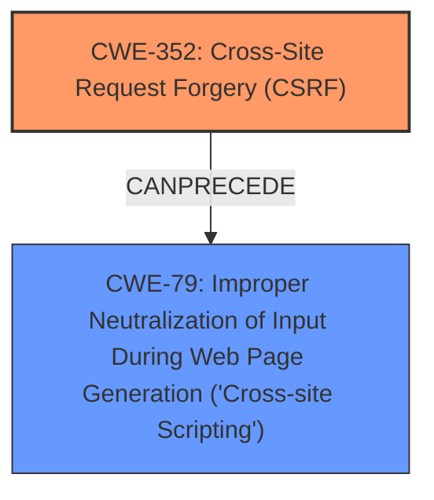

# Raw Analyzer Response for CVE-2024-50534

# Summary
| CWE ID | CWE Name | Confidence | CWE Abstraction Level | CWE Vulnerability Mapping Label | CWE-Vulnerability Mapping Notes |
|---|---|---|---|---|---|
| CWE-352 | Cross-Site Request Forgery (CSRF) | 1.0 | Compound | Primary | Allowed |
| CWE-79 | Improper Neutralization of Input During Web Page Generation ('Cross-site Scripting') | 1.0 | Base | Secondary | Allowed |

## Evidence and Confidence

*   **Confidence Score:** 1.0
*   **Evidence Strength:** HIGH

## Relationship Analysis
The primary weakness is CWE-352, indicating a **lack of CSRF protection**, which allows an attacker to induce users into performing actions they did not intend. This can then lead to a secondary weakness like CWE-79, where the attacker can inject malicious scripts into the web page through the CSRF attack, resulting in a stored cross-site scripting vulnerability. Thus, CWE-352 can precede CWE-79 in a vulnerability chain. Both CWEs are at appropriate abstraction levels (Compound and Base, respectively).

## Vulnerability Chain
The vulnerability chain starts with the **lack of CSRF protection** (CWE-352). An attacker exploits this by crafting a malicious request. If successful, this leads to a stored cross-site scripting vulnerability (CWE-79) because the application **does not neutralize input** before storing it and rendering it in a web page.

## Summary of Analysis
The analysis is based on the provided evidence from the vulnerability description, which clearly states that the application has a Cross-Site Request Forgery (CSRF) vulnerability and allows Stored **XSS**. The keyphrase analysis highlights the connection between the **lack of CSRF protection** and the resulting XSS.

The vulnerability description states: "Cross-Site Request Forgery (CSRF) vulnerability in Syed Umair Hussain Shah World Prayer Time allows Stored **XSS**." This directly links the CSRF vulnerability to the presence of stored cross-site scripting.

CWE-352 is selected as the primary CWE because the **lack of CSRF protection** is the root cause that enables the XSS vulnerability. CWE-79 is a secondary CWE because it represents the impact of the missing CSRF protection which enables the stored XSS.

The selected CWEs are at the optimal level of specificity. CWE-352 is a Compound weakness, which is appropriate for CSRF vulnerabilities. CWE-79 is a Base weakness, which accurately describes the improper neutralization of input leading to XSS.

Relevant CWE Information:

# Enhanced Context (25 CWEs)
The following CWEs were identified as potentially relevant to this vulnerability:

## CWE-80: Improper Neutralization of Script-Related HTML Tags in a Web Page (Basic XSS)
**Abstraction Level**: Variant
**Similarity Score**: 0.73
**Source**: dense

**Description**:
The product receives input from an upstream component, but it does not neutralize or incorrectly neutralizes special characters such as "<", ">", and "&" that could be interpreted as web-scripting elements when they are sent to a downstream component that processes web pages.

**Mapping Guidance**:
- Usage: Allowed
- Rationale: This CWE entry is at the Variant level of abstraction, which is a preferred level of abstraction for mapping to the root causes of vulnerabilities.

*Not Used:* While related to XSS, CWE-80 is a more specific variant of CWE-79, focusing on script-related HTML tags. Since the vulnerability description simply mentions "Stored XSS" without specifying the exact nature of the injected scripts, CWE-79 is a better fit.

## CWE-303: Incorrect Implementation of Authentication Algorithm
**Abstraction Level**: Base
**Similarity Score**: 0.73
**Source**: dense

**Description**:
The requirements for the product dictate the use of an established authentication algorithm, but the implementation of the algorithm is incorrect.

**Mapping Guidance**:
- Usage: Allowed
- Rationale: This CWE entry is at the Base level of abstraction, which is a preferred level of abstraction for mapping to the root causes of vulnerabilities.

*Not Used:* This CWE is not relevant to the vulnerability description, which focuses on CSRF and XSS.

## CWE-668: Exposure of Resource to Wrong Sphere
**Abstraction Level**: Class
**Similarity Score**: 0.73
**Source**: dense

**Description**:
The product exposes a resource to the wrong control sphere, providing unintended actors with inappropriate access to the resource.

**Mapping Guidance**:
- Usage: Discouraged
- Rationale: CWE-668 is high-level and is often misused as a catch-all when lower-level CWE IDs might be applicable. It is sometimes used for low-information vulnerability reports [REF-1287]. It is a level-1 Class (i.e., a child of a Pillar). It is not useful for trend analysis.

*Not Used:* This CWE is too general and doesn't accurately represent the specific weaknesses described in the vulnerability.

## CWE-41: Improper Resolution of Path Equivalence
**Abstraction Level**: Base
**Similarity Score**: 0.72
**Source**: dense

**Description**:
The product is vulnerable to file system contents disclosure through path equivalence. Path equivalence involves the use of special characters in file and directory names. The associated manipulations are intended to generate multiple names for the same object.

**Mapping Guidance**:
- Usage: Allowed
- Rationale: This CWE entry is at the Base level of abstraction, which is a preferred level of abstraction for mapping to the root causes of vulnerabilities.

*Not Used:* This CWE is not relevant to the vulnerability description, which focuses on CSRF and XSS.

## CWE-204: Observable Response Discrepancy
**Abstraction Level**: Base
**Similarity Score**: 0.72
**Source**: dense

**Description**:
The product provides different responses to incoming requests in a way that reveals internal state information to an unauthorized actor outside of the intended control sphere.

**Mapping Guidance**:
- Usage: Allowed
- Rationale: This CWE entry is at the Base level of abstraction, which is a preferred level of abstraction for mapping to the root causes of vulnerabilities.

*Not Used:* This CWE is not relevant to the vulnerability description, which focuses on CSRF and XSS.

## CWE-472: External Control of Assumed-Immutable Web Parameter
**Abstraction Level**: Base
**Similarity Score**: 0.72
**Source**: dense

**Description**:
The web application does not sufficiently verify inputs that are assumed to be immutable but are actually externally controllable, such as hidden form fields.

**Mapping Guidance**:
- Usage: Allowed
- Rationale: This CWE entry is at the Base level of abstraction, which is a preferred level of abstraction for mapping to the root causes of vulnerabilities.

*Not Used:* While relevant to web applications, this CWE doesn't directly address the root cause or impact described in the vulnerability.

## CWE-703: Improper Check or Handling of Exceptional Conditions
**Abstraction Level**: Pillar
**Similarity Score**: 0.72
**Source**: dense

**Description**:
The product does not properly anticipate or handle exceptional conditions that rarely occur during normal operation of the product.

**Mapping Guidance**:
- Usage: Discouraged
- Rationale: This CWE entry is extremely high-level, a Pillar.

*Not Used:* This CWE is too general and doesn't accurately represent the specific weaknesses described in the vulnerability.

## CWE-345: Insufficient Verification of Data Authenticity
**Abstraction Level**: Class
**Similarity Score**: 0.72
**Source**: dense

**Description**:
The product does not sufficiently verify the origin or authenticity of data, in a way that causes it to accept invalid data.

**Mapping Guidance**:
- Usage: Discouraged
- Rationale: This CWE entry is a level-1 Class (i.e., a child of a Pillar). It might have lower-level children that would be more appropriate

*Not Used:* While CSRF involves insufficient verification of request origin, CWE-352 is a more specific and appropriate mapping.

## CWE-425: Direct Request ('Forced Browsing')
**Abstraction Level**: Base
**Similarity Score**: 0.72
**Source**: dense

**Description**:
The web application does not adequately enforce appropriate authorization on all restricted URLs, scripts, or files.

**Mapping Guidance**:
- Usage: Allowed
- Rationale: This CWE entry is at the Base level of abstraction, which is a preferred level of abstraction for mapping to the root causes of vulnerabilities.

*Not Used:* This CWE is not relevant to the vulnerability description, which focuses on CSRF and XSS.

## CWE-1391: Use of Weak Credentials
**