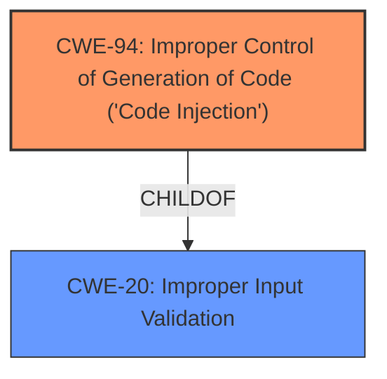

# Analysis Report for CVE-2024-50572

# Vulnerability Analysis Report: CVE-2024-50572

## Description

A vulnerability has been identified in RUGGEDCOM RM1224 LTE(4G) EU (6GK6108-4AM00-2BA2) (All versions < V8.2), RUGGEDCOM RM1224 LTE(4G) NAM (6GK6108-4AM00-2DA2) (All versions < V8.2), SCALANCE M804PB (6GK5804-0AP00-2AA2) (All versions < V8.2), SCALANCE M812-1 ADSL-Router (6GK5812-1AA00-2AA2) (All versions < V8.2), SCALANCE M812-1 ADSL-Router (6GK5812-1BA00-2AA2) (All versions < V8.2), SCALANCE M816-1 ADSL-Router (6GK5816-1AA00-2AA2) (All versions < V8.2), SCALANCE M816-1 ADSL-Router (6GK5816-1BA00-2AA2) (All versions < V8.2), SCALANCE M826-2 SHDSL-Router (6GK5826-2AB00-2AB2) (All versions < V8.2), SCALANCE M874-2 (6GK5874-2AA00-2AA2) (All versions < V8.2), SCALANCE M874-3 (6GK5874-3AA00-2AA2) (All versions < V8.2), SCALANCE M874-3 3G-Router (CN) (6GK5874-3AA00-2FA2) (All versions < V8.2), SCALANCE M876-3 (6GK5876-3AA02-2BA2) (All versions < V8.2), SCALANCE M876-3 (ROK) (6GK5876-3AA02-2EA2) (All versions < V8.2), SCALANCE M876-4 (6GK5876-4AA10-2BA2) (All versions < V8.2), SCALANCE M876-4 (EU) (6GK5876-4AA00-2BA2) (All versions < V8.2), SCALANCE M876-4 (NAM) (6GK5876-4AA00-2DA2) (All versions < V8.2), SCALANCE MUM853-1 (A1) (6GK5853-2EA10-2AA1) (All versions < V8.2), SCALANCE MUM853-1 (B1) (6GK5853-2EA10-2BA1) (All versions < V8.2), SCALANCE MUM853-1 (EU) (6GK5853-2EA00-2DA1) (All versions < V8.2), SCALANCE MUM856-1 (A1) (6GK5856-2EA10-3AA1) (All versions < V8.2), SCALANCE MUM856-1 (B1) (6GK5856-2EA10-3BA1) (All versions < V8.2), SCALANCE MUM856-1 (CN) (6GK5856-2EA00-3FA1) (All versions < V8.2), SCALANCE MUM856-1 (EU) (6GK5856-2EA00-3DA1) (All versions < V8.2), SCALANCE MUM856-1 (RoW) (6GK5856-2EA00-3AA1) (All versions < V8.2), SCALANCE S615 EEC LAN-Router (6GK5615-0AA01-2AA2) (All versions < V8.2), SCALANCE S615 LAN-Router (6GK5615-0AA00-2AA2) (All versions < V8.2). Affected devices do not properly sanitize an input field. This could allow an authenticated remote attacker with administrative privileges to inject code or spawn a system root shell.

## Vulnerability Description Key Phrases

- **Impact:** inject code or spawn a system root shell
- **Attacker:** authenticated remote attacker with administrative privileges
- **Product:** ['RUGGEDCOM RM1224 LTE(4G) EU', 'RUGGEDCOM RM1224 LTE(4G) NAM', 'SCALANCE M804PB', 'SCALANCE M812-1 ADSL-Router', 'SCALANCE M812-1 ADSL-Router', 'SCALANCE M816-1 ADSL-Router', 'SCALANCE M816-1 ADSL-Router', 'SCALANCE M826-2 SHDSL-Router', 'SCALANCE M874-2', 'SCALANCE M874-3', 'SCALANCE M874-3 3G-Router (CN)', 'SCALANCE M876-3', 'SCALANCE M876-3 (ROK)', 'SCALANCE M876-4', 'SCALANCE M876-4 (EU)', 'SCALANCE M876-4 (NAM)', 'SCALANCE MUM853-1 (A1)', 'SCALANCE MUM853-1 (B1)', 'SCALANCE MUM853-1 (EU)', 'SCALANCE MUM856-1 (A1)', 'SCALANCE MUM856-1 (B1)', 'SCALANCE MUM856-1 (CN)', 'SCALANCE MUM856-1 (EU)', 'SCALANCE MUM856-1 (RoW)', 'SCALANCE S615 EEC LAN-Router', 'SCALANCE S615 LAN-Router']
- **Version:** All versions < V8.2

## Analysis (with Relationship Data)

# Summary
| CWE ID | CWE Name | Confidence | CWE Abstraction Level | CWE Vulnerability Mapping Label | CWE-Vulnerability Mapping Notes |
|---|---|---|---|---|---|
| CWE-94 | Improper Control of Generation of Code ('Code Injection') | 0.9 | Base | Allowed-with-Review | Primary CWE: The vulnerability allows an authenticated remote attacker with administrative privileges to inject code or spawn a system root shell due to improper sanitization of an input field. |
| CWE-20 | Improper Input Validation | 0.7 | Class | Discouraged | Secondary Candidate: The root cause is an **improper sanitization of an input field** which falls under the umbrella of improper input validation. |

## Evidence and Confidence

*   **Confidence Score:** 0.8
*   **Evidence Strength:** MEDIUM

## Relationship Analysis
The primary weakness is CWE-94, which is a base-level CWE. CWE-20 is a class-level CWE and a parent of many input validation related CWEs. CWE-94 is more specific to the root cause of the vulnerability and more appropriate than CWE-20.



## Vulnerability Chain
The vulnerability chain starts with the **improper sanitization of an input field** (CWE-94). This leads to the ability to inject code and spawn a system root shell.
  - Root Cause: CWE-94
  - Impact: Code injection, System Root Shell

## Summary of Analysis
The vulnerability description indicates that the affected devices do not properly sanitize an input field, allowing an authenticated remote attacker with administrative privileges to inject code or spawn a system root shell. The primary CWE is CWE-94, which accurately reflects the root cause of the vulnerability. The "Root cause" in "CVE Reference Links Content Summary" is "Improper sanitization of an input field" which maps well to this CWE.

CWE-20 was considered because the improper sanitization of an input field falls under the umbrella of improper input validation. However, since the vulnerability specifically mentions code injection as a potential impact, CWE-94 is a more specific and appropriate choice.

Relevant CWE Information:

# Enhanced Context (25 CWEs)
The following CWEs were identified as potentially relevant to this vulnerability:

## CWE Classification Guidance

The following guidance has been automatically included because relevant keywords were detected in the vulnerability description:

### Privileges vs Permissions Guidance

## Complete CWE Specifications

CWE-94: Improper Control of Generation of Code ('Code Injection')

CWE-20: Improper Input Validation


## CWE Relationship Analysis

Current CWEs represent these abstraction levels: .


### Vulnerability Chain Analysis

**Chain starting from CWE-94:**
- 94 (Improper Control of Generation of Code ('Code Injection')) - ROOT


**Chain starting from CWE-20:**
- 20 (Improper Input Validation) - ROOT


### CWE Relationship Diagram

```mermaid
graph TD
    classDef primary fill:#f96,stroke:#333,stroke-width:2px
    classDef secondary fill:#69f,stroke:#333
    classDef tertiary fill:#9e9,stroke:#333
```


*Report generated on 2025-07-13 20:10:41*
