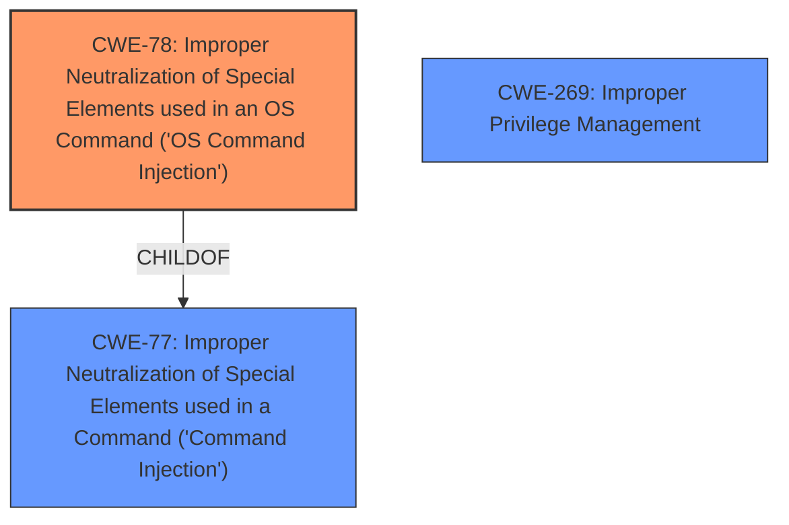

# Analysis for CVE-2024-50591

# Summary
| CWE ID | CWE Name | Confidence | CWE Abstraction Level | CWE Vulnerability Mapping Label | CWE-Vulnerability Mapping Notes |
|---|---|---|---|---|---|
| CWE-78 | Improper Neutralization of Special Elements used in an OS Command ('OS Command Injection') | 1.0 | Base | Primary CWE | Allowed |
| CWE-269 | Improper Privilege Management | 0.5 | Class | Secondary | Discouraged |

## Evidence and Confidence

*   **Confidence Score:** 0.8
*   **Evidence Strength:** HIGH

## Relationship Analysis
The primary relationship influencing the decision is the hierarchical relationship between CWE-77 (Command Injection) and CWE-78 (OS Command Injection). CWE-78 is a more specific child of CWE-77, indicating that it applies to command injection within the context of operating system commands. Given that the vulnerability involves injecting commands directly into the OS via the Elefant Update Service, CWE-78 is the more appropriate choice. CWE-269 is a Class level weakness and is too general to be considered a good fit.

## Vulnerability Chain
The vulnerability chain starts with the **improper neutralization** of input within the Elefant Update Service, leading to **command injection**. This then results in the escalation of privileges to NT AUTHORITY\SYSTEM, allowing the attacker to execute arbitrary commands on the system.

1.  **Root Cause:** **Improper Neutralization** of input in the Elefant Update Service.
2.  **Weakness:** CWE-78 Improper Neutralization of Special Elements used in an OS Command ('OS Command Injection')
3.  **Impact:** Privilege escalation to NT AUTHORITY\SYSTEM, arbitrary command execution.

## Summary of Analysis
The initial analysis identified command injection as the primary weakness, and the retriever results supported this by listing CWE-77 and CWE-78 as top candidates. After reviewing the descriptions and relationships, CWE-78 was selected as the primary CWE because it is a more specific case of command injection that directly applies to OS commands. The vulnerability description and the CVE reference summary both emphasize the **command injection** aspect, providing strong evidence for this classification.

Relevant CWE Information:

# Enhanced Context (25 CWEs)
The following CWEs were identified as potentially relevant to this vulnerability:

## CWE-78: Improper Neutralization of Special Elements used in an OS Command ('OS Command Injection')
**Abstraction Level**: base
**Similarity Score**: 4.33
**Source**: graph

**Description**:
CWE-78: Improper Neutralization of Special Elements used in an OS Command ('OS Command Injection')

**Mapping Guidance**:
- Usage: Allowed
- Rationale: This CWE entry is at the Base level of abstraction, which is a preferred level of abstraction for mapping to the root causes of vulnerabilities.

**Relationships**:
- CANFOLLOW -> CWE-184
- CANALSOBE -> CWE-88
- CHILDOF -> CWE-77
- CHILDOF -> CWE-77
- CHILDOF -> CWE-74

# Complete CWE Specifications

CWE-77: Improper Neutralization of Special Elements used in a Command ('Command Injection')
CWE-78: Improper Neutralization of Special Elements used in an OS Command ('OS Command Injection')

**CWE-78: Improper Neutralization of Special Elements used in an OS Command ('OS Command Injection')**

*   **Technical Explanation:** The Elefant Update Service **fails to properly neutralize special elements** in input received via named pipes, allowing an attacker to inject arbitrary OS commands. The commands are executed with NT AUTHORITY\SYSTEM privileges.
*   **Security Implications and Potential Impact:** An attacker can escalate privileges to NT AUTHORITY\SYSTEM and execute arbitrary code on the system. This could lead to complete system compromise.
*   **Parent-Child Relationships:** CWE-78 is a child of CWE-77, which is a broader category of command injection.
*   **Primary/Secondary:** CWE-78 is the primary weakness.
*   **MITRE Mapping Guidance:** The guidance for CWE-78 allows its use, and it is at the Base level of abstraction, which is preferred.
*   **Evidence:** "The **command injection** can be exploited by communicating with the Elefant Update Service which is running as SYSTEM via Windows Named Pipes." and "A crafted message of type MessageType.SupportServiceInfos can be sent to the local ESU service to inject commands, which are then executed as NT AUTHORITY\SYSTEM."

**CWE-269: Improper Privilege Management**

*   **Technical Explanation:** The Elefant Update Service runs as NT AUTHORITY\SYSTEM. The **command injection** vulnerability allows an attacker with local access to escalate privileges and execute arbitrary commands. While this is happening, the service does not properly manage the privileges of the user context it is operating under.
*   **Security Implications and Potential Impact:** An attacker can escalate privileges to NT AUTHORITY\SYSTEM and execute arbitrary code on the system. This could lead to complete system compromise.
*   **Parent-Child Relationships:** None.
*   **Primary/Secondary:** CWE-269 is a secondary weakness, it is the result of the **command injection**, but it is more of a symptom than the root cause.
*   **MITRE Mapping Guidance:** The guidance for CWE-269 is Discouraged because "CWE-269 is commonly misused. It can be conflated with "privilege escalation," which is a technical impact that is listed in many low-information vulnerability reports [REF-1287]. It is not useful for trend analysis."
*   **Evidence:** "An attacker with local access the to medical office computer can escalate his Windows user privileges to NT AUTHORITY\SYSTEM by exploiting a **command injection** vulnerability"