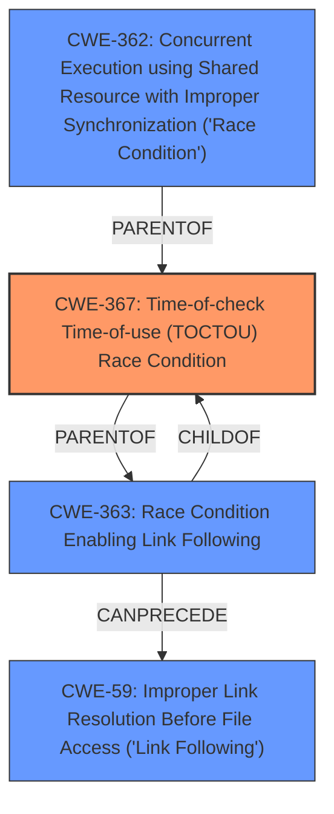

# Analysis for CVE-2024-50592

# Summary
| CWE ID | CWE Name | Confidence | CWE Abstraction Level | CWE Vulnerability Mapping Label | CWE-Vulnerability Mapping Notes |
|---|---|---|---|---|---|
| CWE-367 | Time-of-check Time-of-use (TOCTOU) Race Condition | 0.9 | Base |  Primary CWE | Allowed |
| CWE-269 | Improper Privilege Management | 0.4 | Class | Secondary Candidate | Discouraged |

## Evidence and Confidence

*   **Confidence Score:** 0.7
*   **Evidence Strength:** HIGH

## Relationship Analysis
The primary weakness is a **race condition**. The most relevant CWE is CWE-367: Time-of-check Time-of-use (TOCTOU) Race Condition, which is a base-level CWE. Although CWE-362: Concurrent Execution using Shared Resource with Improper Synchronization ('Race Condition') has the best score, it is a Class-level CWE and less specific than CWE-367. Also related is CWE-363: Race Condition Enabling Link Following which can precede CWE-59.

## Vulnerability Chain
The vulnerability chain starts with a **race condition** (CWE-367) where the Elefant Update Service copies executables to a user-writable directory. An attacker exploits this **race condition** to overwrite the executable before it is executed by the service. Because the service runs with NT AUTHORITY\SYSTEM privileges, the attacker effectively achieves privilege escalation.

## Summary of Analysis
The primary weakness is a **race condition** (CWE-367), where there is a time gap between the file copy and the execution. This allows a local attacker to overwrite the executable with a malicious one, leading to privilege escalation.

The vulnerability description mentions:
- "**race condition** in the Elefant Update Service"
- "user can overwrite either PostESUUpdate.exe or Update_OpenJava.exe in the time frame after the copy and before the execution of the final repair step"
- "The overwritten executable is then executed as NT AUTHORITY\SYSTEM."

The CVE Reference Links Content Summary also supports this:
- "The vulnerability stems from a **race condition** within the Elefant Software Updater service during the repair or update process."
- "There is a time window between the file copy and execution in the repair/update process."
- "The attacker leverages the **race condition** between the file copy and execution to inject the malicious executable."

I considered CWE-362 "Concurrent Execution using Shared Resource with Improper Synchronization ('Race Condition')", but it's a Class-level CWE, and CWE-367 is a more specific Base-level CWE that accurately describes the TOCTOU vulnerability. CWE-269 "Improper Privilege Management" was also considered due to the privilege escalation, but it's discouraged as it only describes the impact and not the root cause.

# Relevant CWE Information:

## CWE-367: Time-of-check Time-of-use (TOCTOU) Race Condition
**Abstraction Level**: Base
**Similarity Score**: 0.76
**Source**: dense

**Description**:
The product checks the state of a resource before using that resource, but the resource's state can change between the check and the use in a way that invalidates the results of the check. This can cause the product to perform invalid actions when the resource is in an unexpected state.

**Mapping Guidance**:
- Usage: Allowed
- Rationale: This CWE entry is at the Base level of abstraction, which is a preferred level of abstraction for mapping to the root causes of vulnerabilities.