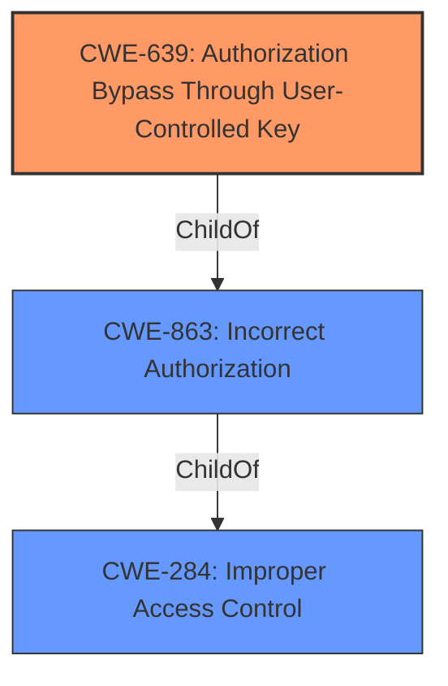

# Enhanced Analysis for CVE-2024-50633

# Summary
| CWE ID | CWE Name | Confidence | CWE Abstraction Level | CWE Vulnerability Mapping Label | CWE-Vulnerability Mapping Notes |
|---|---|---|---|---|---|
| CWE-639 | Authorization Bypass Through User-Controlled Key | 0.9 | Base | Allowed | Primary CWE. The vulnerability allows attackers to bypass authorization checks by manipulating user-controlled keys, specifically user IDs, in API requests. |
| CWE-284 | Improper Access Control | 0.7 | Pillar | Discouraged | Secondary candidate. A broader category encompassing authentication and authorization failures but less specific than CWE-639. |
| CWE-863 | Incorrect Authorization | 0.6 | Class | Allowed-with-Review | Secondary candidate. Authorization checks are performed, but incorrectly, leading to unauthorized access.|

## Evidence and Confidence

*   **Confidence Score:** 0.9
*   **Evidence Strength:** HIGH

## Relationship Analysis
The primary CWE, CWE-639, is a Base level CWE that provides a specific description of the vulnerability. CWE-284 is a Pillar level CWE representing a high-level view of access control problems and is less descriptive. CWE-863 is a Class level CWE, it is more specific than CWE-284, but it is less specific than CWE-639. The relationships are:
  - CWE-639 has no direct parent-child relationships within the provided CWEs.
  - CWE-284 is a high-level category that could encompass CWE-639, but it's less precise.
  - CWE-863 is a Class level CWE, it is more specific than CWE-284, but it is less specific than CWE-639.



## Vulnerability Chain
The vulnerability chain begins with a **Broken Object Level Authorization (BOLA)**, which leads to attackers being able to read information by sending a crafted POST request to the component /api/principals.

## Summary of Analysis
The primary CWE is CWE-639, Authorization Bypass Through User-Controlled Key, due to the **root cause** being a **Broken Object Level Authorization (BOLA)** vulnerability, where attackers can bypass authorization checks by manipulating user-controlled keys (user IDs) in API requests. This is supported by the "Root cause of vulnerability: Broken Object Level Authorization (BOLA) in Indico." from the CVE Reference Links Content Summary.
The other CWEs considered are CWE-284 and CWE-863. CWE-284 is a general category for access control issues and is less specific than CWE-639. CWE-863 describes cases where authorization checks are incorrectly performed, which is not the primary issue here. The evidence clearly points to the ability to bypass authorization checks by manipulating user-controlled keys, making CWE-639 the most appropriate and specific mapping.

Relevant CWE Information:
* **CWE-639:** Authorization Bypass Through User-Controlled Key
* **CWE-284:** Improper Access Control
* **CWE-863:** Incorrect Authorization


## CWE Relationship Analysis

Current CWEs represent these abstraction levels: .


### Vulnerability Chain Analysis

**Chain starting from CWE-284:**
- 284 (Improper Access Control) - ROOT


**Chain starting from CWE-863:**
- 863 (Incorrect Authorization) - ROOT


### CWE Relationship Diagram

```mermaid
graph TD
    classDef primary fill:#f96,stroke:#333,stroke-width:2px
    classDef secondary fill:#69f,stroke:#333
    classDef tertiary fill:#9e9,stroke:#333
```