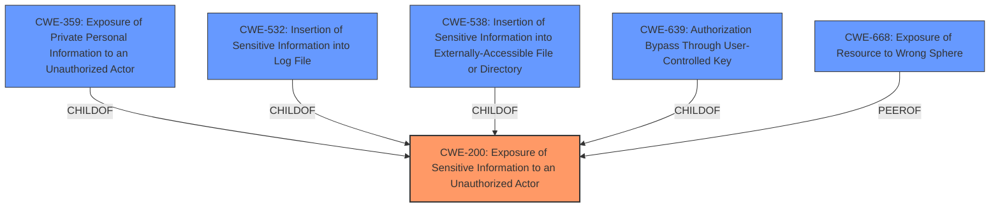

# Analysis for CVE-2024-5067

# Summary

| CWE ID  | CWE Name                                                                                | Confidence | CWE Abstraction Level | CWE Vulnerability Mapping Label | CWE-Vulnerability Mapping Notes |
| :-------- | :-------------------------------------------------------------------------------------- | :--------- | :-------------------- | :------------------------------ | :------------------------------ |
| CWE-200   | Exposure of Sensitive Information to an Unauthorized Actor                               | 0.9        | Class                   | Primary                         | Allowed                        |
| CWE-668   | Exposure of Resource to Wrong Sphere                                                | 0.7        | Class                   | Secondary                         | Discouraged                      |
| CWE-532   | Insertion of Sensitive Information into Log File                                        | 0.6        | Base                    | Secondary                         | Allowed                       |
| CWE-359   | Exposure of Private Personal Information to an Unauthorized Actor                      | 0.6        | Base                    | Secondary                         | Allowed                       |
| CWE-639   | Authorization Bypass Through User-Controlled Key                                       | 0.5        | Base                    | Secondary                         | Allowed                       |
| CWE-538   | Insertion of Sensitive Information into Externally-Accessible File or Directory       | 0.5        | Base                    | Secondary                         | Allowed                       |

## Evidence and Confidence

*   **Confidence Score:** 0.8
*   **Evidence Strength:** HIGH

## Relationship Analysis
The primary relationship influencing the decision is the hierarchical structure, specifically the parent-child relationship between CWE-200 and its more specific children. CWE-200 is chosen as the primary because the vulnerability involves the broad exposure of sensitive information. However, several child CWEs like CWE-359, CWE-532, CWE-538, and CWE-639 were considered as they represent more specific scenarios of information exposure. The relationships guide us to consider the most specific CWE that accurately fits the vulnerability details while keeping the broader context of information exposure in mind.

## Vulnerability Chain
The chain of events leading to the vulnerability can be mapped as follows:
1.  **Insufficient Access Control:** The application **does not sufficiently restrict access to sensitive information** based on roles.
2.  **Information Exposure (CWE-200):** Certain project-level analytics settings, specifically the `cube_api_key`, are exposed in the DOM to group members with Developer or higher roles.
3.  **Unauthorized Data Access:** The leaked `cube_api_key` can be used to access the `cube.dev` data source, potentially leading to data breaches and misuse of sensitive analytics information.

The **Primary CWE** is CWE-200, as it directly identifies the exposure of sensitive information.

## Summary of Analysis
The analysis is based on the provided evidence, primarily the vulnerability description and the CVE reference links content summary. The description clearly states that "certain project-level analytics settings could be leaked in DOM to group members with Developer or higher roles." The CVE reference links content summary further specifies that the `cube_api_key` is being exposed in the source code, leading to unauthorized data access.

The graph relationships influenced the final selection by highlighting the different ways in which sensitive information could be exposed, allowing for a more nuanced understanding of the vulnerability.

The selected CWEs are at the optimal level of specificity because they accurately represent the nature of the vulnerability while also considering the broader context of information exposure. CWE-200 captures the general exposure of sensitive information, while CWE-359, CWE-532, CWE-538 and CWE-639 were considered but not selected as the primary because the specific context didn't perfectly align with those more specific scenarios, although they could be secondary issues.

Relevant CWE Information:

# Enhanced Context (25 CWEs)
The following CWEs were identified as potentially relevant to this vulnerability:

## CWE-639: Authorization Bypass Through User-Controlled Key
**Abstraction Level**: Base
**Similarity Score**: 0.74
**Source**: dense

**Description**:
The system's authorization functionality does not prevent one user from gaining access to another user's data or record by modifying the key value identifying the data.

**Mapping Guidance**:
- Usage: Allowed
- Rationale: This CWE entry is at the Base level of abstraction, which is a preferred level of abstraction for mapping to the root causes of vulnerabilities.

*Considered but not chosen as primary:* While an authorization bypass is present, the primary issue is the exposure of the key itself.

## CWE-538: Insertion of Sensitive Information into Externally-Accessible File or Directory
**Abstraction Level**: Base
**Similarity Score**: 0.74
**Source**: dense

**Description**:
The product places sensitive information into files or directories that are accessible to actors who are allowed to have access to the files, but not to the sensitive information.

**Mapping Guidance**:
- Usage: Allowed
- Rationale: This CWE entry is at the Base level of abstraction, which is a preferred level of abstraction for mapping to the root causes of vulnerabilities.

*Considered but not chosen as primary:* This is a more specific scenario of information exposure, but the vulnerability involves exposure in the DOM, which isn't necessarily a file or directory.

## CWE-209: Generation of Error Message Containing Sensitive Information
**Abstraction Level**: Base
**Similarity Score**: 0.73
**Source**: dense

**Description**:
The product generates an error message that includes sensitive information about its environment, users, or associated data.

**Mapping Guidance**:
- Usage: Allowed
- Rationale: This CWE entry is at the Base level of abstraction, which is a preferred level of abstraction for mapping to the root causes of vulnerabilities.

*Not chosen:* The vulnerability is not about error messages.

## CWE-1286: Improper Validation of Syntactic Correctness of Input
**Abstraction Level**: Base
**Similarity Score**: 0.73
**Source**: dense

**Description**:
The product receives input that is expected to be well-formed - i.e., to comply with a certain syntax - but it does not validate or incorrectly validates that the input complies with the syntax.

**Mapping Guidance**:
- Usage: Allowed
- Rationale: This CWE entry is at the Base level of abstraction, which is a preferred level of abstraction for mapping to the root causes of vulnerabilities.

*Not chosen:* Input validation is not relevant to this vulnerability.

## CWE-267: Privilege Defined With Unsafe Actions
**Abstraction Level**: Base
**Similarity Score**: 0.73
**Source**: dense

**Description**:
A particular privilege, role, capability, or right can be used to perform unsafe actions that were not intended, even when it is assigned to the correct entity.

**Mapping Guidance**:
- Usage: Allowed
- Rationale: This CWE entry is at the Base level of abstraction, which is a preferred level of abstraction for mapping to the root causes of vulnerabilities.

*Considered but not chosen as primary:* While privilege levels are involved, the root cause is the information exposure, not necessarily the definition of the privileges.

## CWE-212: Improper Removal of Sensitive Information Before Storage or Transfer
**Abstraction Level**: Base
**Similarity Score**: 0.73
**Source**: dense

**Description**:
The product stores, transfers, or shares a resource that contains sensitive information, but it does not properly remove that information before the product makes the resource available to unauthorized actors.

*Not chosen:* This vulnerability is not about storage or transfer, but rather direct exposure in the DOM.

## CWE-532: Insertion of Sensitive Information into Log File
**Abstraction Level**: Base
**Similarity Score**: 0.73
**Source**: dense

**Description**:
The product writes sensitive information to a log file.

**Mapping Guidance**:
- Usage: Allowed
- Rationale: This CWE entry is at the Base level of abstraction, which is a preferred level of abstraction