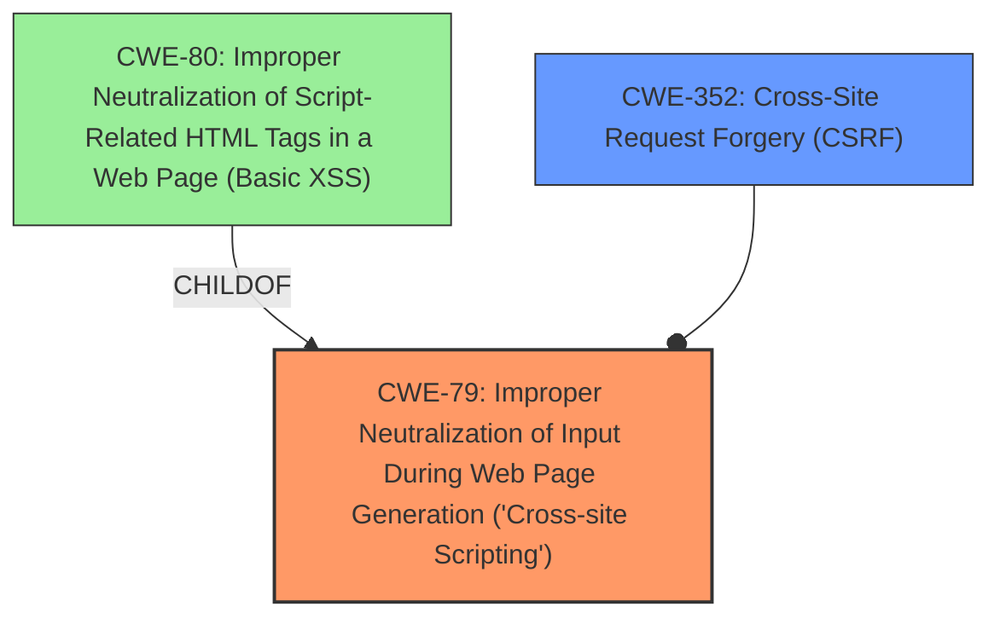

# Analysis Report for CVE-2024-50861

# Vulnerability Analysis Report: CVE-2024-50861

## Description

The ip_mod_dns_key_form.cgi request in GestioIP v3.5.7 is vulnerable to Stored XSS. An attacker can inject malicious code into the TSIG Key field, which is saved in the database and triggers XSS when viewed, enabling data exfiltration and CSRF attacks.

## Vulnerability Description Key Phrases

- **Weakness:** stored XSS
- **Impact:** ['inject malicious code', 'data exfiltration', 'XSS attacks']
- **Vector:** inject malicious code
- **Product:** GestioIP
- **Version:** v3.5.7
- **Component:** ip_mod_dns_key_form.cgi request

## Analysis (with Relationship Data)

# Summary
| CWE ID | CWE Name | Confidence | CWE Abstraction Level | CWE Vulnerability Mapping Label | CWE-Vulnerability Mapping Notes |
|---|---|---|---|---|---|
| CWE-79 | Improper Neutralization of Input During Web Page Generation ('Cross-site Scripting') | 1.0 | Base | Allowed | Primary CWE. The **weakness** is **stored XSS** and the description indicates that the product **does not neutralize or incorrectly neutralizes user-controllable input before it is placed in output that is used as a web page** which is served to other users. |
| CWE-352 | Cross-Site Request Forgery (CSRF) | 0.5 | Compound | Allowed | Secondary CWE. The impact includes CSRF attacks but there is no rootcause information to support this. |

## Evidence and Confidence

*   **Confidence Score:** 0.75
*   **Evidence Strength:** MEDIUM

## Relationship Analysis
The primary relationship that influenced the decision was the hierarchical relationship with CWE-79 as the base class for XSS vulnerabilities. While other CWEs like CWE-80 (Improper Neutralization of Script-Related HTML Tags in a Web Page (Basic XSS)) are more specific variants, the description does not provide enough detail to definitively narrow down to a specific type of XSS beyond the base class. The Retriever results suggested CWE-352 (Cross-Site Request Forgery (CSRF)) due to the potential impact, but this is secondary since the primary weakness is XSS from improper neutralization.



## Vulnerability Chain
The vulnerability chain starts with the **improper neutralization** of input in the "TSIG Key" field, leading to **stored XSS**. The impact includes **data exfiltration** and potential **CSRF attacks**.

## Summary of Analysis
The initial analysis focused on identifying the root cause of the vulnerability, which the description clearly states is **stored XSS** due to **improper neutralization** of input. The retriever results supported this with CWE-79 (Improper Neutralization of Input During Web Page Generation ('Cross-site Scripting')) being the top candidate. The relationship analysis reinforced this by highlighting the hierarchical structure with more specific XSS variants. The final decision was to map to the base CWE-79 due to the lack of specific details beyond the general XSS weakness. I also considered CWE-352 (Cross-Site Request Forgery (CSRF)) as a secondary weakness due to the mention of CSRF attacks in the impact, although the evidence is weak.

Relevant CWE Information:

# Enhanced Context (25 CWEs)
The following CWEs were identified as potentially relevant to this vulnerability:

## CWE-80: Improper Neutralization of Script-Related HTML Tags in a Web Page (Basic XSS)
**Abstraction Level**: Variant
**Similarity Score**: 0.75
**Source**: dense

**Description**:
The product receives input from an upstream component, but it does not neutralize or incorrectly neutralizes special characters such as "<", ">", and "&" that could be interpreted as web-scripting elements when they are sent to a downstream component that processes web pages.

**Mapping Guidance**:
- Usage: Allowed
- Rationale: This CWE entry is at the Variant level of abstraction, which is a preferred level of abstraction for mapping to the root causes of vulnerabilities.

CWE-80 was considered but not chosen as there was no specific information about HTML tag handling.

## CWE-74: Improper Neutralization of Special Elements in Output Used by a Downstream Component ('Injection')
**Abstraction Level**: Class
**Similarity Score**: 0.72
**Source**: dense

**Description**:
The product constructs all or part of a command, data structure, or record using externally-influenced input from an upstream component, but it does not neutralize or incorrectly neutralizes special elements that could modify how it is parsed or interpreted when it is sent to a downstream component.

**Mapping Guidance**:
- Usage: Discouraged
- Rationale: CWE-74 is high-level and often misused when lower-level weaknesses are more appropriate.

CWE-74 was not chosen because it is a class level CWE.

## CWE-79: Improper Neutralization of Input During Web Page Generation ('Cross-site Scripting')
**Abstraction Level**: Base
**Similarity Score**: 0.71
**Source**: dense

**Description**:
The product does not neutralize or incorrectly neutralizes user-controllable input before it is placed in output that is used as a web page that is served to other users.

**Mapping Guidance**:
- Usage: Allowed
- Rationale: This CWE entry is at the Base level of abstraction, which is a preferred level of abstraction for mapping to the root causes of vulnerabilities.

CWE-79 was selected as the primary CWE.

## CWE-116: Improper Encoding or Escaping of Output
**Abstraction Level**: Class
**Similarity Score**: 0.71
**Source**: dense

**Description**:
The product prepares a structured message for communication with another component, but encoding or escaping of the data is either missing or done incorrectly. As a result, the intended structure of the message is not preserved.

**Mapping Guidance**:
- Usage: Allowed-with-Review
- Rationale: This CWE entry is a Class and might have Base-level children that would be more appropriate

CWE-116 was considered but not chosen as it is class level and XSS is a better fit.

## CWE-425: Direct Request ('Forced Browsing')
**Abstraction Level**: Base
**Similarity Score**: 0.71
**Source**: dense

**Description**:
The web application does not adequately enforce appropriate authorization on all restricted URLs, scripts, or files.

**Mapping Guidance**:
- Usage: Allowed
- Rationale: This CWE entry is at the Base level of abstraction, which is a preferred level of abstraction for mapping to the root causes of vulnerabilities.

CWE-425 was not chosen as there was no mention of authorization issues.

## CWE-472: External Control of Assumed-Immutable Web Parameter
**Abstraction Level**: Base
**Similarity Score**: 0.71
**Source**: dense

**Description**:
The web application does not sufficiently verify inputs that are assumed to be immutable but are actually externally controllable, such as hidden form fields.

**Mapping Guidance**:
- Usage: Allowed
- Rationale: This CWE entry is at the Base level of abstraction, which is a preferred level of abstraction for mapping to the root causes of vulnerabilities.

CWE-472 was not chosen as there was no mention of immutable web parameters.

## CWE-346: Origin Validation Error
**Abstraction Level**: Class
**Similarity Score**: 0.70
**Source**: dense

**Description**:
The product does not properly verify that the source of data or communication is valid.

**Mapping Guidance**:
- Usage: Allowed-with-Review
- Rationale: This CWE entry is a Class and might have Base-level children that would be more appropriate

CWE-346 was not chosen as there was no mention of source validation issues.

## CWE-1286: Improper Validation of Syntactic Correctness of Input
**Abstraction Level**: Base
**Similarity Score**: 0.70
**Source**: dense

**Description**:
The product receives input that is expected to be well-formed - i.e., to comply with a certain syntax - but it does not validate or incorrectly validates that the input complies with the syntax.

**Mapping Guidance**:
- Usage: Allowed
- Rationale: This CWE entry is at the Base level of abstraction, which is a preferred level of abstraction for mapping to the root causes of vulnerabilities.

CWE-1286 was not chosen as there was no mention of syntactic correctness issues.

## CWE-434: Unrestricted Upload of File with Dangerous Type
**Abstraction Level**: Base
**Similarity Score**: 0.70
**Source**: dense

**Description**:
The product allows the upload or transfer of dangerous file types that are automatically processed within its environment.

**Mapping Guidance**:
- Usage: Allowed
- Rationale: This CWE entry is at the Base level of abstraction, which is a preferred level of abstraction for mapping to the root causes of vulnerabilities.

CWE-434 was not chosen as there was no mention of file uploads.

## CWE-918: Server-Side Request Forgery (SSRF)
**Abstraction Level**: Base
**Similarity Score**: 0.70


## CWE Relationship Analysis

Current CWEs represent these abstraction levels: .


### Vulnerability Chain Analysis

**Chain starting from CWE-116:**
- 116 (Improper Encoding or Escaping of Output) - ROOT


**Chain starting from CWE-80:**
- 80 (Improper Neutralization of Script-Related HTML Tags in a Web Page (Basic XSS)) - ROOT


### CWE Relationship Diagram

```mermaid
graph TD
    classDef primary fill:#f96,stroke:#333,stroke-width:2px
    classDef secondary fill:#69f,stroke:#333
    classDef tertiary fill:#9e9,stroke:#333
```


*Report generated on 2025-07-13 20:19:19*
