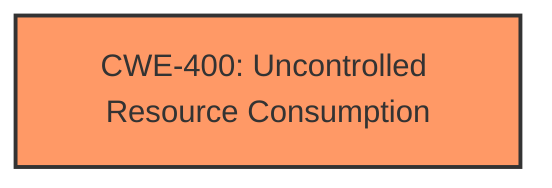

# Analysis for CVE-2024-50953

# Summary
| CWE ID | CWE Name | Confidence | CWE Abstraction Level | CWE Vulnerability Mapping Label | CWE-Vulnerability Mapping Notes |
|---|---|---|---|---|---|
| CWE-400 | Uncontrolled Resource Consumption | 0.7 | Class | Primary | Discouraged |

## Evidence and Confidence

*   **Confidence Score:** 0.7
*   **Evidence Strength:** LOW

## Relationship Analysis
The primary CWE considered was CWE-400 (**Uncontrolled Resource Consumption**), which is a Class-level CWE. No specific child CWEs were identified that would provide a more precise classification based on the limited information. The retriever results suggested several potential CWEs related to buffer overflows and input validation, but these were deemed less relevant as the vulnerability description only mentions a "crafted Modbus message" leading to a denial of service. The lack of detail prevents a more specific classification.

## Vulnerability Chain
The vulnerability chain consists of:
1.  A crafted Modbus message (root cause, unspecified CWE)
2.  **Uncontrolled Resource Consumption** (CWE-400)
3.  Denial of Service (DoS)

The provided information does not allow for identifying the specific weakness in the Modbus message parsing or handling that leads to resource consumption.

## Summary of Analysis
The initial assessment focused on identifying a CWE that describes the root cause of the denial of service. The description mentions a crafted Modbus message leading to a Denial of Service. The best fit appears to be CWE-400 (**Uncontrolled Resource Consumption**), as it directly relates to the impact of the vulnerability.

The evidence is weak because the description does not specify the nature of the crafted message or the mechanism by which it leads to resource consumption. Ideally, the CWE would identify the specific **improper** handling of the Modbus message. Lacking this, CWE-400 is chosen as the next best option.

The selection of CWE-400 is at a higher level of abstraction (Class). Ideally, a more specific Base or Variant CWE would be preferred if more details were available. The lack of specific information about the **root cause** prevents a more precise classification.

Relevant CWE Information:

# Enhanced Context (25 CWEs)
The following CWEs were identified as potentially relevant to this vulnerability:

## CWE-400: Uncontrolled Resource Consumption
**Abstraction Level**: Class
**Similarity Score**: 0.71
**Source**: dense

**Description**:
The product does not properly control the allocation and maintenance of a limited resource, thereby enabling an actor to influence the amount of resources consumed, eventually leading to the exhaustion of available resources.

**Mapping Guidance**:
- Usage: Discouraged
- Rationale: CWE-400 is intended for incorrect behaviors in which the product is expected to track and restrict how many resources it consumes, but CWE-400 is often misused because it is conflated with the "technical impact" of vulnerabilities in which resource consumption occurs. It is sometimes used for low-information vulnerability reports. It is a level-1 Class (i.e., a child of a Pillar).