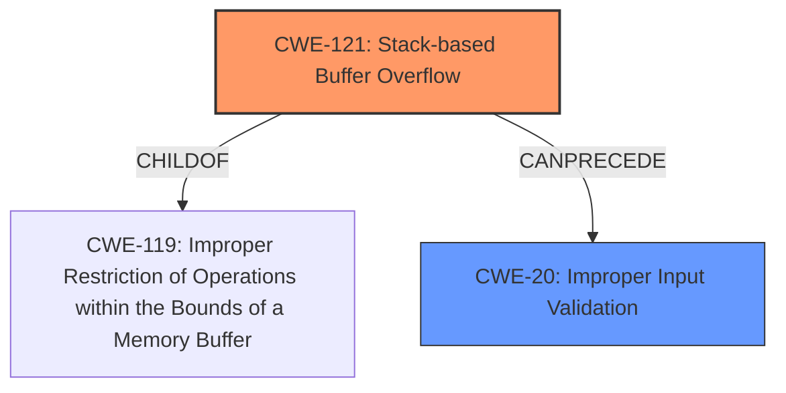

# Enhanced Analysis for CVE-2024-50994

# Summary
| CWE ID | CWE Name | Confidence | CWE Abstraction Level | CWE Vulnerability Mapping Label | CWE-Vulnerability Mapping Notes |
|---|---|---|---|---|---|
| CWE-121 | Stack-based Buffer Overflow | 1.0 | Variant | Allowed | Primary CWE |
| CWE-20 | Improper Input Validation | 0.6 | Class | Discouraged | Secondary Candidate |

## Evidence and Confidence

*   **Confidence Score:** 0.8
*   **Evidence Strength:** MEDIUM

## Relationship Analysis
The primary CWE is CWE-121 (Stack-based Buffer Overflow), which is a variant of CWE-119 (Improper Restriction of Operations within the Bounds of a Memory Buffer). CWE-20 (Improper Input Validation) is a class-level CWE that could apply as a broader issue. The relationship between CWE-121 and CWE-119 indicates a hierarchical structure where the more specific CWE-121 is preferred when the overflow occurs on the stack.



## Vulnerability Chain
The vulnerability chain starts with **stack overflow** due to insufficient input validation, which leads to a Denial of Service (DoS).
- **Root Cause:** CWE-121 (Stack-based Buffer Overflow) due to the parameters ipv6_wan_ipaddr, ipv6_lan_ipaddr, ipv6_wan_length, and ipv6_lan_length not being properly validated.
- **Impact:** Denial of Service (DoS).

## Summary of Analysis
The vulnerability description clearly states a **stack overflow** in the Netgear R8500 device. The key phrase "**stack overflow**" directly maps to CWE-121 (Stack-based Buffer Overflow). The crafted POST request exploiting parameters ipv6_wan_ipaddr, ipv6_lan_ipaddr, ipv6_wan_length, and ipv6_lan_length within the ipv6_fix.cgi component provides sufficient context to identify CWE-121 as the primary weakness.

CWE-20 (Improper Input Validation) could be considered a secondary weakness because the stack overflow likely stems from **missing** or **improper input validation** of the parameters. However, since the description explicitly mentions the type of buffer overflow (stack-based), CWE-121 is a more specific and appropriate choice for the primary CWE.

The retriever results also strongly suggest CWE-121 as the best match, with a score of 1.0.

I am selecting CWE-121 as the primary CWE because the vulnerability description explicitly mentions a **stack overflow**. This aligns perfectly with the definition of CWE-121.

Relevant CWE Information:

# Enhanced Context (25 CWEs)
The following CWEs were identified as potentially relevant to this vulnerability:

## CWE-121: Stack-based Buffer Overflow
**Abstraction Level**: Variant
**Similarity Score**: 0.73
**Source**: dense

**Description**:
A stack-based buffer overflow condition is a condition where the buffer being overwritten is allocated on the stack (i.e., is a local variable or, rarely, a parameter to a function).

**Mapping Guidance**:
- Usage: Allowed
- Rationale: This CWE entry is at the Variant level of abstraction, which is a preferred level of abstraction for mapping to the root causes of vulnerabilities.

## CWE-20: Improper Input Validation
**Abstraction Level**: class
**Similarity Score**: 2.55
**Source**: graph

**Description**:
CWE-20: Improper Input Validation

**Mapping Guidance**:
- Usage: Discouraged
- Rationale: CWE-20 is commonly misused in low-information vulnerability reports when lower-level CWEs could be used instead, or when more details about the vulnerability are available [REF-1287]. It is not useful for trend analysis. It is also a level-1 Class (i.e., a child of a Pillar).


## CWE Relationship Analysis

Current CWEs represent these abstraction levels: .


### Vulnerability Chain Analysis

**Chain starting from CWE-119:**
- 119 (Improper Restriction of Operations within the Bounds of a Memory Buffer) - ROOT


**Chain starting from CWE-121:**
- 121 (Stack-based Buffer Overflow) - ROOT


### CWE Relationship Diagram

```mermaid
graph TD
    classDef primary fill:#f96,stroke:#333,stroke-width:2px
    classDef secondary fill:#69f,stroke:#333
    classDef tertiary fill:#9e9,stroke:#333
```