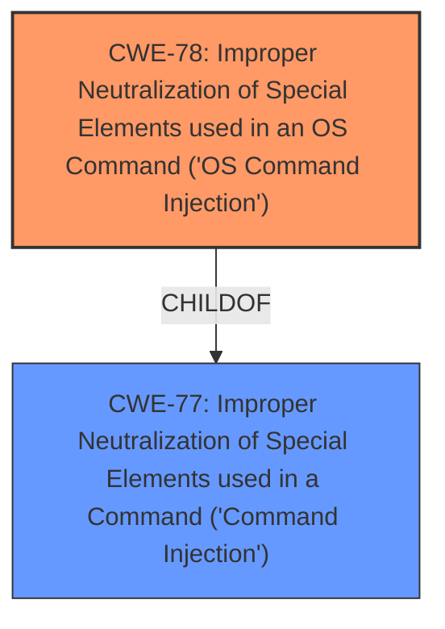

# Raw Analyzer Response for CVE-2024-50999

# Summary
| CWE ID | CWE Name | Confidence | CWE Abstraction Level | CWE Vulnerability Mapping Label | CWE-Vulnerability Mapping Notes |
|---|---|---|---|---|---|
| CWE-78 | Improper Neutralization of Special Elements used in an OS Command ('OS Command Injection') | 1.0 | Base | Allowed | Primary CWE. The vulnerability description explicitly states a command injection vulnerability, and CWE-78 directly addresses OS command injection. |

## Evidence and Confidence

*   **Confidence Score:** 1.0
*   **Evidence Strength:** HIGH

## Relationship Analysis
The primary relationship considered here is the ChildOf relationship between CWE-78 and CWE-77. While CWE-77 (Improper Neutralization of Special Elements used in a Command ('Command Injection')) is a broader class, the description explicitly mentions OS commands, making CWE-78 the more specific and appropriate choice.

## Vulnerability Chain
The vulnerability chain starts with the **improper neutralization** of special elements within the `sysNewPasswd` parameter. This leads to the execution of arbitrary OS commands.
  - **Root Cause:** CWE-78 Improper Neutralization of Special Elements used in an OS Command ('OS Command Injection')
  - **Impact:** Execution of arbitrary OS commands.

## Summary of Analysis
The initial assessment strongly points to CWE-78 as the primary weakness. The vulnerability description clearly states that the vulnerability is a "**command injection**" vulnerability in the `sysNewPasswd` parameter, leading to the ability to execute arbitrary OS commands. This aligns directly with the definition of CWE-78: "The product constructs all or part of an OS command using externally-influenced input...but it does not neutralize or incorrectly neutralizes special elements that could modify the intended OS command."

The relationship analysis reinforces this choice. While CWE-77 is a parent class, the explicit mention of "OS commands" necessitates the more specific CWE-78.

The final selection of CWE-78 is at the optimal level of specificity, as it directly addresses the root cause of the vulnerability, which is the **improper neutralization** of special elements leading to OS command execution.

Relevant CWE Information:

# Enhanced Context (25 CWEs)
The following CWEs were identified as potentially relevant to this vulnerability:

## CWE-77: Improper Neutralization of Special Elements used in a Command ('Command Injection')
**Abstraction Level**: Class
**Similarity Score**: 0.76
**Source**: dense

**Description**:
The product constructs all or part of a command using externally-influenced input from an upstream component, but it does not neutralize or incorrectly neutralizes special elements that could modify the intended command when it is sent to a downstream component.

**Mapping Guidance**:
- Usage: Allowed-with-Review
- Rationale: CWE-77 is often misused when OS command injection (CWE-78) was intended instead [REF-1287].

*Justification for not selecting CWE-77*: While CWE-77 is a closely related class, the vulnerability description specifically mentions "OS commands," making CWE-78 a more precise and accurate classification. The Rationale for CWE-77 even mentions to check if CWE-78 was intended instead.

## CWE-78: Improper Neutralization of Special Elements used in an OS Command ('OS Command Injection')
**Abstraction Level**: Base
**Similarity Score**: 0.75
**Source**: dense

**Description**:
The product constructs all or part of an OS command using externally-influenced input from an upstream component, but it does not neutralize or incorrectly neutralizes special elements that could modify the intended OS command when it is sent to a downstream component.

**Mapping Guidance**:
- Usage: Allowed
- Rationale: This CWE entry is at the Base level of abstraction, which is a preferred level of abstraction for mapping to the root causes of vulnerabilities.

*Justification for selecting CWE-78*: The vulnerability description explicitly identifies a **command injection** vulnerability that allows attackers to execute arbitrary OS commands via a crafted request. This aligns perfectly with the description of CWE-78.

## CWE-89: Improper Neutralization of Special Elements used in an SQL Command ('SQL Injection')
**Abstraction Level**: Base
**Similarity Score**: 724.81
**Source**: sparse

**Description**:
The product constructs all or part of an SQL command using externally-influenced input from an upstream component, but it does not neutralize or incorrectly neutralizes special elements that could modify the intended SQL command when it is sent to a downstream component. Without sufficient removal or quoting of SQL syntax in user-controllable inputs, the generated SQL query can cause those inputs to be interpreted as SQL instead of ordinary user data.

**Mapping Guidance**:
- Usage: Allowed
- Rationale: This CWE entry is at the Base level of abstraction, which is a preferred level of abstraction for mapping to the root causes of vulnerabilities.

*Justification for not selecting CWE-89*: The vulnerability description does not mention any SQL commands or databases, thus SQL injection is not present.

## CWE-74: Improper Neutralization of Special Elements in Output Used by a Downstream Component ('Injection')
**Abstraction Level**: Class
**Similarity Score**: 696.82
**Source**: sparse

**Description**:
The product constructs all or part of a command, data structure, or record using externally-influenced input from an upstream component, but it does not neutralize or incorrectly neutralizes special elements that could modify how it is parsed or interpreted when it is sent to a downstream component.

**Mapping Guidance**:
- Usage: Discouraged
- Rationale: CWE-74 is high-level and often misused when lower-level weaknesses are more appropriate.

*Justification for not selecting CWE-74*: While this is an injection issue, the description is too generic. It's more appropriate to use a more specific CWE ID for command injection such as CWE-78.

## CWE-79: Improper Neutralization of Input During Web Page Generation ('Cross-site Scripting')
**Abstraction Level**: base
**Similarity Score**: 3.89
**Source**: graph

**Description**:
CWE-79: Improper Neutralization of Input During Web Page Generation ('Cross-site Scripting')

**Mapping Guidance**:
- Usage: Allowed
- Rationale: This CWE entry is at the Base level of abstraction, which is a preferred level of abstraction for mapping to the root causes of vulnerabilities.

*Justification for not selecting CWE-79*: The vulnerability description does not mention anything related to web page generation or cross-site scripting.

## Other CWEs Considered:
CWE-1391, CWE-288, CWE-790, CWE-425, CWE-259, CWE-798, CWE-497, CWE-138, CWE-116, CWE-1336, CWE-117, CWE-321, CWE-113, CWE-96, CWE-184 - These CWEs were considered but ultimately not selected because they did not align with the specific details of the vulnerability description, which clearly indicated a command injection issue.