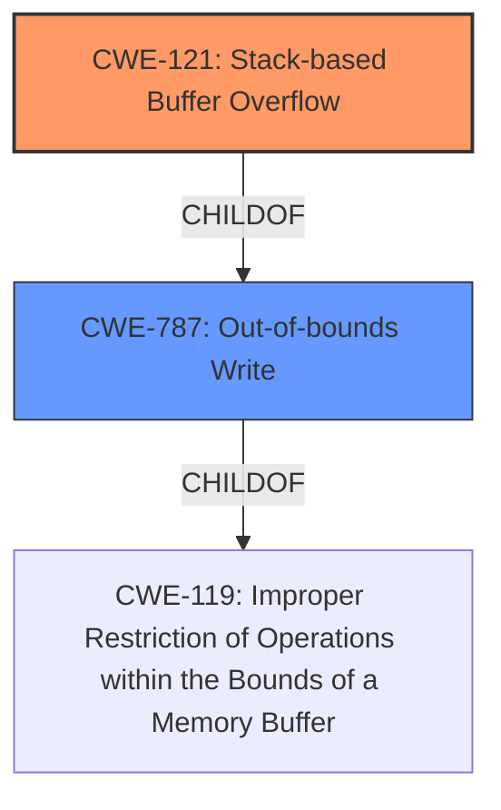

# Enhanced Analysis for CVE-2024-51007

# Summary
| CWE ID | CWE Name | Confidence | CWE Abstraction Level | CWE Vulnerability Mapping Label | CWE-Vulnerability Mapping Notes |
|---|---|---|---|---|---|
| CWE-121 | Stack-based Buffer Overflow | 0.9 | Variant | Primary | Allowed |
| CWE-787 | Out-of-bounds Write | 0.6 | Base | Secondary | Allowed |

## Evidence and Confidence

*   **Confidence Score:** 0.8
*   **Evidence Strength:** MEDIUM

## Relationship Analysis
The primary relationship is that CWE-121 [Stack-based Buffer Overflow] is a variant of a more general out-of-bounds write, CWE-787 [Out-of-bounds Write]. CWE-121 focuses on the location of the buffer (stack), which is specified in the vulnerability description. CWE-121 is a more precise characterization of the vulnerability than its parent.



## Vulnerability Chain
The vulnerability chain starts with a **stack overflow** due to **improper handling of the passphrase parameter**, leading to a denial-of-service condition.
  - Root Cause: Stack-based Buffer Overflow (CWE-121)
  - Impact: Denial of Service (DoS)

## Summary of Analysis
The primary weakness is a **stack overflow** caused by a crafted POST request to wireless.cgi using the passphrase parameter. This directly aligns with CWE-121 [Stack-based Buffer Overflow] because the overflow occurs on the stack. While the vulnerability could also be described as CWE-787 [Out-of-bounds Write], CWE-121 provides a more specific classification since the overflow occurs on the stack. The evidence is moderate, relying on the description stating "stack overflow." The retriever results also list CWE-121 as the top candidate.

The CWE selection is based on the following evidence:
*   The vulnerability description explicitly states "stack overflow"
*   The retriever results list CWE-121 [Stack-based Buffer Overflow] as the best match.

Other CWEs Considered:
*   CWE-120 [Buffer Copy without Checking Size of Input ('Classic Buffer Overflow')]: Considered but not used because the description does not mention copying without checking size, only a general stack overflow.
*   CWE-787 [Out-of-bounds Write]: Considered as a secondary CWE as it is a parent of CWE-121, but CWE-121 is more specific.


## CWE Relationship Analysis

Current CWEs represent these abstraction levels: .


### Vulnerability Chain Analysis

**Chain starting from CWE-119:**
- 119 (Improper Restriction of Operations within the Bounds of a Memory Buffer) - ROOT


**Chain starting from CWE-121:**
- 121 (Stack-based Buffer Overflow) - ROOT


### CWE Relationship Diagram

```mermaid
graph TD
    classDef primary fill:#f96,stroke:#333,stroke-width:2px
    classDef secondary fill:#69f,stroke:#333
    classDef tertiary fill:#9e9,stroke:#333
```