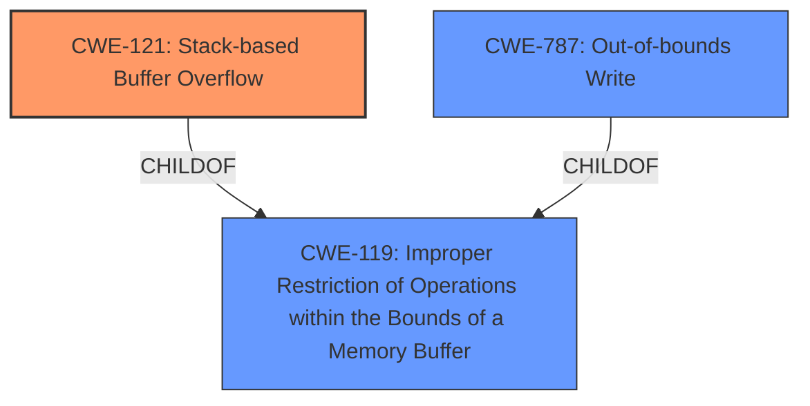

# Analysis for CVE-2024-51019

# Summary
| CWE ID | CWE Name | Confidence | CWE Abstraction Level | CWE Vulnerability Mapping Label | CWE-Vulnerability Mapping Notes |
|---|---|---|---|---|---|
| CWE-121 | Stack-based Buffer Overflow | 1.0 | Variant | Primary | Allowed |
| CWE-787 | Out-of-bounds Write | 0.5 | Base | Secondary Candidate | Allowed |

## Evidence and Confidence

*   **Confidence Score:** 0.8
*   **Evidence Strength:** MEDIUM

## Relationship Analysis
The primary CWE is CWE-121, which is a variant of buffer overflow. CWE-787 is also an out-of-bounds write, which is related.

## Vulnerability Chain
The vulnerability chain starts with a **stack overflow** due to a crafted POST request, leading to a Denial of Service (DoS).

## Summary of Analysis
The vulnerability description clearly states that a **stack overflow** exists in Netgear R7000P v1.3.3.154 via the pppoe_localnetmask parameter at pppoe.cgi. The crafted POST request triggers the **stack overflow**, causing a Denial of Service (DoS).

The Retriever Results also list CWE-121 as the top match with a score of 1.0.

CWE-121 (Stack-based Buffer Overflow) is the most appropriate because the vulnerability description specifically mentions a **stack overflow**.
CWE-787 (Out-of-bounds Write) is considered as a secondary candidate because a stack overflow often leads to an out-of-bounds write.

Relevant CWE Information:

# Enhanced Context (25 CWEs)
The following CWEs were identified as potentially relevant to this vulnerability:

## CWE-121: Stack-based Buffer Overflow
**Abstraction Level**: Variant
**Similarity Score**: 0.72
**Source**: dense

**Description**:
A stack-based buffer overflow condition is a condition where the buffer being overwritten is allocated on the stack (i.e., is a local variable or, rarely, a parameter to a function).

**Mapping Guidance**:
- Usage: Allowed
- Rationale: This CWE entry is at the Variant level of abstraction, which is a preferred level of abstraction for mapping to the root causes of vulnerabilities.

## CWE-787: Out-of-bounds Write
**Abstraction Level**: base
**Similarity Score**: 2.28
**Source**: graph

**Description**:
CWE-787: Out-of-bounds Write

**Mapping Guidance**:
- Usage: Allowed
- Rationale: This CWE entry is at the Base level of abstraction, which is a preferred level of abstraction for mapping to the root causes of vulnerabilities.