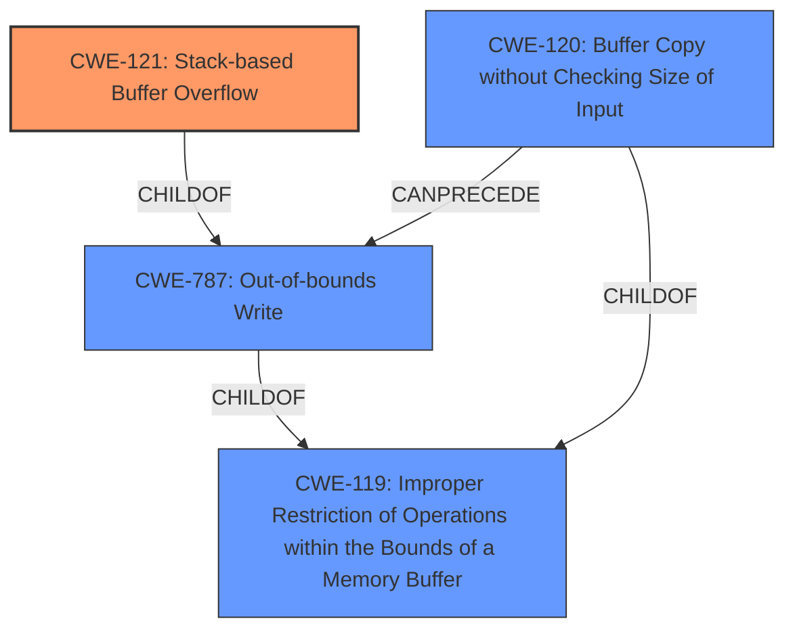

# Analysis Report for CVE-2024-51022

# Vulnerability Analysis Report: CVE-2024-51022

## Description

Netgear XR300 v1.0.3.78 was discovered to contain a **stack overflow** via the ssid parameter in bridge_wireless_main.cgi. This vulnerability allows attackers to cause a Denial of Service (DoS) via a crafted POST request.

## Vulnerability Description Key Phrases

- **Weakness:** stack overflow
- **Impact:** Denial of Service (DoS)
- **Vector:** crafted POST request
- **Attacker:** attackers
- **Product:** Netgear XR300
- **Version:** v1.0.3.78
- **Component:** bridge_wireless_main.cgi

## Analysis (with Relationship Data)

# Summary
| CWE ID | CWE Name | Confidence | CWE Abstraction Level | CWE Vulnerability Mapping Label | CWE-Vulnerability Mapping Notes |
|---|---|---|---|---|---|
| CWE-121 | Stack-based Buffer Overflow | 1.0 | Variant | Allowed | Primary CWE |
| CWE-787 | Out-of-bounds Write | 0.7 | Base | Allowed | Secondary Candidate |
| CWE-120 | Buffer Copy without Checking Size of Input ('Classic Buffer Overflow') | 0.6 | Base | Allowed-with-Review | Secondary Candidate |

## Evidence and Confidence

*   **Confidence Score:** 0.9
*   **Evidence Strength:** MEDIUM

## Relationship Analysis
The primary identified weakness is a stack-based buffer overflow (CWE-121). This is a variant of the broader class of buffer overflows. CWE-121 is a more specific case of CWE-787 (Out-of-bounds Write) and CWE-119 (Improper Restriction of Operations within the Bounds of a Memory Buffer). CWE-120 (Buffer Copy without Checking Size of Input) is also related as it is a common cause of buffer overflows. The relationships help to refine the selection from general buffer overflows to the more specific stack-based overflow.



## Vulnerability Chain
The vulnerability chain starts with a crafted POST request containing an overly long 'ssid' parameter. This input is then processed by 'bridge_wireless_main.cgi' without proper size validation, leading to a **stack overflow**. The **stack overflow** (CWE-121) allows an attacker to overwrite memory on the stack, potentially leading to denial of service.

## Summary of Analysis
The analysis indicates a **stack overflow** vulnerability in Netgear XR300 due to **improper handling** of the 'ssid' parameter within the 'bridge_wireless_main.cgi' component. The primary CWE is CWE-121 (Stack-based Buffer Overflow), as the overflow occurs on the stack.

The initial assessment considered CWE-120 (Buffer Copy without Checking Size of Input) because it is a top CWE for similar CVE descriptions and a common cause of overflows. However, the description specifically mentions "stack overflow," making CWE-121 a more precise classification. CWE-787 (Out-of-bounds Write) is also relevant as a broader category that includes stack overflows, but CWE-121 is more specific.

The decision to select CWE-121 is based on the explicit mention of "stack overflow" in the vulnerability description. The retriever results also list CWE-121 with a high score. The relationship analysis confirms that CWE-121 is a specific type of out-of-bounds write, reinforcing its appropriateness.

The selected CWEs are at the optimal level of specificity because CWE-121 is a variant-level CWE that directly describes the type of buffer overflow. While CWE-787 is a valid, more general, classification, CWE-121 provides more precise information about the vulnerability.

Relevant CWE Information:

# Enhanced Context (25 CWEs)
The following CWEs were identified as potentially relevant to this vulnerability:

## CWE-77: Improper Neutralization of Special Elements used in a Command ('Command Injection')
**Abstraction Level**: Class
**Similarity Score**: 0.72
**Source**: dense

**Description**:
The product constructs all or part of a command using externally-influenced input from an upstream component, but it does not neutralize or incorrectly neutralizes special elements that could modify the intended command when it is sent to a downstream component.

**Mapping Guidance**:
- Usage: Allowed-with-Review
- Rationale: CWE-77 is often misused when OS command injection (CWE-78) was intended instead [REF-1287].

*Not Selected*: This CWE is not relevant as the vulnerability is a buffer overflow, not command injection.

## CWE-121: Stack-based Buffer Overflow
**Abstraction Level**: Variant
**Similarity Score**: 0.71
**Source**: dense

**Description**:
A stack-based buffer overflow condition is a condition where the buffer being overwritten is allocated on the stack (i.e., is a local variable or, rarely, a parameter to a function).

**Mapping Guidance**:
- Usage: Allowed
- Rationale: This CWE entry is at the Variant level of abstraction, which is a preferred level of abstraction for mapping to the root causes of vulnerabilities.

*Selected*: This CWE is the primary choice as the vulnerability description explicitly mentions a "stack overflow."

## CWE-134: Use of Externally-Controlled Format String
**Abstraction Level**: Base
**Similarity Score**: 0.71
**Source**: dense

**Description**:
The product uses a function that accepts a format string as an argument, but the format string originates from an external source.

**Mapping Guidance**:
- Usage: Allowed
- Rationale: This CWE entry is at the Base level of abstraction, which is a preferred level of abstraction for mapping to the root causes of vulnerabilities.

*Not Selected*: This CWE is not relevant as the vulnerability is a buffer overflow, not a format string vulnerability.

## CWE-755: Improper Handling of Exceptional Conditions
**Abstraction Level**: Class
**Similarity Score**: 0.70
**Source**: dense

**Description**:
The product does not handle or incorrectly handles an exceptional condition.

**Mapping Guidance**:
- Usage: Discouraged
- Rationale: This CWE entry is a level-1 Class (i.e., a child of a Pillar). It might have lower-level children that would be more appropriate

*Not Selected*: This is too general. The specific exceptional condition is a buffer overflow.

## CWE-78: Improper Neutralization of Special Elements used in an OS Command ('OS Command Injection')
**Abstraction Level**: Base
**Similarity Score**: 0.69
**Source**: dense

**Description**:
The product constructs all or part of an OS command using externally-influenced input from an upstream component, but it does not neutralize or incorrectly neutralizes special elements that could modify the intended OS command when it is sent to a downstream component.

**Mapping Guidance**:
- Usage: Allowed
- Rationale: This CWE entry is at the Base level of abstraction, which is a preferred level of abstraction for mapping to the root causes of vulnerabilities.

*Not Selected*: This CWE is not relevant as the vulnerability is a buffer overflow, not command injection.

## CWE-288: Authentication Bypass Using an Alternate Path or Channel
**Abstraction Level**: Base
**Similarity Score**: 0.69
**Source**: dense

**Description**:
The product requires authentication, but the product has an alternate path or channel that does not require authentication.

**Mapping Guidance**:
- Usage: Allowed
- Rationale: This CWE entry is at the Base level of abstraction, which is a preferred level of abstraction for mapping to the root causes of vulnerabilities.

*Not Selected*: This CWE is not relevant as the vulnerability is a buffer overflow, not an authentication bypass.

## CWE-912: Hidden Functionality
**Abstraction Level**: Class
**Similarity Score**: 0.68
**Source**: dense

**Description**:
The product contains functionality that is not documented, not part of the specification, and not accessible through an interface or command sequence that is obvious to the product's users or administrators.

**Mapping Guidance**:
- Usage: Allowed-with-Review
- Rationale: This CWE entry is a Class and might have Base-level children that would be more appropriate

*Not Selected*: This CWE is not relevant as the vulnerability is a buffer overflow, not related to hidden functionality.

## CWE-790: Improper Filtering of Special Elements
**Abstraction Level**: Class
**Similarity Score**: 0.68
**Source**: dense

**Description**:
The product receives data from an upstream component, but does not filter or incorrectly filters special elements before sending it to a downstream component.

**Mapping Guidance**:
- Usage: Allowed-with-Review
- Rationale: This CWE entry is a Class and might have Base-level children that would be more appropriate

*Not Selected*: While filtering might be a mitigation, the root cause is the buffer overflow.

## CWE-497: Exposure of Sensitive System


## CWE Relationship Analysis

Current CWEs represent these abstraction levels: .


### Vulnerability Chain Analysis

**Chain starting from CWE-288:**
- 288 (Authentication Bypass Using an Alternate Path or Channel) - ROOT


**Chain starting from CWE-121:**
- 121 (Stack-based Buffer Overflow) - ROOT


### CWE Relationship Diagram

```mermaid
graph TD
    classDef primary fill:#f96,stroke:#333,stroke-width:2px
    classDef secondary fill:#69f,stroke:#333
    classDef tertiary fill:#9e9,stroke:#333
```


*Report generated on 2025-07-13 20:27:16*
