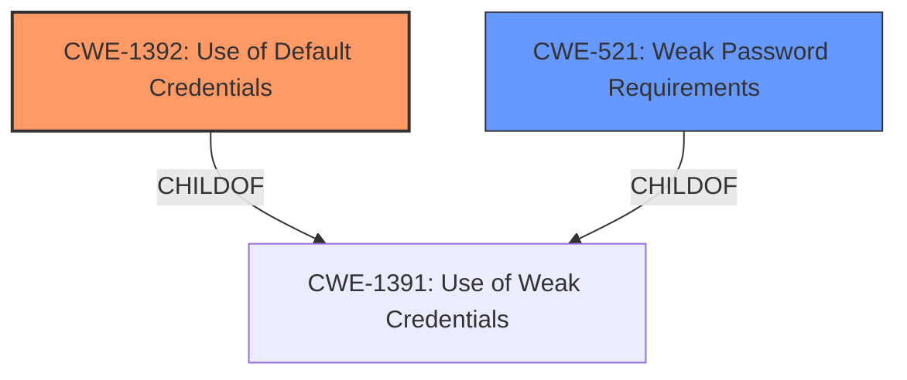

# Analysis Report for CVE-2024-51051

# Vulnerability Analysis Report: CVE-2024-51051

## Description

AVSCMS v8.2.0 was discovered to contain **weak default credentials** for the Administrator account.

## Vulnerability Description Key Phrases

- **Rootcause:** weak default credentials
- **Product:** AVSCMS
- **Version:** 8.2.0
- **Component:** Administrator account

## Analysis (with Relationship Data)

# Summary
| CWE ID  | CWE Name                                               | Confidence | CWE Abstraction Level | CWE Vulnerability Mapping Label | CWE-Vulnerability Mapping Notes |
| ------- | ------------------------------------------------------ | ---------- | --------------------- | ------------------------------- | ------------------------------- |
| CWE-1392 | Use of Default Credentials                             | 0.9        | Base                  | Primary                         | Allowed                       |
| CWE-521  | Weak Password Requirements                             | 0.7        | Base                  | Secondary                       | Allowed                       |

## Evidence and Confidence

*   **Confidence Score:** 0.8
*   **Evidence Strength:** HIGH

## Relationship Analysis

The primary weakness is the **use of default credentials (CWE-1392)**, a base-level CWE. It exists because password complexity requirements are not enforced, which can be classified as **weak password requirements (CWE-521)**. CWE-1392 is a child of CWE-1391 (Use of Weak Credentials), which is a class-level CWE. CWE-521 is also a child of CWE-1391. Choosing CWE-1392 is more specific than CWE-1391. There is no direct relationship between CWE-1392 and CWE-521, but the CVE description indicates that **weak default credentials** and **lack of password policy/management** contribute to the vulnerability.



## Vulnerability Chain

The vulnerability chain starts with the **use of default credentials (CWE-1392)**. Because there is a **lack of password policy/management**, it leads to easily guessed passwords that allows unauthorized access and compromise of the application. The **weak password requirements (CWE-521)** also contribute to the problem.

## Summary of Analysis

The vulnerability is primarily due to the **use of weak default credentials**, specifically "admin:admin" for the administrator account in AVSCMS v8.2.0. This aligns directly with CWE-1392 (Use of Default Credentials). The CVE Reference Links Content Summary supports this, stating that the application ships with a default administrative username and password of "admin:admin". The lack of enforced password strength policy and the absence of password strength management further exacerbate the issue, making CWE-521 (Weak Password Requirements) a secondary contributing factor.

The selection of CWE-1392 is justified because it is a base-level CWE that accurately describes the root cause, which is the presence of default credentials. Although CWE-1391 (Use of Weak Credentials) is a parent class, CWE-1392 provides a more specific and accurate description of the vulnerability.

CWE-798 (Use of Hard-coded Credentials) was considered, but it was determined that CWE-1392 is a better fit because the credentials are not necessarily "hard-coded" in the sense of being compiled into the application, but rather set as defaults.

CWE-259 (Use of Hard-coded Password) was also considered. Although it is a variant-level CWE, it does not accurately reflect the fact that the issue is related to default credentials, not necessarily hard-coded passwords.


## CWE Relationship Analysis

Current CWEs represent these abstraction levels: .


### Vulnerability Chain Analysis

**Chain starting from CWE-1391:**
- 1391 (Use of Weak Credentials) - ROOT


**Chain starting from CWE-798:**
- 798 (Use of Hard-coded Credentials) - ROOT


### CWE Relationship Diagram

```mermaid
graph TD
    classDef primary fill:#f96,stroke:#333,stroke-width:2px
    classDef secondary fill:#69f,stroke:#333
    classDef tertiary fill:#9e9,stroke:#333
```


*Report generated on 2025-07-13 20:27:48*
