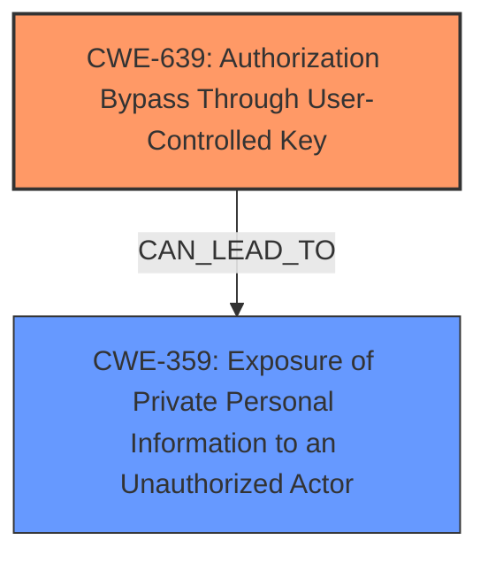

# Enhanced Analysis for CVE-2024-51066

# Summary
| CWE ID | CWE Name | Confidence | CWE Abstraction Level | CWE Vulnerability Mapping Label | CWE-Vulnerability Mapping Notes |
|---|---|---|---|---|---|
| CWE-639 | Authorization Bypass Through User-Controlled Key | 1.0 | Base | Allowed | Primary CWE. The system's authorization functionality does not prevent one user from gaining access to another user's data or record by modifying the key value identifying the data. |
| CWE-359 | Exposure of Private Personal Information to an Unauthorized Actor | 0.7 | Base | Allowed | Secondary Candidate. The product does not properly prevent a person's private, personal information from being accessed by actors who either (1) are not explicitly authorized to access the information or (2) do not have the implicit consent of the person about whom the information is collected. |

## Evidence and Confidence

*   **Confidence Score:** 0.9
*   **Evidence Strength:** MEDIUM

## Relationship Analysis
The primary CWE is CWE-639, which is a base level CWE. There are no direct parent-child relationships mentioned in the provided information that significantly influence the decision. However, the relationship to CWE-359 indicates a potential impact of the authorization bypass, leading to exposure of sensitive information. Abstraction levels were considered to choose the most specific and relevant CWE.



## Vulnerability Chain
The vulnerability chain starts with **Insecure Direct Object Reference** (**Authorization Bypass Through User-Controlled Key**) which leads to unauthorized access and results in the **Exposure of Private Personal Information to an Unauthorized Actor**.

## Summary of Analysis
The analysis is based on the provided vulnerability description, which clearly states the presence of an **Insecure Direct Object Reference**. This aligns directly with CWE-639, as the vulnerability allows unauthorized access to customer PII by manipulating the key value used to identify the data. The retriever results also strongly suggest CWE-639 as the primary candidate.

The graph relationships support the idea that an authorization bypass can lead to the exposure of sensitive information. The selection of CWE-639 is at the optimal level of specificity as it accurately describes the **root cause** of the vulnerability.

The evidence from the vulnerability description key phrases: "rootcause: **Insecure Direct Object Reference**" supports the mapping to CWE-639.

CWEs Considered But Not Used:
*   CWE-99: Improper Control of Resource Identifiers ('Resource Injection') - While related, this is a broader category than CWE-639. The description specifically mentions authorization bypass via user-controlled key, making CWE-639 a more precise fit.
*   CWE-425: Direct Request ('Forced Browsing') - Similar to CWE-99, this is a broader category that doesn't capture the specific mechanism of authorization bypass through user-controlled keys.
*   CWE-798: Use of Hard-coded Credentials - This is irrelevant as the vulnerability is about authorization bypass, not hardcoded credentials.
*   CWE-1299: Missing Protection Mechanism for Alternate Hardware Interface - This is irrelevant as the vulnerability is in a web application and not related to hardware interfaces.
*   CWE-613: Insufficient Session Expiration - This is irrelevant as the vulnerability is about authorization bypass, not session management.
*   CWE-782: Exposed IOCTL with Insufficient Access Control - This is irrelevant as the vulnerability is in a web application and not related to IOCTL.
*   CWE-532: Insertion of Sensitive Information into Log File - This is about logging sensitive information, which is not the case in the vulnerability description.
*   CWE-89: Improper Neutralization of Special Elements used in an SQL Command ('SQL Injection') - This is related to SQL injection, which is not mentioned in the vulnerability description.
*   CWE-259: Use of Hard-coded Password - Irrelevant as the vulnerability is about authorization bypass, not hardcoded passwords.

Relevant CWE Information:

# Enhanced Context (25 CWEs)
The following CWEs were identified as potentially relevant to this vulnerability:

## CWE-639: Authorization Bypass Through User-Controlled Key
**Abstraction Level**: Base
**Similarity Score**: 0.74
**Source**: dense

**Description**:
The system's authorization functionality does not prevent one user from gaining access to another user's data or record by modifying the key value identifying the data.

**Mapping Guidance**:
- Usage: Allowed
- Rationale: This CWE entry is at the Base level of abstraction, which is a preferred level of abstraction for mapping to the root causes of vulnerabilities.


## CWE-425: Direct Request ('Forced Browsing')
**Abstraction Level**: Base
**Similarity Score**: 0.73
**Source**: dense

**Description**:
The web application does not adequately enforce appropriate authorization on all restricted URLs, scripts, or files.

**Mapping Guidance**:
- Usage: Allowed
- Rationale: This CWE entry is at the Base level of abstraction, which is a preferred level of abstraction for mapping to the root causes of vulnerabilities.


## CWE-89: Improper Neutralization of Special Elements used in an SQL Command ('SQL Injection')
**Abstraction Level**: Base
**Similarity Score**: 0.72
**Source**: dense

**Description**:
The product constructs all or part of an SQL command using externally-influenced input from an upstream component, but it does not neutralize or incorrectly neutralizes special elements that could modify the intended SQL command when it is sent to a downstream component. Without sufficient removal or quoting of SQL syntax in user-controllable inputs, the generated SQL query can cause those inputs to be interpreted as SQL instead of ordinary user data.

**Mapping Guidance**:
- Usage: Allowed
- Rationale: This CWE entry is at the Base level of abstraction, which is a preferred level of abstraction for mapping to the root causes of vulnerabilities.


## CWE-472: External Control of Assumed-Immutable Web Parameter
**Abstraction Level**: Base
**Similarity Score**: 0.72
**Source**: dense

**Description**:
The web application does not sufficiently verify inputs that are assumed to be immutable but are actually externally controllable, such as hidden form fields.

**Mapping Guidance**:
- Usage: Allowed
- Rationale: This CWE entry is at the Base level of abstraction, which is a preferred level of abstraction for mapping to the root causes of vulnerabilities.


## CWE-79: Improper Neutralization of Input During Web Page Generation ('Cross-site Scripting')
**Abstraction Level**: Base
**Similarity Score**: 0.70
**Source**: dense

**Description**:
The product does not neutralize or incorrectly neutralizes user-controllable input before it is placed in output that is used as a web page that is served to other users.

**Mapping Guidance**:
- Usage: Allowed
- Rationale: This CWE entry is at the Base level of abstraction, which is a preferred level of abstraction for mapping to the root causes of vulnerabilities.


## CWE-359: Exposure of Private Personal Information to an Unauthorized Actor
**Abstraction Level**: Base
**Similarity Score**: 0.70
**Source**: dense

**Description**:
The product does not properly prevent a person's private, personal information from being accessed by actors who either (1) are not explicitly authorized to access the information or (2) do not have the implicit consent of the person about whom the information is collected.

**Mapping Guidance**:
- Usage: Allowed
- Rationale: This CWE entry is at the Base level of abstraction, which is a preferred level of abstraction for mapping to the root causes of vulnerabilities.


## CWE-209: Generation of Error Message Containing Sensitive Information
**Abstraction Level**: Base
**Similarity Score**: 0.70
**Source**: dense

**Description**:
The product generates an error message that includes sensitive information about its environment, users, or associated data.

**Mapping Guidance**:
- Usage: Allowed
- Rationale: This CWE entry is at the Base level of abstraction, which is a preferred level of abstraction for mapping to the root causes of vulnerabilities.


## CWE-434: Unrestricted Upload of File with Dangerous Type
**Abstraction Level**: Base
**Similarity Score**: 0.70
**Source**: dense

**Description**:
The product allows the upload or transfer of dangerous file types that are automatically processed within its environment.

**Mapping Guidance**:
- Usage: Allowed
- Rationale: This CWE entry is at the Base level of abstraction, which is a preferred level of abstraction for mapping to the root causes of vulnerabilities.


## CWE-267: Privilege Defined With Unsafe Actions
**Abstraction Level**: Base
**Similarity Score**: 0.70
**Source**: dense

**Description**:
A particular privilege, role, capability, or right can be used to perform unsafe actions that were


## CWE Relationship Analysis

Current CWEs represent these abstraction levels: .


### Vulnerability Chain Analysis

**Chain starting from CWE-99:**
- 99 (Improper Control of Resource Identifiers ('Resource Injection')) - ROOT


**Chain starting from CWE-89:**
- 89 (Improper Neutralization of Special Elements used in an SQL Command ('SQL Injection')) - ROOT


### CWE Relationship Diagram

```mermaid
graph TD
    classDef primary fill:#f96,stroke:#333,stroke-width:2px
    classDef secondary fill:#69f,stroke:#333
    classDef tertiary fill:#9e9,stroke:#333
```