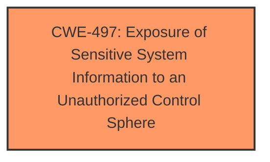

# Analysis for CVE-2024-51123

# Summary
| CWE ID | CWE Name | Confidence | CWE Abstraction Level | CWE Vulnerability Mapping Label | CWE-Vulnerability Mapping Notes |
|---|---|---|---|---|---|
| CWE-497 | Exposure of Sensitive System Information to an Unauthorized Control Sphere | 0.7 | Base | Allowed | Primary CWE. The vulnerability allows a remote attacker to obtain sensitive information. |

## Evidence and Confidence

*   **Confidence Score:** 0.7
*   **Evidence Strength:** LOW

## Relationship Analysis
The primary CWE is CWE-497, which stands alone in this case because the description directly states that the vulnerability leads to the exposure of sensitive information to unauthorized actors. There are no clear parent-child or chain relationships evident in the provided information to suggest alternative or related CWEs.

## Vulnerability Chain
The vulnerability chain here is direct:

1.  **Weakness:** The application **exposes sensitive information** via a specific component.
2.  **Impact:** A remote attacker can obtain this sensitive information.

The root cause and the impact are closely linked, with the **exposure of sensitive information** being the primary issue.

## Summary of Analysis
The analysis is based on the vulnerability description stating that a remote attacker can obtain sensitive information. This directly aligns with CWE-497, "Exposure of Sensitive System Information to an Unauthorized Control Sphere."

The evidence is weak because the CVE Reference Links Content Summary section is marked as "UNRELATED", and no root cause is mentioned.

Other CWEs from the **Retriever Results** were considered, but not used:

*   CWE-284 (Improper Access Control): While access control issues can lead to information exposure, the description focuses more on the direct **exposure of sensitive information** rather than an access control mechanism failure.
*   CWE-22 (Improper Limitation of a Pathname to a Restricted Directory ('Path Traversal')): This CWE involves path traversal issues, which are not indicated in the provided description.
*   CWE-79 (Improper Neutralization of Input During Web Page Generation ('Cross-site Scripting')): This CWE involves cross-site scripting issues, which are not indicated in the provided description.
*   CWE-113 (Improper Neutralization of CRLF Sequences in HTTP Headers ('HTTP Request/Response Splitting')): This CWE involves CRLF injection issues, which are not indicated in the provided description.
*   CWE-614 (Sensitive Cookie in HTTPS Session Without 'Secure' Attribute) and CWE-1004 (Sensitive Cookie Without 'HttpOnly' Flag): These CWEs involve cookie-related security issues, which are not indicated in the provided description.
* CWE-425 Direct Request ('Forced Browsing'): Similar to CWE-284, this could be involved, but the evidence is insufficient.

The selection of CWE-497 is at the optimal level of specificity, as it directly describes the **exposure of sensitive information**, which is the core of the vulnerability.