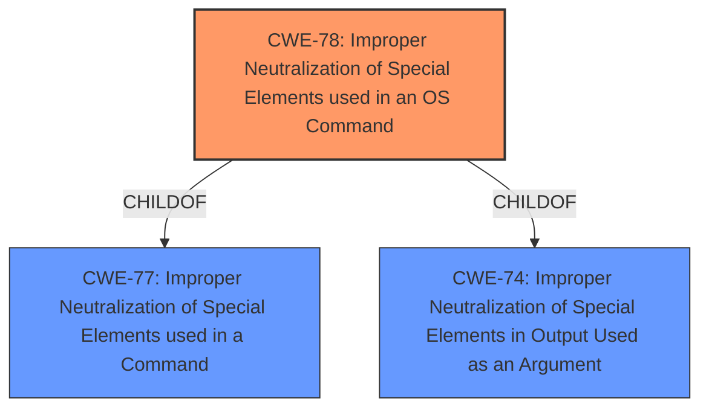

# Raw Analyzer Response for CVE-2024-51258

# Summary
| CWE ID | CWE Name | Confidence | CWE Abstraction Level | CWE Vulnerability Mapping Label | CWE-Vulnerability Mapping Notes |
|---|---|---|---|---|---|
| CWE-78 | Improper Neutralization of Special Elements used in an OS Command ('OS Command Injection') | 0.9 | Base | Allowed | Primary CWE. The vulnerability allows attackers to inject malicious commands and execute arbitrary commands, indicating **improper neutralization** of special elements in an OS command.|

## Evidence and Confidence

*   **Confidence Score:** 0.9
*   **Evidence Strength:** HIGH

## Relationship Analysis
The primary identified weakness is CWE-78, which describes the **improper neutralization** of special elements used in an OS command. The retriever results also suggest CWE-88, CWE-94, and CWE-93. However, the core issue described in the vulnerability is the injection of malicious commands leading to arbitrary command execution, which aligns most directly with CWE-78. While other CWEs might be applicable depending on the specifics of the implementation, CWE-78 captures the fundamental vulnerability.

## Vulnerability Chain
The vulnerability chain starts with the **improper neutralization** of special elements within the `mainfunction.cgi` script. This allows an attacker to inject malicious commands via the `doSSLTunnel` function, leading to arbitrary command execution on the system. The root cause is the **lack of proper input validation or sanitization**, which enables the injection.

## Summary of Analysis
The analysis is primarily based on the provided vulnerability description, which explicitly states that attackers can inject malicious commands into `mainfunction.cgi` and execute arbitrary commands. This directly points to CWE-78 (Improper Neutralization of Special Elements used in an OS Command). The retriever results also support this finding. Other CWEs like CWE-88, CWE-94, and CWE-93 were considered but deemed less relevant as primary classifications because they represent different aspects or consequences of the injection, rather than the root cause. CWE-78 is at the Base level of abstraction, which is appropriate for mapping to the root cause of this vulnerability.

Relevant CWE Information:
- CWE-78: Improper Neutralization of Special Elements used in an OS Command ('OS Command Injection')
  - The product constructs all or part of an OS command using externally-influenced input from an upstream component, but it does not neutralize or incorrectly neutralizes special elements that could modify the intended OS command when it is sent to a downstream component.
  - Usage: Allowed
  - Rationale: This CWE entry is at the Base level of abstraction, which is a preferred level of abstraction for mapping to the root causes of vulnerabilities.