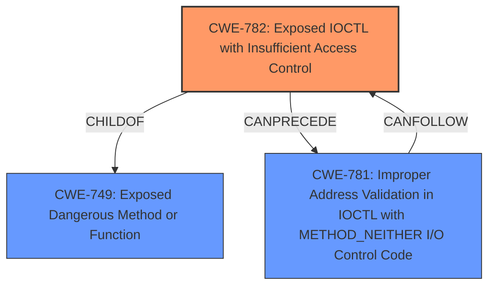

# Analysis for CVE-2024-51324

# Summary

| CWE ID  | CWE Name                                                     | Confidence | CWE Abstraction Level | CWE Vulnerability Mapping Label | CWE-Vulnerability Mapping Notes |
| :-------- | :----------------------------------------------------------- | :--------- | :-------------------- | :------------------------------ | :------------------------------ |
| CWE-782   | Exposed IOCTL with Insufficient Access Control             | 1          | Variant               | Primary                         | Allowed                         |

## Evidence and Confidence

*   **Confidence Score:** 1
*   **Evidence Strength:** HIGH

## Relationship Analysis

The primary identified CWE is CWE-782, which is a Variant level CWE. This is appropriate because it provides a specific description of the vulnerability. The retriever results also included CWE-781 (Improper Address Validation in IOCTL with METHOD_NEITHER I/O Control Code) which is related to CWE-782 and can precede or follow it, but CWE-782 provides a more direct match to the **root cause**, which is insufficient access control for a sensitive IOCTL.

## Vulnerability Chain

The vulnerability chain starts with the **root cause**: CWE-782 (Exposed IOCTL with Insufficient Access Control). The chain then leads to the impact: the ability to terminate arbitrary processes.

## Summary of Analysis

The initial analysis strongly points to CWE-782 (Exposed IOCTL with Insufficient Access Control) as the most relevant CWE.

Evidence:

*   The CVE description states that the vulnerability is in the "BdApiUtil driver of Baidu Antivirus".
*   The CVE Reference Links Content Summary indicates that "An IOCTL code (0x800024B4) within the `BdApiUtil.sys` driver allows for arbitrary process termination."
*   The CVE Reference Links Content Summary also states that "The driver allows a user to terminate any process on the system, given that the driver is already installed."
*   The **root cause** of the vulnerability is identified as an IOCTL code that allows for arbitrary process termination
*   The weakness is **the driver allows a user to terminate any process on the system, given that the driver is already installed.**

CWE-782 (Exposed IOCTL with Insufficient Access Control) aligns perfectly with this description. It states that "The product implements an IOCTL with functionality that should be restricted, but it does not properly enforce access control for the IOCTL."

The other CWEs considered were less specific. CWE-781, for instance, relates to improper address validation in IOCTLs, which is a related but distinct issue. CWE-367 (Time-of-check Time-of-use (TOCTOU) Race Condition) and CWE-362 (Concurrent Execution using Shared Resource with Improper Synchronization ('Race Condition')) are not relevant because the vulnerability does not involve race conditions.

CWE-782 is at the optimal level of specificity because it directly addresses the **root cause** of the vulnerability which is that an IOCTL that should be restricted is not properly protected.