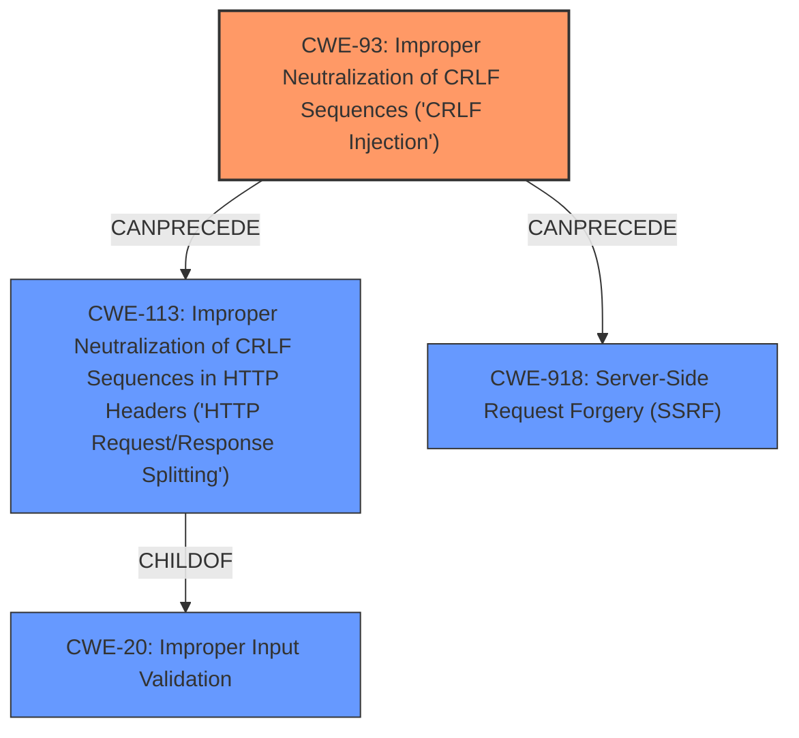

# Analysis for CVE-2024-51501

# Summary
| CWE ID | CWE Name | Confidence | CWE Abstraction Level | CWE Vulnerability Mapping Label | CWE-Vulnerability Mapping Notes |
|---|---|---|---|---|---|
| CWE-93 | Improper Neutralization of CRLF Sequences ('CRLF Injection') | 1.0 | Base | Primary | Allowed |
| CWE-113 | Improper Neutralization of CRLF Sequences in HTTP Headers ('HTTP Request/Response Splitting') | 0.9 | Variant | Secondary | Allowed |
| CWE-918 | Server-Side Request Forgery (SSRF) | 0.7 | Base | Secondary | Allowed |

## Evidence and Confidence

*   **Confidence Score:** 0.9
*   **Evidence Strength:** HIGH

## Relationship Analysis
The primary CWE is CWE-93, which represents the root cause of the vulnerability: the **improper neutralization of CRLF sequences**. CWE-113 is a variant of CWE-93, specifying that the CRLF injection occurs in HTTP headers, making it a more specific description of the vulnerability's location. CWE-918 arises as an impact of the CRLF injection leading to request splitting and SSRF. CWE-93 can precede both CWE-113 and CWE-918 in a vulnerability chain.

## Vulnerability Chain
The vulnerability chain starts with **improper input sanitization** (CWE-93) leading to CRLF injection. This allows an attacker to inject arbitrary headers or smuggle HTTP requests (CWE-113), which in turn can lead to request splitting and Server Side Request Forgery (CWE-918).

CWE-93 (Root Cause: **Improper Neutralization of CRLF Sequences**) -> CWE-113 (Improper Neutralization of CRLF Sequences in HTTP Headers) -> CWE-918 (Server-Side Request Forgery)

## Summary of Analysis
The initial assessment and the retriever results point towards CWE-93 and CWE-113 as the most relevant CWEs. The vulnerability description clearly states that the Refit library is vulnerable to **CRLF injection** because `HttpHeaders.TryAddWithoutValidation` method does not check for CRLF characters in the header value. This aligns perfectly with CWE-93, which describes **improper neutralization of CRLF sequences**. The fact that this occurs in HTTP headers leads to the secondary classification of CWE-113. The potential impact, SSRF, further supports the classification, though as an impact rather than a root cause.

The evidence for **CRLF injection** is strong: "The way HTTP headers are added to a request is via the `HttpHeaders.TryAddWithoutValidation` method. This method does not check for CRLF characters in the header value. This means that any headers added to a refit request are vulnerable to CRLF-injection."

The graph relationships confirm the hierarchical relationship between CWE-93 and CWE-113, and the potential for CWE-93 to precede CWE-918.

The selected CWEs are at the optimal level of specificity. CWE-93 identifies the core weakness, while CWE-113 provides more context by specifying that the CRLF injection occurs in HTTP headers.

Relevant CWE Information:

# Enhanced Context (25 CWEs)
The following CWEs were identified as potentially relevant to this vulnerability:

## CWE-113: Improper Neutralization of CRLF Sequences in HTTP Headers ('HTTP Request/Response Splitting')
**Abstraction Level**: Variant
**Similarity Score**: 0.77
**Source**: dense

**Description**:
The product receives data from an HTTP agent/component (e.g., web server, proxy, browser, etc.), but it does not neutralize or incorrectly neutralizes CR and LF characters before the data is included in outgoing HTTP headers.

**Mapping Guidance**:
- Usage: Allowed
- Rationale: This CWE entry is at the Variant level of abstraction, which is a preferred level of abstraction for mapping to the root causes of vulnerabilities.

**Why Chosen**: This is the specific location of the CRLF Injection, so this is a secondary CWE to consider.

## CWE-74: Improper Neutralization of Special Elements in Output Used by a Downstream Component ('Injection')
**Abstraction Level**: Class
**Similarity Score**: 0.72
**Source**: dense

**Description**:
The product constructs all or part of a command, data structure, or record using externally-influenced input from an upstream component, but it does not neutralize or incorrectly neutralizes special elements that could modify how it is parsed or interpreted when it is sent to a downstream component.

**Mapping Guidance**:
- Usage: Discouraged
- Rationale: CWE-74 is high-level and often misused when lower-level weaknesses are more appropriate.

**Why Not Chosen**: This is too generic. The vulnerability is specific to CRLF injection.

## CWE-93: Improper Neutralization of CRLF Sequences ('CRLF Injection')
**Abstraction Level**: Base
**Similarity Score**: 0.72
**Source**: dense

**Description**:
The product uses CRLF (carriage return line feeds) as a special element, e.g. to separate lines or records, but it does not neutralize or incorrectly neutralizes CRLF sequences from inputs.

**Mapping Guidance**:
- Usage: Allowed
- Rationale: This CWE entry is at the Base level of abstraction, which is a preferred level of abstraction for mapping to the root causes of vulnerabilities.

**Why Chosen**: This is the primary weakness.

## CWE-918: Server-Side Request Forgery (SSRF)
**Abstraction Level**: Base
**Similarity Score**: 0.71
**Source**: dense

**Description**:
The web server receives a URL or similar request from an upstream component and retrieves the contents of this URL, but it does not sufficiently ensure that the request is being sent to the expected destination.

**Mapping Guidance**:
- Usage: Allowed
- Rationale: This CWE entry is at the Base level of abstraction, which is a preferred level of abstraction for mapping to the root causes of vulnerabilities.

**Why Chosen**: This is an impact of the CRLF Injection and could be a secondary CWE to consider.

## CWE-1289: Improper Validation of Unsafe Equivalence in Input
**Abstraction Level**: Base
**Similarity Score**: 0.71
**Source**: dense

**Description**:
The product receives an input value that is used as a resource identifier or other type of reference, but it does not validate or incorrectly validates that the input is equivalent to a potentially-unsafe value.

**Mapping Guidance**:
- Usage: Allowed
- Rationale: This CWE entry is at the Base level of abstraction, which is a preferred level of abstraction for mapping to the root causes of vulnerabilities.

**Why Not Chosen**: This is not the specific kind of input issue.

## CWE-212: Improper Removal of Sensitive Information Before Storage or Transfer
**Abstraction Level**: Base
**Similarity Score**: 0.71
**Source**: dense

**Description**:
The product stores, transfers, or shares a resource that contains sensitive information, but it does not properly remove that information before the product makes the resource available to unauthorized actors.

**Mapping Guidance**:
- Usage: Allowed
- Rationale: This CWE entry is at the Base level of abstraction, which is a preferred level of abstraction for mapping to the root causes of vulnerabilities.

**Why Not Chosen**: This is not related to sensitive information.

## CWE-184: Incomplete List of Disallowed Inputs
**Abstraction Level**: Base
**Similarity Score**: 0.70
**Source**: dense

**Description**:
The product implements a protection mechanism that relies on a list of inputs (or properties of inputs) that are not allowed by policy or otherwise require other action to neutralize before additional processing takes place, but the list is incomplete.

**Mapping Guidance**:
- Usage: Allowed
- Rationale: This CWE entry is at the Base level of abstraction, which is a preferred level of abstraction for mapping to the root causes of vulnerabilities.

**Why Not Chosen**: There is no evidence for this.

## CWE-138: Improper Neutralization of Special Elements
**Abstraction Level**: Class
**Similarity Score**: 0.70
**Source**: dense

**Description**:
The product receives input from an upstream component, but it does not neutralize or incorrectly neutralizes special elements that could be interpreted as control elements or syntactic markers when they are sent to a downstream component