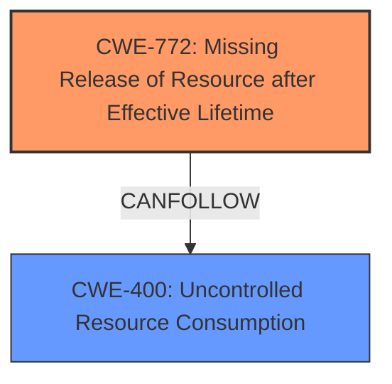

# Analysis for CVE-2024-51513

# Summary

| CWE ID    | CWE Name                                            | Confidence | CWE Abstraction Level | CWE Vulnerability Mapping Label | CWE-Vulnerability Mapping Notes |
| :-------- | :-------------------------------------------------- | :--------- | :---------------------- | :------------------------------ | :------------------------------ |
| CWE-772   | Missing Release of Resource after Effective Lifetime | 0.8        | Base                    | Primary                         | Allowed                       |
| CWE-400   | Uncontrolled Resource Consumption                   | 0.6        | Class                   | Secondary                       | Discouraged                    |

## Evidence and Confidence

*   **Confidence Score:** 0.7
*   **Evidence Strength:** MEDIUM

## Relationship Analysis

The primary relationship influencing the decision is that CWE-772 "Missing Release of Resource after Effective Lifetime" can lead to CWE-400 "Uncontrolled Resource Consumption". This aligns with the vulnerability description, where processes are not being fully terminated (CWE-772), which leads to increased power consumption (CWE-400). The choice of CWE-772 as the primary weakness is due to it being the root cause of the resource consumption issue. It is also at the Base level of abstraction which is preferred.

## Vulnerability Chain

The vulnerability chain starts with the **failure to properly terminate processes** (CWE-772), leading to **increased power consumption** (CWE-400). The root cause is the missing release of resources, and the impact is uncontrolled resource consumption.

## Summary of Analysis

The initial assessment and resulting conclusion are based on the provided evidence, specifically:

*   "The vulnerability stems from **processes not being fully terminated** within the VPN module." This strongly suggests CWE-772 (Missing Release of Resource after Effective Lifetime).
*   "Successful exploitation of this vulnerability will lead to **increased power consumption**." This indicates CWE-400 (Uncontrolled Resource Consumption) as a consequence.

The graph relationships show that CWE-772 can lead to CWE-400, solidifying the selection.

The chosen CWEs are at the optimal level of specificity, with CWE-772 being a Base level CWE and representing the direct cause of the vulnerability. While CWE-400 is a Class level CWE, it accurately reflects the impact of the vulnerability.

Relevant CWE Information:

# Enhanced Context (25 CWEs)
The following CWEs were identified as potentially relevant to this vulnerability:

## CWE-755: Improper Handling of Exceptional Conditions
**Abstraction Level**: Class
**Similarity Score**: 0.72

## CWE-400: Uncontrolled Resource Consumption
**Abstraction Level**: Class
**Similarity Score**: 0.70

## CWE-119: Improper Restriction of Operations within the Bounds of a Memory Buffer
**Abstraction Level**: Class
**Similarity Score**: 0.69

## CWE-824: Access of Uninitialized Pointer
**Abstraction Level**: Base
**Similarity Score**: 0.69

## CWE-667: Improper Locking
**Abstraction Level**: Class
**Similarity Score**: 0.69

## CWE-696: Incorrect Behavior Order
**Abstraction Level**: Class
**Similarity Score**: 0.69

## CWE-203: Observable Discrepancy
**Abstraction Level**: Base
**Similarity Score**: 0.69

## CWE-252: Unchecked Return Value
**Abstraction Level**: Base
**Similarity Score**: 0.69

## CWE-835: Loop with Unreachable Exit Condition ('Infinite Loop')
**Abstraction Level**: Base
**Similarity Score**: 0.69

## CWE-1391: Use of Weak Credentials
**Abstraction Level**: Class
**Similarity Score**: 0.69

## CWE-770: Allocation of Resources Without Limits or Throttling
**Abstraction Level**: Base
**Similarity Score**: 585.59

## CWE-1284: Improper Validation of Specified Quantity in Input
**Abstraction Level**: Base
**Similarity Score**: 583.22

## CWE-772: Missing Release of Resource after Effective Lifetime
**Abstraction Level**: Base
**Similarity Score**: 579.80

## CWE-789: Memory Allocation with Excessive Size Value
**Abstraction Level**: Variant
**Similarity Score**: 579.13

## CWE-367: Time-of-check Time-of-use (TOCTOU) Race Condition
**Abstraction Level**: Base
**Similarity Score**: 548.84

## CWE-772: Missing Release of Resource after Effective Lifetime
**Abstraction Level**: base
**Similarity Score**: 4.33

## CWE-911: Improper Update of Reference Count
**Abstraction Level**: base
**Similarity Score**: 4.33

## CWE-125: Out-of-bounds Read
**Abstraction Level**: base
**Similarity Score**: 4.33

## CWE-770: Allocation of Resources Without Limits or Throttling
**Abstraction Level**: base
**Similarity Score**: 3.30

## CWE-1325: Improperly Controlled Sequential Memory Allocation
**Abstraction Level**: base
**Similarity Score**: 2.93

## CWE-824: Access of Uninitialized Pointer
**Abstraction Level**: Base
**Similarity Score**: 2.88

## CWE-1284: Improper Validation of Specified Quantity in Input
**Abstraction Level**: Base
**Similarity Score**: 2.87

## CWE-825: Expired Pointer Dereference
**Abstraction Level**: base
**Similarity Score**: 2.87

## CWE-823: Use of Out-of-range Pointer Offset
**Abstraction Level**: base
**Similarity Score**: 2.87

## CWE-787: Out-of-bounds Write
**Abstraction Level**: base
**Similarity Score**: 2.87

**CWE-772: Missing Release of Resource after Effective Lifetime**

*   **Technical Explanation:** The vulnerability's core issue is the **failure to fully terminate processes**, which directly corresponds to resources (memory, process handles, etc.) not being released after their intended use. This leads to a buildup of unused resources.
*   **Security Implications:** If resources are not released, they remain allocated, potentially leading to resource exhaustion, denial of service, or other unpredictable behaviors. In this specific case, the consequence is increased power consumption.
*   **Relationship Analysis:** CWE-772 is a base-level CWE, making it a good fit for directly representing the **root cause**. It is also a parent of more specific CWEs like CWE-401 (Resource Leak) and CWE-1091 (Missing Release of Memory).
*   **Mapping Guidance:** The usage is ALLOWED, and the rationale aligns with the vulnerability description.
*   **Decision Justification:** The **root cause** is the **missing release of resources**, which makes CWE-772 the most appropriate primary CWE.
*   **Confidence:** 0.8

**CWE-400: Uncontrolled Resource Consumption**

*   **Technical Explanation:** The **failure to terminate processes** (CWE-772) results in the system consuming more power than expected. This aligns with uncontrolled resource consumption as the system is using resources inefficiently.
*   **Security Implications:** While the direct impact is increased power consumption, uncontrolled resource consumption can also lead to denial-of-service conditions, system instability, and other performance issues.
*   **Relationship Analysis:** CWE-400 is a class-level CWE and is a child of CWE-298 (Improper Resource Management). It is also a consequence of CWE-772 in this case.
*   **Mapping Guidance:** The usage is DISCOURAGED, but it is still useful to record a consequence of the **root cause**.
*   **Decision Justification:** CWE-400 accurately describes the impact of the vulnerability, which is increased power consumption due to the missing resource release. While it's discouraged, it's helpful as a secondary CWE to illustrate the impact.
*   **Confidence:** 0.6

**CWEs Considered but Not Used:**

*   **CWE-770: Allocation of Resources Without Limits or Throttling:** This CWE focuses on allocating resources without restrictions, which isn't the primary issue here. The problem is the **failure to release** already allocated resources, not the allocation itself.
*   **CWE-789: Memory Allocation with Excessive Size Value:** This is related to allocating too much memory, which is not described in the vulnerability.
*   **CWE-1284: Improper Validation of Specified Quantity in Input:** This CWE relates to validating input quantities, which is irrelevant in this scenario.