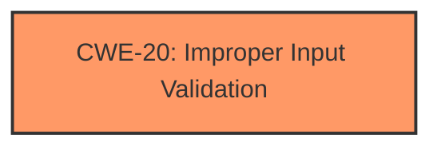

# Raw Analyzer Response for CVE-2024-51519

# Summary
| CWE ID | CWE Name | Confidence | CWE Abstraction Level | CWE Vulnerability Mapping Label | CWE-Vulnerability Mapping Notes |
|---|---|---|---|---|---|
| CWE-20 | Improper Input Validation | 0.9 | Class | Primary CWE | Allowed-with-Review |

## Evidence and Confidence

*   **Confidence Score:** 0.9
*   **Evidence Strength:** HIGH

## Relationship Analysis
The primary relationship that influenced the decision was the hierarchical structure with CWE-20 at the Class level. While more specific CWEs exist under CWE-20, the provided information does not offer enough detail to pinpoint a more specific cause. The retriever results also suggest CWE-20 as a potential candidate.

## Vulnerability Chain
The vulnerability chain starts with **improper input validation** (CWE-20), which leads to a potential impact on availability.

## Summary of Analysis
The vulnerability description clearly states that "**input parameters not being verified**" is the root cause. This directly aligns with the description of CWE-20 (Improper Input Validation): "The product receives input or data, but it does not validate or incorrectly validates that the input has the properties that are required to process the data safely and correctly." The impact is that successful exploitation "may affect availability."

The choice of CWE-20 is further supported by the "Vulnerability Description Key Phrases" which identifies "**input parameters not being verified**" as the **rootcause**. The "CVE Reference Links Content Summary" section also highlights that the root cause is "**Input parameters in the HDC module are not properly validated**" and the **weakness** is "**Insufficient input validation**".

While the retriever results suggest other CWEs, such as CWE-807 (Reliance on Untrusted Inputs in a Security Decision), CWE-1285 (Improper Validation of Specified Index, Position, or Offset in Input), or CWE-233 (Improper Handling of Parameters), these are not as directly supported by the provided text as CWE-20. The provided information does not allow further refinement to a more specific CWE.

The decision is based on the available evidence. The selection of CWE-20 aligns with MITRE's guidance. The retriever results, vulnerability description, and CVE summary all support this selection.

Relevant CWE Information:

# Enhanced Context (25 CWEs)
The following CWEs were identified as potentially relevant to this vulnerability:

## CWE-20: Improper Input Validation
**Abstraction Level**: Class
**Similarity Score**: 0.73
**Source**: dense

**Description**:
The product receives input or data, but it does
        not validate or incorrectly validates that the input has the
        properties that are required to process the data safely and
        correctly.

**Mapping Guidance**:
- Usage: Discouraged
- Rationale: CWE-20 is commonly misused in low-information vulnerability reports when lower-level CWEs could be used instead, or when more details about the vulnerability are available [REF-1287]. It is not useful for trend analysis. It is also a level-1 Class (i.e., a child of a Pillar).