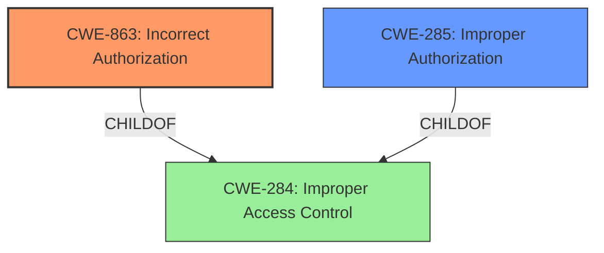

# Enhanced Analysis for CVE-2024-51525

# Summary
| CWE ID | CWE Name | Confidence | CWE Abstraction Level | CWE Vulnerability Mapping Label | CWE-Vulnerability Mapping Notes |
|---|---|---|---|---|---|
| CWE-863 | Incorrect Authorization | 0.8 | Class | Allowed-with-Review | Primary CWE |
| CWE-285 | Improper Authorization | 0.6 | Class | Discouraged | Secondary Candidate |

## Evidence and Confidence

*   **Confidence Score:** 0.7
*   **Evidence Strength:** MEDIUM

## Relationship Analysis
The primary relationship that influenced the CWE selection was the hierarchical relationship between CWE-285 and CWE-863. Although both CWEs describe authorization issues, CWE-863 (Incorrect Authorization) is more specific, indicating that an authorization check is performed but is done incorrectly. This aligns well with the **"Permission control vulnerability"** description where the control is present but not functioning as intended. The other CWEs, such as those related to privilege management, do not fit as well since the vulnerability is specifically about **permission control**, not broader privilege issues. The Abstraction level for CWE-863 is Class and the guidance is Allowed-with-Review, suggesting that a more specific Base CWE should be preferred, however, there is no further information provided to support a more specific CWE, therefore, I have settled on CWE-863.



## Vulnerability Chain
The vulnerability chain starts with a **permission control vulnerability**. The chain is simple:
1.  **Root Cause:** **Permission control vulnerability** (CWE-863)
2.  **Impact:** Affects service confidentiality.

## Summary of Analysis
The analysis is primarily based on the description of the vulnerability as a **"Permission control vulnerability"**. The phrase suggests that there is a mechanism intended to control permissions, but that mechanism is flawed. This aligns with CWE-863 (Incorrect Authorization), which describes a situation where an authorization check is performed, but it is performed incorrectly. The retriever results also list CWE-863 as a potential match.

CWE-285 (Improper Authorization) was also considered as it broadly covers authorization failures. However, CWE-863 is more specific, indicating that the authorization check is present but flawed, which better fits the "control" aspect of the vulnerability description. The guidance for CWE-285 discourages its use, further supporting the selection of CWE-863.

The selection of CWE-863 is at the optimal level of specificity given the information provided. While the guidance for CWE-863 suggests looking for more specific Base CWEs, the provided vulnerability description does not contain the necessary information to narrow it down further.

Relevant CWE Information:
- **Vulnerability Description Key Phrases:** **rootcause: Permission control vulnerability**
- **CVE Reference Links Content Summary:** Vulnerability: Permission control vulnerability in the clipboard module


## CWE Relationship Analysis

Current CWEs represent these abstraction levels: .


### Vulnerability Chain Analysis

**Chain starting from CWE-284:**
- 284 (Improper Access Control) - ROOT


**Chain starting from CWE-863:**
- 863 (Incorrect Authorization) - ROOT


### CWE Relationship Diagram

```mermaid
graph TD
    classDef primary fill:#f96,stroke:#333,stroke-width:2px
    classDef secondary fill:#69f,stroke:#333
    classDef tertiary fill:#9e9,stroke:#333
```