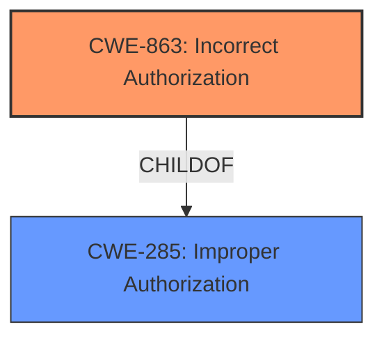

# Analysis Report for CVE-2024-51527

# Vulnerability Analysis Report: CVE-2024-51527

## Description

**Permission control vulnerability** in the Gallery app Impact Successful exploitation of this vulnerability may affect service confidentiality.

## Vulnerability Description Key Phrases

- **Rootcause:** Permission control vulnerability
- **Impact:** Successful exploitation of this vulnerability may affect service confidentiality
- **Product:** Gallery app

## Analysis (with Relationship Data)

# Summary
| CWE ID | CWE Name | Confidence | CWE Abstraction Level | CWE Vulnerability Mapping Label | CWE-Vulnerability Mapping Notes |
|---|---|---|---|---|---|
| CWE-863 | Incorrect Authorization | 0.8 | Class | Primary CWE | Allowed-with-Review |
| CWE-285 | Improper Authorization | 0.7 | Class | Secondary Candidate | Discouraged |

## Evidence and Confidence

*   **Confidence Score:** 0.75
*   **Evidence Strength:** MEDIUM

## Relationship Analysis
The primary relationship influencing the selection is that CWE-863 (Incorrect Authorization) is a more specific child of the broader CWE-285 (Improper Authorization). While both apply, the vulnerability description suggests that authorization checks are present but flawed, making CWE-863 a more precise fit. The guidance explicitly suggests that CWE-285 is high-level and lower-level CWEs should be used when possible.



## Vulnerability Chain
The vulnerability chain starts with a **permission control vulnerability** which leads to **incorrect authorization** and finally results in an impact on **service confidentiality**.

## Summary of Analysis
The initial assessment considered several CWEs related to privilege and permission issues. However, based on the evidence available, the vulnerability is best characterized as an authorization problem. The key phrase "**permission control vulnerability**" and "**insufficient permission control**" suggests that the system's authorization mechanism is flawed.

The choice between CWE-285 and CWE-863 was critical. While CWE-285 (Improper Authorization) initially seemed suitable, the guidance suggesting it is a high-level class and that lower-level CWEs should be preferred led to selecting CWE-863 (Incorrect Authorization). The "**insufficient permission control**" indicates that the checks are in place, but they are not working correctly, which aligns with CWE-863.

Relevant CWE Information:

# Enhanced Context (25 CWEs)
The following CWEs were identified as potentially relevant to this vulnerability:

## Vulnerability Description
**Permission control vulnerability** in the Gallery app Impact Successful exploitation of this vulnerability may affect service confidentiality.

### Vulnerability Description Key Phrases
- **rootcause:** **Permission control vulnerability**
- **impact:** Successful exploitation of this vulnerability may affect service confidentiality
- **product:** Gallery app

## CVE Reference Links Content Summary
Based on the provided information, here's an analysis of CVE-2024-51527:

**Root Cause of Vulnerability:**

*   The vulnerability stems from a **permission control issue** within the Gallery application.

**Weaknesses/Vulnerabilities Present:**

*   **Insufficient permission control:** The Gallery app doesn't properly enforce permissions, allowing unauthorized access or manipulation.

### Detailed Analysis of Chosen CWEs:

*   **CWE-863: Incorrect Authorization**
    *   **Technical Explanation:** This CWE describes a situation where the product performs an authorization check, but the check is implemented incorrectly. This aligns with the "**insufficient permission control**" description, suggesting that the checks are present but flawed.
    *   **Security Implications:** An attacker could bypass these flawed checks to gain unauthorized access to resources or perform actions they should not be allowed to.
    *   **Relationship Analysis:** CWE-863 is a child of CWE-285 (Improper Authorization), providing a more specific classification.
    *   **Mapping Guidance Influence:** The guidance suggests using specific children of CWE-285, which led to the selection of CWE-863.
*   **CWE-285: Improper Authorization**
    *   **Technical Explanation:** This CWE describes a situation where the product does not perform or incorrectly performs an authorization check. Although CWE-863 is a better fit, this is also applicable.
    *   **Security Implications:** An attacker could bypass these flawed checks to gain unauthorized access to resources or perform actions they should not be allowed to.
    *   **Relationship Analysis:** CWE-863 is a child of CWE-285 (Improper Authorization), providing a more specific classification.
    *   **Mapping Guidance Influence:** The guidance suggests using specific children of CWE-285 if possible.

### Considered but Not Used:

*   **CWE-862: Missing Authorization:** While the initial assessment considered missing authorization, the phrase "**insufficient permission control**" indicates that there are checks, but they are not effective, meaning that authorization checks are present, thus it is **incorrect** to assign CWE-862.
*   **CWE-269: Improper Privilege Management:** This CWE was considered, but the guidance explicitly discourages its use. The vulnerability doesn't appear to be related to privilege management, but rather to incorrect authorization checks.
*   **CWE-732: Incorrect Permission Assignment for Critical Resource:** This CWE was considered, but it is often misused for vulnerabilities in which permissions are not checked. It also references permissions being assigned to resources.


## CWE Relationship Analysis

Current CWEs represent these abstraction levels: .


### Vulnerability Chain Analysis

**Chain starting from CWE-863:**
- 863 (Incorrect Authorization) - ROOT


**Chain starting from CWE-732:**
- 732 (Incorrect Permission Assignment for Critical Resource) - ROOT


### CWE Relationship Diagram

```mermaid
graph TD
    classDef primary fill:#f96,stroke:#333,stroke-width:2px
    classDef secondary fill:#69f,stroke:#333
    classDef tertiary fill:#9e9,stroke:#333
```


*Report generated on 2025-07-13 20:41:17*
