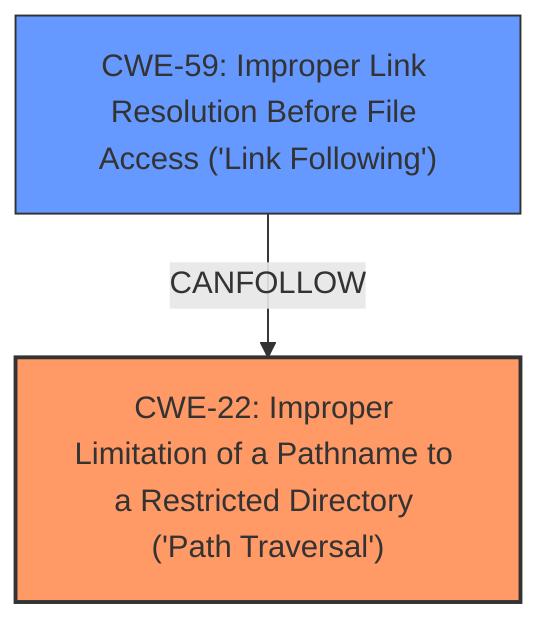

# Analysis for CVE-2024-5154

# Summary
| CWE ID | CWE Name | Confidence | CWE Abstraction Level | CWE Vulnerability Mapping Label | CWE-Vulnerability Mapping Notes |
|---|---|---|---|---|---|
| CWE-22 | Improper Limitation of a Pathname to a Restricted Directory ('Path Traversal') | 1.0 | Base | Primary | Allowed |
| CWE-59 | Improper Link Resolution Before File Access ('Link Following') | 0.7 | Base | Secondary Candidate | Allowed |

## Evidence and Confidence

*   **Confidence Score:** 0.9
*   **Evidence Strength:** HIGH

## Relationship Analysis
The primary weakness is **CWE-22** Improper Limitation of a Pathname to a Restricted Directory ('Path Traversal'). This is because the vulnerability description explicitly mentions **directory traversal** as the root cause. The secondary weakness is **CWE-59** Improper Link Resolution Before File Access ('Link Following'). The relationship between these two is that path traversal can lead to the ability to manipulate or follow links, potentially leading to **CWE-59**. The abstraction levels are both Base, indicating they are specific and actionable weaknesses.

## Vulnerability Chain
The vulnerability chain starts with **CWE-22** (Improper Limitation of a Pathname to a Restricted Directory ('Path Traversal')) which allows a malicious container to create a symbolic link to arbitrary files on the host. This then enables **CWE-59** (Improper Link Resolution Before File Access ('Link Following')), allowing the container to read and write to arbitrary files on the host system.

## Summary of Analysis
The initial analysis identified **CWE-22** as the primary weakness due to the explicit mention of **directory traversal**. Further analysis considered the possibility of **CWE-59** due to the creation of symbolic links. The final decision is to map both **CWE-22** as the primary weakness and **CWE-59** as a secondary weakness.

The evidence from the vulnerability description supports this classification: "A flaw was found in cri-o. A malicious container can create a symbolic link to arbitrary files on the host via **directory traversal** (../). This flaw allows the container to read and write to arbitrary files on the host system."

The graph relationships influenced the selection by highlighting the potential chain of events, where path traversal (**CWE-22**) leads to link following (**CWE-59**).

The selected CWEs are at the optimal level of specificity because they are both Base-level CWEs, providing a detailed and actionable description of the weaknesses.

**CWEs Considered But Not Used:**

*   **CWE-61: UNIX Symbolic Link (Symlink) Following:** While relevant, this is a Compound CWE and less specific than the root cause, **CWE-22**.
*   **CWE-23: Relative Path Traversal:** This is a more specific variant of **CWE-22**, but **CWE-22** more accurately captures the general issue of improper path limitation.
*   **CWE-732: Incorrect Permission Assignment for Critical Resource:** This is related to incorrect permission assignments, but the primary issue here is path traversal, not permission assignment.
*   **CWE-668: Exposure of Resource to Wrong Sphere:** This is a high-level CWE and less specific than **CWE-22** and **CWE-59**.
*   **CWE-24, CWE-25: Path Traversal '../filedir'**: These are specific variants of relative path traversal. **CWE-22** is a better fit since it is the base class of these variants.
*   **CWE-363: Race Condition Enabling Link Following:** This CWE is related to race conditions, but the primary issue here is the lack of proper path validation, not a race condition.