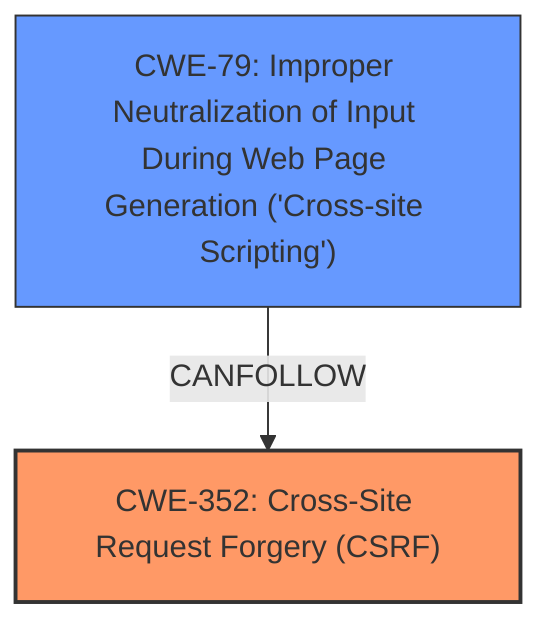

# Raw Analyzer Response for CVE-2024-51634

# Summary
| CWE ID    | CWE Name                                                                       | Confidence | CWE Abstraction Level | CWE Vulnerability Mapping Label | CWE-Vulnerability Mapping Notes |
| --------- | ------------------------------------------------------------------------------ | ---------- | --------------------- | ------------------------------- | ----------------------------- |
| CWE-352   | Cross-Site Request Forgery (CSRF)                                              | 0.9        | Compound              | Primary                         | Allowed                       |
| CWE-79    | Improper Neutralization of Input During Web Page Generation ('Cross-site Scripting') | 0.9        | Base                  | Secondary                       | Allowed                       |

## Evidence and Confidence

*   **Confidence Score:** 0.9
*   **Evidence Strength:** HIGH

## Relationship Analysis
The primary weakness is the **lack of CSRF protection**, which directly leads to the possibility of **Cross-Site Request Forgery (CSRF)** attacks. The secondary weakness is **Cross-Site Scripting (XSS)**, which arises from **improper neutralization of input**. CWE-352 and CWE-79 are related in that a successful CSRF attack can potentially lead to XSS if the attacker can control input that is later displayed to other users. CWE-352 is a Compound weakness that Requires multiple conditions, including a lack of CSRF tokens. CWE-79 is a Base level weakness focusing on improper neutralization.

## Vulnerability Chain
The vulnerability chain starts with the **lack of CSRF protection (CWE-352)**, which allows an attacker to trick a user into performing actions they did not intend. A consequence of this, due to **improper neutralization of input (CWE-79)**, is the injection of malicious scripts into web pages viewed by other users.

## Summary of Analysis
The analysis is based on the provided evidence, particularly the keyphrases "**lack of CSRF protection**" and "**XSS**". The retriever results strongly suggest CWE-352 and CWE-79, which align with the vulnerability description.

The vulnerability description clearly states a "**lack of CSRF protection**" as the ROOTCAUSE and "**Cross-Site Scripting**" as a WEAKNESS. This directly aligns with CWE-352 and CWE-79.

The chosen CWEs are at the optimal level of specificity because they directly represent the **root cause** (CWE-352) and the resulting **vulnerability** (CWE-79).

Relevant CWE Information:

*   **CWE-352: Cross-Site Request Forgery (CSRF)**: This is the primary weakness because the application does not sufficiently verify the origin of requests, making it vulnerable to CSRF attacks.
*   **CWE-79: Improper Neutralization of Input During Web Page Generation ('Cross-site Scripting')**: This is a secondary weakness because the application does not properly neutralize user-controllable input, leading to XSS vulnerabilities.

Other CWEs considered but not used:

*   CWE-434, CWE-89, CWE-116, and CWE-22 were considered but deemed less relevant as they do not directly address the core weaknesses of CSRF and XSS described in the vulnerability.
    *   CWE-425: Direct Request ('Forced Browsing') - While related to authorization issues, it doesn't directly capture the CSRF aspect where a legitimate user is tricked into making the request.
    *   CWE-80: Improper Neutralization of Script-Related HTML Tags in a Web Page (Basic XSS) - Very similar to CWE-79, but CWE-79 is a broader, more encompassing category.