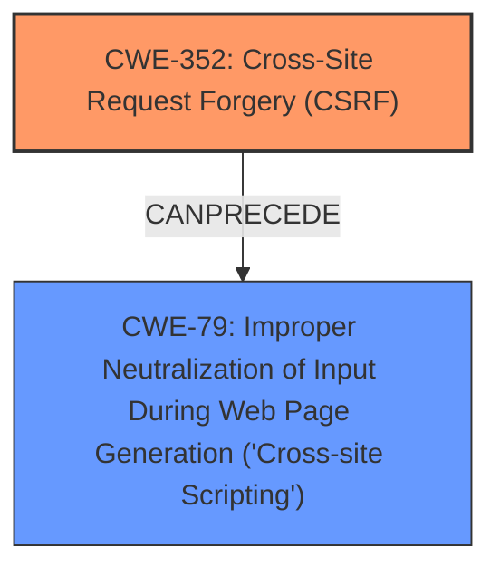

# Raw Analyzer Response for CVE-2024-51635

# Summary
| CWE ID | CWE Name | Confidence | CWE Abstraction Level | CWE Vulnerability Mapping Label | CWE-Vulnerability Mapping Notes |
|---|---|---|---|---|---|
| CWE-352 | Cross-Site Request Forgery (CSRF) | 0.9 | Compound | Primary | Allowed |
| CWE-79 | Improper Neutralization of Input During Web Page Generation ('Cross-site Scripting') | 0.8 | Base | Secondary | Allowed |

## Evidence and Confidence

*   **Confidence Score:** 0.85
*   **Evidence Strength:** MEDIUM

## Relationship Analysis
The primary relationship of interest is the interaction between CWE-352 and CWE-79. The vulnerability involves CSRF leading to Stored XSS, meaning a successful CSRF attack can result in malicious script being stored on the server and executed when other users access the affected data. While not explicitly stated, it is inferred that the CSRF allows an attacker to inject malicious code that is not properly neutralized, resulting in XSS.

## Vulnerability Chain
The vulnerability chain starts with **Cross-Site Request Forgery (CSRF)**, which allows an attacker to perform actions on behalf of another user without their knowledge or consent. The next step in the chain is the injection of malicious code via the CSRF attack. This malicious code is then stored on the server. Finally, the stored code is executed in the browsers of other users, leading to **Stored XSS**.

## Summary of Analysis
The initial analysis focused on identifying the root cause and the resulting impact. The vulnerability description explicitly mentions both "Cross-Site Request Forgery (CSRF)" and "Stored XSS." Given the description, the primary weakness is **CWE-352 Cross-Site Request Forgery (CSRF)**, as it allows an attacker to inject malicious code. The secondary weakness is **CWE-79 Improper Neutralization of Input During Web Page Generation ('Cross-site Scripting')**, which occurs because the injected code is not properly neutralized.

The evidence for this mapping is primarily derived from the vulnerability description: "Cross-Site Request Forgery (CSRF) vulnerability in Garmur While Loading allows Stored **XSS**." This statement directly links the CSRF vulnerability to the resulting Stored XSS.

The selection of CWE-352 as the primary weakness is also supported by the keyphrase analysis, which identifies CWE-352 as a relevant CWE for the **WEAKNESS: 'cross-site request forgery'** and the **ROOTCAUSE: 'improper access control'**. The selection of CWE-79 is driven by the **IMPACT: 'stored cross-site scripting'**.

Based on the evidence and the relationship analysis, the selected CWEs are at the optimal level of specificity.

Relevant CWE Information:

# Enhanced Context (25 CWEs)
The following CWEs were identified as potentially relevant to this vulnerability:

## CWE-352: Cross-Site Request Forgery (CSRF)

## CWE-79: Improper Neutralization of Input During Web Page Generation ('Cross-site Scripting')
| CWE ID | CWE Name | Confidence | CWE Abstraction Level | CWE Vulnerability Mapping Label | CWE-Vulnerability Mapping Notes |
|---|---|---|---|---|---|
| CWE-352 | Cross-Site Request Forgery (CSRF) | 0.9 | Compound | Primary | Allowed |
| CWE-79 | Improper Neutralization of Input During Web Page Generation ('Cross-site Scripting') | 0.8 | Base | Secondary | Allowed |