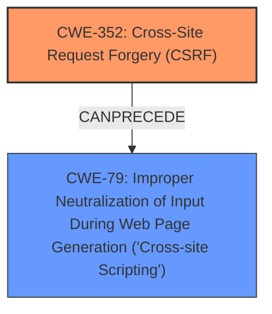

# Enhanced Analysis for CVE-2024-51645

# Summary
| CWE ID  | CWE Name                                                                      | Confidence | CWE Abstraction Level | CWE Vulnerability Mapping Label | CWE-Vulnerability Mapping Notes |
| :-------- | :---------------------------------------------------------------------------- | :---------- | :---------------------- | :------------------------------ | :------------------------------ |
| CWE-352   | Cross-Site Request Forgery (CSRF)                                             | 1         | Compound                | Primary                         | Allowed                       |
| CWE-79    | Improper Neutralization of Input During Web Page Generation ('Cross-site Scripting') | 1         | Base                    | Secondary                       | Allowed                       |

## Evidence and Confidence

*   **Confidence Score:** 1
*   **Evidence Strength:** HIGH

## Relationship Analysis
The primary weakness is the **lack of CSRF protection**, which directly leads to the possibility of stored **XSS**. CWE-352 [Cross-Site Request Forgery (CSRF)] is the root cause, enabling the secondary weakness, CWE-79 [Improper Neutralization of Input During Web Page Generation ('Cross-site Scripting')]. CWE-352 allows malicious requests to be made on behalf of a user, and if the application **does not properly neutralize** the input, it results in stored XSS.



## Vulnerability Chain
1.  **Root Cause:** **Lack of CSRF protection** (CWE-352) allows unauthorized requests.
2.  **Weakness:** **Improper Neutralization of Input** (CWE-79) allows malicious script to be stored.
3.  **Impact:** Stored **XSS** vulnerability, potentially leading to account compromise or other malicious actions.

## Summary of Analysis
The vulnerability description clearly states that the ThemeFuse Maintenance Mode plugin is vulnerable to stored **XSS** due to a **lack of CSRF protection**. The **lack of CSRF protection** allows attackers to inject malicious code into the application, which is then stored and executed in users' browsers, leading to the **XSS** vulnerability. This aligns perfectly with CWE-352 [Cross-Site Request Forgery (CSRF)] as the root cause and CWE-79 [Improper Neutralization of Input During Web Page Generation ('Cross-site Scripting')] as the secondary weakness that enables the stored **XSS**.

The retriever results strongly suggest CWE-352 [Cross-Site Request Forgery (CSRF)] as the primary weakness, with high scores for the keyphrases "lack of CSRF protection", "XSS", "cross-site scripting", "ThemeFuse Maintenance Mode", and "n/a through 1.1.3". The relationship analysis confirms that CWE-352 can precede CWE-79, as the **lack of CSRF protection** can allow attackers to inject malicious code, which can then be stored and executed if the application **does not properly neutralize** the input.

CWE-80 [Improper Neutralization of Script-Related HTML Tags in a Web Page (Basic XSS)] was considered but not selected as the primary CWE because the root cause is the **lack of CSRF protection**, which allows the **XSS** to occur. CWE-80 is more specific to the type of **XSS** vulnerability, but CWE-79 [Improper Neutralization of Input During Web Page Generation ('Cross-site Scripting')] is a more general case of improper neutralization. CWE-434 [Unrestricted Upload of File with Dangerous Type] was considered, given its retriever score, but it does not apply because the vulnerability isn't related to file uploads.

Relevant CWE Information:
*   CWE-352: Cross-Site Request Forgery (CSRF)
*   CWE-79: Improper Neutralization of Input During Web Page Generation ('Cross-site Scripting')


## CWE Relationship Analysis

Current CWEs represent these abstraction levels: .


### Vulnerability Chain Analysis

**Chain starting from CWE-352:**
- 352 (Cross-Site Request Forgery (CSRF)) - ROOT


**Chain starting from CWE-79:**
- 79 (Improper Neutralization of Input During Web Page Generation ('Cross-site Scripting')) - ROOT


### CWE Relationship Diagram

```mermaid
graph TD
    classDef primary fill:#f96,stroke:#333,stroke-width:2px
    classDef secondary fill:#69f,stroke:#333
    classDef tertiary fill:#9e9,stroke:#333
```