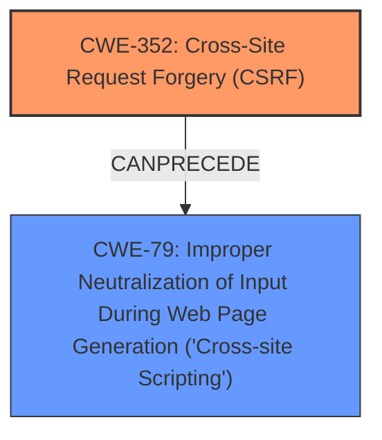

# Analysis for CVE-2024-51647

# Summary
| CWE ID | CWE Name | Confidence | CWE Abstraction Level | CWE Vulnerability Mapping Label | CWE-Vulnerability Mapping Notes |
|---|---|---|---|---|---|
| CWE-352 | Cross-Site Request Forgery (CSRF) | 0.9 | Compound | Primary | Allowed |
| CWE-79 | Improper Neutralization of Input During Web Page Generation ('Cross-site Scripting') | 0.9 | Base | Secondary | Allowed |

## Evidence and Confidence

*   **Confidence Score:** 0.9
*   **Evidence Strength:** HIGH

## Relationship Analysis
The analysis indicates a compound vulnerability stemming from **Cross-Site Request Forgery (CSRF)**, which then facilitates **Improper Neutralization of Input During Web Page Generation ('Cross-site Scripting') (XSS)**. CWE-352 is a compound weakness, encompassing multiple contributing factors. CWE-79 is a base-level weakness, representing a specific type of input validation failure. The relationship is that successful CSRF can lead to XSS if the application doesn't properly neutralize input.

## Vulnerability Chain
The vulnerability chain starts with the **WEAKNESS** of **Cross-Site Request Forgery (CSRF)**, which allows an attacker to inject malicious input. This leads to the **IMPACT** of stored **Cross-Site Scripting (XSS)** because the application **does not neutralize or incorrectly neutralizes user-controllable input** before placing it in a web page.

## Summary of Analysis
The primary weakness is **CWE-352 Cross-Site Request Forgery (CSRF)** because the application does not properly verify if the request was intentionally made by the user, allowing the attacker to inject malicious input. This input is then not properly neutralized, leading to **CWE-79 Improper Neutralization of Input During Web Page Generation ('Cross-site Scripting')**. The vulnerability description explicitly mentions both **CSRF** and stored **XSS**, making these CWEs the most appropriate. The evidence includes phrases like "**Cross-Site Request Forgery (CSRF) vulnerability** in Chaser324 Featured Posts Scroll allows Stored **XSS**". This direct statement links the two weaknesses. CWE-352 is a compound weakness, which is appropriate here since CSRF is often a combination of multiple issues, and CWE-79 describes the **improper neutralization** that allows the **XSS** to occur.

Relevant CWE Information:

# Enhanced Context (25 CWEs)
The following CWEs were identified as potentially relevant to this vulnerability:

## CWE-80: Improper Neutralization of Script-Related HTML Tags in a Web Page (Basic XSS)
**Abstraction Level**: Variant
**Similarity Score**: 0.74
**Source**: dense

**Description**:
The product receives input from an upstream component, but it does not neutralize or incorrectly neutralizes special characters such as "<", ">", and "&" that could be interpreted as web-scripting elements when they are sent to a downstream component that processes web pages.

**Mapping Guidance**:
- Usage: Allowed
- Rationale: This CWE entry is at the Variant level of abstraction, which is a preferred level of abstraction for mapping to the root causes of vulnerabilities.

**Why Not Used:** CWE-80 is a more specific variant of CWE-79. While it could apply, the description doesn't provide enough detail to confirm that the **XSS** is specifically due to improper neutralization of script-related HTML tags.

## CWE-451: User Interface (UI) Misrepresentation of Critical Information
**Abstraction Level**: Class
**Similarity Score**: 0.74
**Source**: dense

**Description**:
The user interface (UI) does not properly represent critical information to the user, allowing the information - or its source - to be obscured or spoofed. This is often a component in phishing attacks.

**Mapping Guidance**:
- Usage: Allowed-with-Review
- Rationale: This CWE entry is a Class and might have Base-level children that would be more appropriate

**Why Not Used:** Not applicable. The vulnerability is about **CSRF** and **XSS**, not UI misrepresentation.

## CWE-116: Improper Encoding or Escaping of Output
**Abstraction Level**: Class
**Similarity Score**: 0.74
**Source**: dense

**Description**:
The product prepares a structured message for communication with another component, but encoding or escaping of the data is either missing or done incorrectly. As a result, the intended structure of the message is not preserved.

**Mapping Guidance**:
- Usage: Allowed-with-Review
- Rationale: This CWE entry is a Class and might have Base-level children that would be more appropriate

**Why Not Used:** While related to **XSS**, CWE-116 is more general than CWE-79. CWE-79 better captures the specific issue of improper neutralization of input during web page generation.

## CWE-41: Improper Resolution of Path Equivalence
**Abstraction Level**: Base
**Similarity Score**: 0.74
**Source**: dense

**Description**:
The product is vulnerable to file system contents disclosure through path equivalence. Path equivalence involves the use of special characters in file and directory names. The associated manipulations are intended to generate multiple names for the same object.

**Mapping Guidance**:
- Usage: Allowed
- Rationale: This CWE entry is at the Base level of abstraction, which is a preferred level of abstraction for mapping to the root causes of vulnerabilities.

**Why Not Used:** Not applicable. This is related to path manipulation, which is not part of the vulnerability description.

## CWE-212: Improper Removal of Sensitive Information Before Storage or Transfer
**Abstraction Level**: Base
**Similarity Score**: 0.74
**Source**: dense

**Description**:
The product stores, transfers, or shares a resource that contains sensitive information, but it does not properly remove that information before the product makes the resource available to unauthorized actors.

**Mapping Guidance**:
- Usage: Allowed
- Rationale: This CWE entry is at the Base level of abstraction, which is a preferred level of abstraction for mapping to the root causes of vulnerabilities.

**Why Not Used:** Not applicable. This is related to sensitive information exposure, which is not part of the vulnerability description.

## CWE-472: External Control of Assumed-Immutable Web Parameter
**Abstraction Level**: Base
**Similarity Score**: 0.74
**Source**: dense

**Description**:
The web application does not sufficiently verify inputs that are assumed to be immutable but are actually externally controllable, such as hidden form fields.

**Mapping Guidance**:
- Usage: Allowed
- Rationale: This CWE entry is at the Base level of abstraction, which is a preferred level of abstraction for mapping to the root causes of vulnerabilities.

**Why Not Used:** While potentially related to **CSRF**, CWE-472 doesn't fully capture the broader issue of **CSRF** where the application cannot verify the origin of the request.

## CWE-668: Exposure of Resource to Wrong Sphere
**Abstraction Level**: Class
**Similarity Score**: 0.73
**Source**: dense

**Description**:
The product exposes a resource to the wrong control sphere, providing unintended actors with inappropriate access to the resource.

**Mapping Guidance**:
- Usage: Discouraged
- Rationale: CWE-668 is high-level and is often misused as a catch-all when lower-level CWE IDs might be applicable. It is sometimes used for low-information vulnerability reports [REF-1287]. It is a level-1 Class (i.e., a child of a Pillar). It is not useful for trend analysis.

**Why Not Used:** CWE-668 is too high-level and discouraged. More specific CWEs like CWE-352 and CWE-79 are more appropriate.

## CWE-74: Improper Neutralization of Special Elements in Output Used by a Downstream Component ('Injection')
**Abstraction Level**: Class
**Similarity Score**: 0.73
**Source**: dense

**Description**:
The product constructs all or part of a command, data structure, or record using externally-influenced input from an upstream component, but it does not neutralize or incorrectly neutralizes special elements that could modify how it is parsed or interpreted when it is sent to a downstream component.

**Mapping Guidance**:
- Usage: Discouraged
- Rationale: CWE-74 is high-level and often misused when lower-level weaknesses are more appropriate.

**Why Not Used:** While **XSS** can be considered a form of injection, CWE-79 is more specific and directly addresses the context of web page generation.

## CWE-425: Direct Request ('Forced Browsing')
**Abstraction Level**: Base
**Similarity Score**: 0.73
**