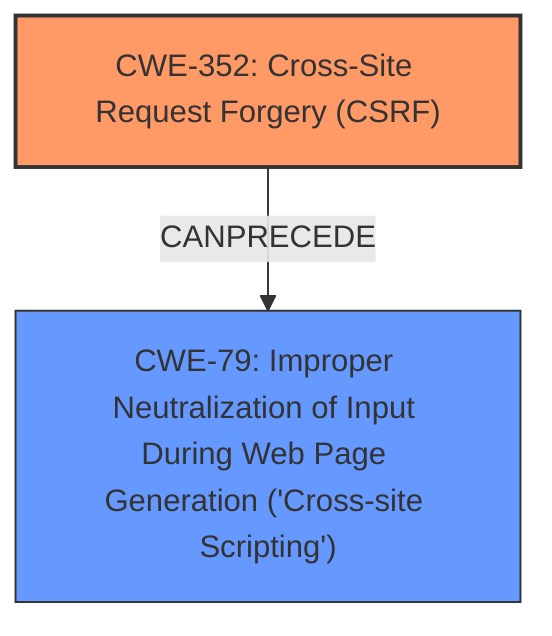

# Enhanced Analysis for CVE-2024-51650

# Summary
| CWE ID | CWE Name | Confidence | CWE Abstraction Level | CWE Vulnerability Mapping Label | CWE-Vulnerability Mapping Notes |
|---|---|---|---|---|---|
| CWE-352 | Cross-Site Request Forgery (CSRF) | 1.0 | Compound | Allowed | Primary CWE. The **root cause** is **Cross-Site Request Forgery (CSRF)**. |
| CWE-79 | Improper Neutralization of Input During Web Page Generation ('Cross-site Scripting') | 1.0 | Base | Allowed | Secondary CWE. The **weakness** is Stored **XSS**. |

## Evidence and Confidence

*   **Confidence Score:** 1.0
*   **Evidence Strength:** HIGH

## Relationship Analysis
The primary weakness is CWE-352 Cross-Site Request Forgery (CSRF), which allows an attacker to induce a user to perform actions they do not intend to. This CSRF vulnerability then leads to a secondary weakness, CWE-79 Improper Neutralization of Input During Web Page Generation ('Cross-site Scripting'), because the attacker uses the CSRF vulnerability to inject malicious scripts.



## Vulnerability Chain
The vulnerability chain starts with:
1.  CWE-352 Cross-Site Request Forgery (CSRF) - The root cause where the application does not sufficiently verify the request.
2.  CWE-79 Improper Neutralization of Input During Web Page Generation ('Cross-site Scripting') - The attacker leverages the CSRF to inject malicious scripts that are not neutralized.

## Summary of Analysis
The vulnerability is a **Cross-Site Request Forgery (CSRF)** vulnerability that allows Stored **XSS**.

The **root cause** is **Cross-Site Request Forgery (CSRF)**. The description states "Cross-Site Request Forgery (CSRF) vulnerability in Scott @ MyDollarPlan.com Random Featured Post allows Stored **XSS**." The CVE Reference Links Content Summary confirms the **root cause** of the vulnerability is **Cross-Site Request Forgery (CSRF)**.

The **weakness** is Stored **XSS**. The vulnerability description states that the **CSRF** vulnerability allows Stored **XSS**.

The CWE-352 is the **root cause** of the vulnerability, leading to the **XSS** vulnerability (CWE-79). The evidence directly supports this conclusion.

I am confident in this assessment as the provided evidence clearly points to these two CWEs. The relationship between CSRF leading to XSS is also well-established and fits the vulnerability description.

# Relevant CWE Information:


## CWE Relationship Analysis

Current CWEs represent these abstraction levels: .


### Vulnerability Chain Analysis

**Chain starting from CWE-352:**
- 352 (Cross-Site Request Forgery (CSRF)) - ROOT


**Chain starting from CWE-79:**
- 79 (Improper Neutralization of Input During Web Page Generation ('Cross-site Scripting')) - ROOT


### CWE Relationship Diagram

```mermaid
graph TD
    classDef primary fill:#f96,stroke:#333,stroke-width:2px
    classDef secondary fill:#69f,stroke:#333
    classDef tertiary fill:#9e9,stroke:#333
```