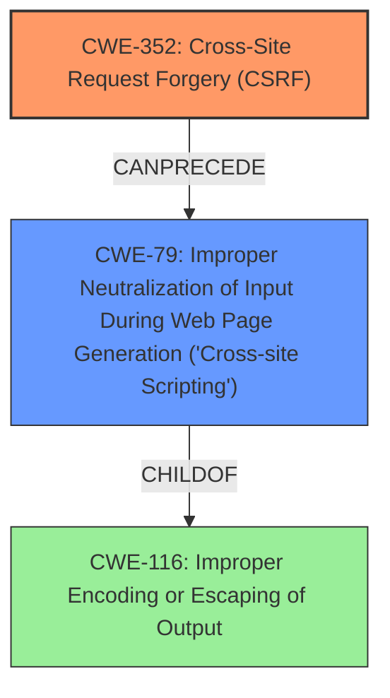

# Raw Analyzer Response for CVE-2024-51654

# Summary
| CWE ID | CWE Name | Confidence | CWE Abstraction Level | CWE Vulnerability Mapping Label | CWE-Vulnerability Mapping Notes |
|---|---|---|---|---|---|
| CWE-352 | Cross-Site Request Forgery (CSRF) | 0.9 | Compound | Primary | Allowed |
| CWE-79 | Improper Neutralization of Input During Web Page Generation ('Cross-site Scripting') | 0.9 | Base | Secondary | Allowed |

## Evidence and Confidence

*   **Confidence Score:** 0.9
*   **Evidence Strength:** HIGH

## Relationship Analysis
The primary weakness is CWE-352 [Cross-Site Request Forgery (CSRF)], which enables an attacker to induce a user to perform actions they did not intend to. The resulting action, in this case, is Stored XSS (CWE-79 [Improper Neutralization of Input During Web Page Generation ('Cross-site Scripting')]), which is a direct result of the lack of CSRF protection. CWE-79 [Improper Neutralization of Input During Web Page Generation ('Cross-site Scripting')] is a child of CWE-116 [Improper Encoding or Escaping of Output].

## Vulnerability Chain
The vulnerability chain begins with CWE-352 [Cross-Site Request Forgery (CSRF)], where the plugin **does not properly validate the origin of requests**. This allows an attacker to forge requests. The forged request leads to Stored XSS (CWE-79 [Improper Neutralization of Input During Web Page Generation ('Cross-site Scripting')]) because the application does not properly neutralize user-controllable input before it is placed in output that is used as a web page.

## Summary of Analysis
The vulnerability description clearly indicates that a **Cross-Site Request Forgery (CSRF)** vulnerability exists, leading to stored **XSS**. The **rootcause** is the lack of CSRF protection, as stated in the CVE Reference Links Content Summary: "The plugin **does not properly validate the origin of requests**, allowing an attacker to forge requests on behalf of an authenticated user." This directly aligns with CWE-352 [Cross-Site Request Forgery (CSRF)].

The **XSS** vulnerability (CWE-79 [Improper Neutralization of Input During Web Page Generation ('Cross-site Scripting')]) is a secondary consequence of the **CSRF** vulnerability. The **CSRF** allows the attacker to inject malicious code, which is then stored and executed due to the lack of proper input neutralization.

The retriever results also suggest CWE-79 [Improper Neutralization of Input During Web Page Generation ('Cross-site Scripting')] and CWE-352 [Cross-Site Request Forgery (CSRF)] as potential candidates.

I considered the other CWEs from the Retriever Results:
*   CWE-89 [Improper Neutralization of Special Elements used in an SQL Command ('SQL Injection')]: This is not applicable as there's no mention of SQL injection in the vulnerability description.
*   CWE-1004 [Sensitive Cookie Without 'HttpOnly' Flag] and CWE-1275 [Sensitive Cookie with Improper SameSite Attribute]: While related to web security, these are not the primary weaknesses exploited in this scenario. The core issue is the lack of CSRF protection and resulting XSS.
*   CWE-601 [URL Redirection to Untrusted Site ('Open Redirect')] and CWE-918 [Server-Side Request Forgery (SSRF)]: These are not relevant to the described vulnerability.
*   CWE-116 [Improper Encoding or Escaping of Output]: While encoding issues might contribute to the XSS, the primary issue enabling the attack is the CSRF vulnerability.
*   CWE-941 [Incorrectly Specified Destination in a Communication Channel] and CWE-184 [Incomplete List of Disallowed Inputs]: These do not directly apply to the vulnerability.

Therefore, based on the provided evidence, CWE-352 [Cross-Site Request Forgery (CSRF)] and CWE-79 [Improper Neutralization of Input During Web Page Generation ('Cross-site Scripting')] are the most appropriate CWEs.