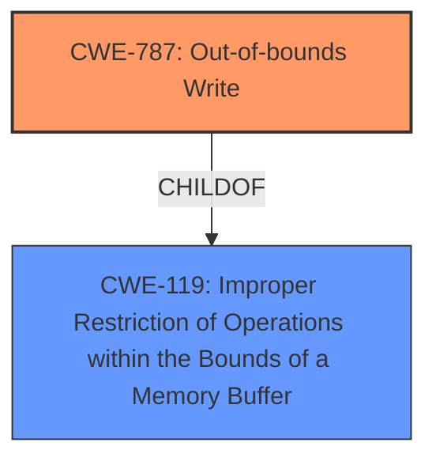

# Enhanced Analysis for CVE-2024-51729

# Summary
| CWE ID | CWE Name | Confidence | CWE Abstraction Level | CWE Vulnerability Mapping Label | CWE-Vulnerability Mapping Notes |
|---|---|---|---|---|---|
| CWE-787 | Out-of-bounds Write | 0.9 | Base | Primary | Allowed |

## Evidence and Confidence

*   **Confidence Score:** 0.9
*   **Evidence Strength:** MEDIUM

## Relationship Analysis
The primary relationship that influenced the decision was the parent-child relationship. CWE-787 is a child of CWE-119 (Improper Restriction of Operations within the Bounds of a Memory Buffer), providing a more specific classification for the observed out-of-bounds write. There is no evidence to suggest a more specific variant of CWE-787 is applicable.



## Vulnerability Chain
The vulnerability chain starts with the use of a non-page-size-aligned address in `copy_user_large_folio()`, which is then passed to `copy_user_gigantic_page()`. This function expects a page-size-aligned address, and the misalignment leads to an **out-of-bounds write**, resulting in **memory corruption** or information leak.

## Summary of Analysis
The primary weakness is that `copy_user_gigantic_page()` receives a non-page-size-aligned address, leading to an out-of-bounds write. The vulnerability description explicitly mentions that the function requires the address to be huge page size aligned but it is not, causing **memory corruption**. The retriever results also ranked CWE-787 as the top candidate.

Relevant evidence from the description:
"copy_user_gigantic_page() requires the address to be huge page size aligned. So, this may cause **memory corruption** or information leak"

CWE-787 is the most accurate and specific representation of this vulnerability.

CWEs considered but not used:

*   CWE-122 (Heap-based Buffer Overflow): While a buffer overflow could be a result of the out-of-bounds write, the root cause is the incorrect address alignment, not necessarily a heap-specific overflow.
*   CWE-823 (Use of Out-of-range Pointer Offset): The issue is not the use of an out-of-range *offset* but the use of a misaligned address as if it were properly aligned.
*   CWE-1284 (Improper Validation of Specified Quantity in Input): There is no explicit mention of improper validation of quantity. The problem is with the address alignment.
*   CWE-415 (Double Free): This is not related to the described vulnerability.
*   CWE-1285 (Improper Validation of Specified Index, Position, or Offset in Input): The problem is not the validation of index/position/offset, but rather an alignment issue.
*   CWE-190 (Integer Overflow or Wraparound): No evidence of integer overflow.
*   CWE-125 (Out-of-bounds Read): While possible as a consequence, the primary action is an out-of-bounds write.
*   CWE-1260 (Improper Handling of Overlap Between Protected Memory Ranges): Not directly applicable; this is more about address alignment.
*   CWE-123 (Write-what-where Condition): While this could be a consequence, it is less specific than CWE-787.
# Summary
| CWE ID | CWE Name | Confidence | CWE Abstraction Level | CWE Vulnerability Mapping Label | CWE-Vulnerability Mapping Notes |
|---|---|---|---|---|---|
| CWE-787 | Out-of-bounds Write | 0.9 | Base | Primary | Allowed |

## Evidence and Confidence

*   **Confidence Score:** 0.9
*   **Evidence Strength:** MEDIUM

## Relationship Analysis
The primary relationship that influenced the decision was the parent-child relationship. CWE-787 is a child of CWE-119 (Improper Restriction of Operations within the Bounds of a Memory Buffer), providing a more specific classification for the observed out-of-bounds write. There is no evidence to suggest a more specific variant of CWE-787 is applicable.


## Vulnerability Chain
The vulnerability chain starts with the use of a non-page-size-aligned address in `copy_user_large_folio()`, which is then passed to `copy_user_gigantic_page()`. This function expects a page-size-aligned address, and the misalignment leads to an **out-of-bounds write**, resulting in **memory corruption** or information leak.

## Summary of Analysis
The primary weakness is that `copy_user_gigantic_page()` receives a non-page-size-aligned address, leading to an out-of-bounds write. The vulnerability description explicitly mentions that the function requires the address to be huge page size aligned but it is not, causing **memory corruption**. The retriever results also ranked CWE-787 as the top candidate.

Relevant evidence from the description:
"copy_user_gigantic_page() requires the address to be huge page size aligned. So, this may cause **memory corruption** or information leak"

CWE-787 is the most accurate and specific representation of this vulnerability.

CWEs considered but not used:

*   CWE-122 (Heap-based Buffer Overflow): While a buffer overflow could be a result of the out-of-bounds write, the root cause is the incorrect address alignment, not necessarily a heap-specific overflow.
*   CWE-823 (Use of Out-of-range Pointer Offset): The issue is not the use of an out-of-range *offset* but the use of a misaligned address as if it were properly aligned.
*   CWE-1284 (Improper Validation of Specified Quantity in Input): There is no explicit mention of improper validation of quantity. The problem is with the address alignment.
*   CWE-415 (Double Free): This is not related to the described vulnerability.
*   CWE-1285 (Improper Validation of Specified Index, Position, or Offset in Input): The problem is not the validation of index/position/offset, but rather an alignment issue.
*   CWE-190 (Integer Overflow or Wraparound): No evidence of integer overflow.
*   CWE-125 (Out-of-bounds Read): While possible as a consequence, the primary action is an out-of-bounds write.
*   CWE-1260 (Improper Handling of Overlap Between Protected Memory Ranges): Not directly applicable; this is more about address alignment.
*   CWE-123 (Write-what-where Condition): While this could be a consequence, it is less specific than CWE-787.


## CWE Relationship Analysis

Current CWEs represent these abstraction levels: .


### Vulnerability Chain Analysis

**Chain starting from CWE-123:**
- 123 (Write-what-where Condition) - ROOT


**Chain starting from CWE-1284:**
- 1284 (Improper Validation of Specified Quantity in Input) - ROOT


### CWE Relationship Diagram

```mermaid
graph TD
    classDef primary fill:#f96,stroke:#333,stroke-width:2px
    classDef secondary fill:#69f,stroke:#333
    classDef tertiary fill:#9e9,stroke:#333
```