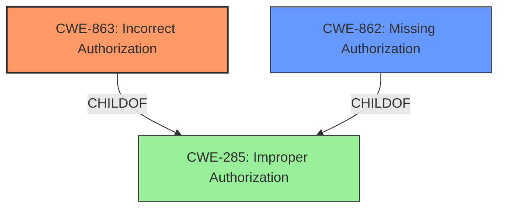

# Analysis for CVE-2024-51988

# Summary
| CWE ID | CWE Name | Confidence | CWE Abstraction Level | CWE Vulnerability Mapping Label | CWE-Vulnerability Mapping Notes |
|---|---|---|---|---|---|
| CWE-863 | Incorrect Authorization | 1.0 | Class | Primary | Allowed-with-Review |
| CWE-862 | Missing Authorization | 0.7 | Class | Secondary | Allowed-with-Review |

## Evidence and Confidence

*   **Confidence Score:** 0.9
*   **Evidence Strength:** HIGH

## Relationship Analysis
The primary relationship that impacted my decision was the differentiation between **Missing Authorization** (CWE-862) and **Incorrect Authorization** (CWE-863). Given the vulnerability description states that the queue deletion via the HTTP API was not verifying the `configure` permission of the user, I determined that the authorization was present but flawed, making CWE-863 more appropriate than CWE-862 as the primary CWE. Both CWE-862 and CWE-863 are children of the more general CWE-285 (Improper Authorization), but selecting them provides a more specific characterization of the vulnerability.

## Vulnerability Chain
The vulnerability chain begins with a **missing or incorrect permission check** on the queue deletion HTTP API endpoint, leading to the **ability to delete queues without proper permissions**, culminating in potential **data loss** and **service disruption**.
  - The root cause is the **incorrect authorization** check.
  - The impact is unauthorized queue deletion and subsequent service disruption.

## Summary of Analysis
My analysis is based on the provided evidence, particularly the vulnerability description and CVE reference summary. The description clearly states that the queue deletion via the HTTP API was **not verifying** the `configure` permission of the user, suggesting that some authorization logic was present but **incorrectly implemented**. The **incorrect authorization** is the root cause that led to the vulnerability.

I considered both **Missing Authorization** (CWE-862) and **Incorrect Authorization** (CWE-863). CWE-863 is more appropriate because the authorization check was present but flawed. If the authorization check was completely absent, CWE-862 would have been a better fit. Both of these are preferred to the general case CWE-285.

The selection of CWE-863 is at the optimal level of specificity because it accurately captures the **incorrect authorization** aspect of the vulnerability. It is a Class-level CWE, which is appropriate given the available information. While a more specific Base-level CWE might exist under CWE-863, there is not enough information to make this determination.

Relevant CWE Information:

# Enhanced Context (25 CWEs)
The following CWEs were identified as potentially relevant to this vulnerability:

## CWE-863: Incorrect Authorization
**Abstraction Level**: Class
**Similarity Score**: 2055.32
**Source**: sparse

**Description**:
The product performs an authorization check when an actor attempts to access a resource or perform an action, but it does not correctly perform the check.

**Mapping Guidance**:
- Usage: Allowed-with-Review
- Rationale: This CWE entry is a Class and might have Base-level children that would be more appropriate

## CWE-862: Missing Authorization
**Abstraction Level**: Class
**Similarity Score**: 1880.59
**Source**: sparse

**Description**:
The product does not perform an authorization check when an actor attempts to access a resource or perform an action.

**Mapping Guidance**:
- Usage: Allowed-with-Review
- Rationale: This CWE entry is a Class and might have Base-level children that would be more appropriate

## CWE-285: Improper Authorization
**Abstraction Level**: Class
**Similarity Score**: 1981.83
**Source**: sparse

**Description**:
The product does not perform or incorrectly performs an authorization check when an actor attempts to access a resource or perform an action.

**Mapping Guidance**:
- Usage: Discouraged
- Rationale: CWE-285 is high-level and lower-level CWEs can frequently be used instead. It is a level-1 Class (i.e., a child of a Pillar).

## CWE-306: Missing Authentication for Critical Function
**Abstraction Level**: base
**Similarity Score**: 2.47
**Source**: graph

**Description**:
CWE-306: Missing Authentication for Critical Function

**Mapping Guidance**:
- Usage: Allowed
- Rationale: This CWE entry is at the Base level of abstraction, which is a preferred level of abstraction for mapping to the root causes of vulnerabilities.

## CWE-201: Insertion of Sensitive Information Into Sent Data
**Abstraction Level**: base
**Similarity Score**: 4.33
**Source**: graph

**Description**:
CWE-201: Insertion of Sensitive Information Into Sent Data

**Mapping Guidance**:
- Usage: Allowed
- Rationale: This CWE entry is at the Base level of abstraction, which is a preferred level of abstraction for mapping to the root causes of vulnerabilities.

## CWE-1390: Weak Authentication
**Abstraction Level**: Class
**Similarity Score**: 0.74
**Source**: dense

**Description**:
The product uses an authentication mechanism to restrict access to specific users or identities, but the mechanism does not sufficiently prove that the claimed identity is correct.

## CWE-770: Allocation of Resources Without Limits or Throttling
**Abstraction Level**: base
**Similarity Score**: 2.12
**Source**: graph

**Description**:
CWE-770: Allocation of Resources Without Limits or Throttling

**Mapping Guidance**:
- Usage: Allowed
- Rationale: This CWE entry is at the Base level of abstraction, which is a preferred level of abstraction for mapping to the root causes of vulnerabilities.

## CWE-287: Improper Authentication
**Abstraction Level**: Class
**Similarity Score**: 195.08
**Source**: sparse

**Description**:
The product performs an authentication check, but it does not correctly perform the check.

**Mapping Guidance**:
- Usage: Discouraged
- Rationale: CWE-287 is high-level and lower-level CWEs can frequently be used instead. It is a level-1 Class (i.e., a child of a Pillar).

## CWE-732: Incorrect Permission Assignment for Critical Resource
**Abstraction Level**: Class
**Similarity Score**: 1876.44
**Source**: sparse

**Description**:
The product specifies permissions for a security-critical resource in a way that allows that resource to be read or modified by unintended actors.

**Mapping Guidance**:
- Usage: Allowed-with-Review
- Rationale: While the name itself indicates an assignment of permissions for resources, this is often misused for vulnerabilities in which "permissions" are not checked, which is an "authorization" weakness (CWE-285 or descendants) within CWE's model.

## CWE-226: Sensitive Information in Resource Not Removed Before Reuse
**Abstraction Level**: base
**Similarity Score**: 4.33
**Source**: graph

**Description**:
CWE-226: Sensitive Information in Resource Not Removed Before Reuse

**Mapping Guidance**:
- Usage: Allowed
- Rationale: This CWE entry is at the Base level of abstraction, which is a preferred level of abstraction for mapping to the root causes of vulnerabilities.

### CWE-863: Incorrect Authorization
*   **Technical Explanation:** CWE-863 (Incorrect Authorization) applies because the RabbitMQ HTTP API performs an authorization check when a user attempts to delete a queue, but this check is flawed. The system fails to properly verify if the user has the `configure` permission, allowing unauthorized users to delete queues.
*   **Security Implications:** This vulnerability allows users with insufficient permissions to delete queues, potentially leading to data loss and service disruption.
*   **Relationship Analysis:** CWE-863 is a child of CWE-285 (Improper Authorization) and is more specific. It indicates that the authorization mechanism is present but flawed, as opposed to completely missing.
*   **Mapping Guidance Influence:** The MITRE mapping guidance for CWE-863 suggests that it is a Class-level CWE and that more specific Base-level children might be appropriate. However, based on the available information, CWE-863 is the most accurate and specific classification.
*   **Primary Weakness:** This is the primary weakness because it is the root cause of the vulnerability.
*   **Confidence:** 1.0

### CWE-86