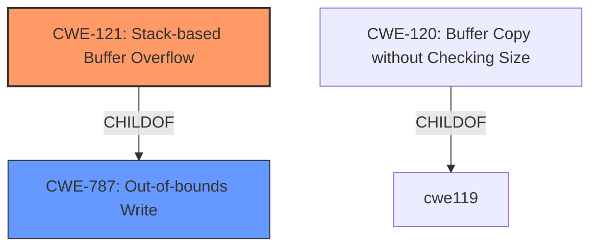

# Raw Analyzer Response for CVE-2024-52013

# Summary
| CWE ID | CWE Name | Confidence | CWE Abstraction Level | CWE Vulnerability Mapping Label | CWE-Vulnerability Mapping Notes |
|---|---|---|---|---|---|
| CWE-121 | Stack-based Buffer Overflow | 0.9 | Variant | Primary CWE | Allowed |
| CWE-787 | Out-of-bounds Write | 0.6 | Base | Secondary Candidate | Allowed |

## Evidence and Confidence

*   **Confidence Score:** 0.8
*   **Evidence Strength:** MEDIUM

## Relationship Analysis
The primary relationship that influenced the decision was the parent-child relationship between CWE-787 (Out-of-bounds Write) and CWE-121 (Stack-based Buffer Overflow), where CWE-121 is a variant of CWE-787. Since the vulnerability description explicitly mentions a **stack overflow**, mapping to the more specific CWE-121 is preferred. CWE-120 was considered but the description included stack overflow and CWE-121 is more specific.

## Vulnerability Chain
The vulnerability chain starts with the **stack overflow** due to the `pptp_user_ip` parameter in `wiz_pptp.cgi`, leading to a Denial of Service (DoS).
  - **Root Cause:** Stack overflow in `wiz_pptp.cgi` due to the `pptp_user_ip` parameter
  - **Weakness:** CWE-121 (Stack-based Buffer Overflow)
  - **Impact:** Denial of Service (DoS)

## Summary of Analysis
The initial analysis focused on identifying the root cause of the vulnerability. The vulnerability description explicitly states a "**stack overflow** via the pptp_user_ip parameter at wiz_pptp.cgi". This directly aligns with CWE-121 (Stack-based Buffer Overflow), which is a variant of CWE-787 (Out-of-bounds Write).

The retriever results also listed CWE-121 as the top candidate. While CWE-120 (Buffer Copy without Checking Size) was suggested due to similar CVE Descriptions, the explicit mention of "stack overflow" makes CWE-121 a more accurate and specific choice.

The decision to select CWE-121 is based on the explicit mention of "stack overflow" in the vulnerability description, making it the most specific and appropriate classification. The evidence for this is the "**weakness:** **stack overflow**" phrase in the Vulnerability Description Key Phrases section.

Relevant CWE Information:

# Enhanced Context (25 CWEs)
The following CWEs were identified as potentially relevant to this vulnerability:

## CWE-121: Stack-based Buffer Overflow
**Abstraction Level**: Variant
**Similarity Score**: 0.75
**Source**: dense

**Description**:
A stack-based buffer overflow condition is a condition where the buffer being overwritten is allocated on the stack (i.e., is a local variable or, rarely, a parameter to a function).

**Mapping Guidance**:
- Usage: Allowed
- Rationale: This CWE entry is at the Variant level of abstraction, which is a preferred level of abstraction for mapping to the root causes of vulnerabilities.

## CWE-787: Out-of-bounds Write
**Abstraction Level**: base
**Similarity Score**: 3.89
**Source**: graph

**Description**:
CWE-787: Out-of-bounds Write

**Mapping Guidance**:
- Usage: Allowed
- Rationale: This CWE entry is at the Base level of abstraction, which is a preferred level of abstraction for mapping to the root causes of vulnerabilities.

**Relationships**:
- CANFOLLOW -> CWE-825
- CANFOLLOW -> CWE-824
- CANFOLLOW -> CWE-823
- CANFOLLOW -> CWE-822
- PARENTOF -> CWE-124