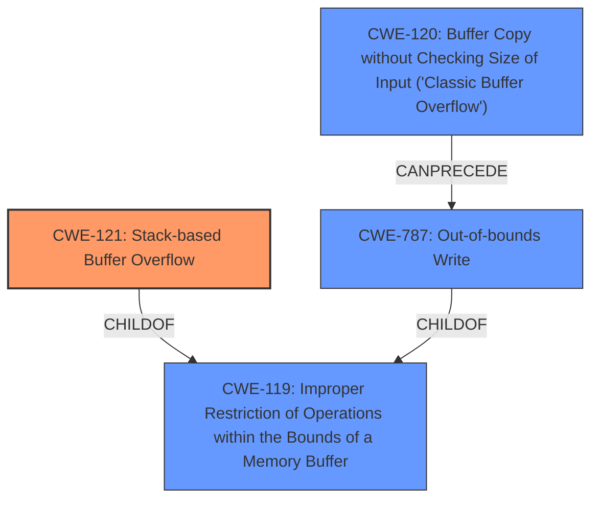

# Raw Analyzer Response for CVE-2024-52014

# Summary
| CWE ID | CWE Name | Confidence | CWE Abstraction Level | CWE Vulnerability Mapping Label | CWE-Vulnerability Mapping Notes |
|---|---|---|---|---|---|
| CWE-121 | Stack-based Buffer Overflow | 1.0 | Variant | Primary | Allowed |
| CWE-787 | Out-of-bounds Write | 0.7 | Base | Secondary Candidate | Allowed |
| CWE-120 | Buffer Copy without Checking Size of Input ('Classic Buffer Overflow') | 0.6 | Base | Secondary Candidate | Allowed-with-Review |

## Evidence and Confidence

*   **Confidence Score:** 0.9
*   **Evidence Strength:** MEDIUM

## Relationship Analysis
The primary CWE is CWE-121 Stack-based Buffer Overflow (Variant).
- CWE-121 is a variant of a buffer overflow, specifically occurring on the stack. This is a child of the more general CWE-119 Improper Restriction of Operations within the Bounds of a Memory Buffer.
- CWE-787 Out-of-bounds Write is a base CWE and a parent of CWE-124 Buffer Underwrite.
- CWE-120 Buffer Copy without Checking Size of Input ('Classic Buffer Overflow') is a base CWE which could lead to an out-of-bounds write. It's a parent of CWE-785.
- CWE-120 and CWE-121 are both related to buffer overflows, and an unchecked buffer copy (CWE-120) can often lead to a stack-based buffer overflow (CWE-121) or out-of-bounds write (CWE-787).

## Vulnerability Chain
The vulnerability chain starts with the **stack overflow** due to the pptp_user_ip parameter in genie_pptp.cgi.
1.  The root cause is a **stack overflow** due to a lack of input validation, specifically for the pptp_user_ip parameter.
2.  The **stack overflow** leads to an out-of-bounds write, corrupting data on the stack.
3.  The impact is a Denial of Service (DoS).

## Summary of Analysis
The primary weakness is a **stack overflow**, making CWE-121 the most appropriate primary CWE. This is supported by the vulnerability description explicitly stating "**stack overflow**".

CWE-121 is a Variant, which is a preferred level of abstraction.

The "CWE for similar CVE Descriptions" suggested CWE-120 Buffer Copy without Checking Size of Input ('Classic Buffer Overflow') as a primary match. While a buffer copy operation *could* be the root cause of the overflow, the description explicitly mentions a stack overflow, so CWE-121 is more precise.

The Retriever Results list CWE-121 as the top combined result with a score of 1.0.

CWE-787 Out-of-bounds Write is considered because a **stack overflow** inherently involves writing beyond the allocated buffer, which aligns with the definition of CWE-787. It is a plausible secondary CWE as it describes the mechanism of the **overflow**.

CWE-120 is considered because copying a buffer without checking its size is a common cause of buffer overflows. However, since the description specifically says "**stack overflow**", CWE-121 is a more precise fit.

Based on the evidence, relationship analysis, and mapping guidance, CWE-121 is the most appropriate primary CWE, with CWE-787 and CWE-120 as secondary candidates.

Relevant CWE Information:

# Enhanced Context (25 CWEs)
The following CWEs were identified as potentially relevant to this vulnerability:

## CWE-121: Stack-based Buffer Overflow
**Abstraction Level**: Variant
**Similarity Score**: 0.74
**Source**: dense

**Description**:
A stack-based buffer overflow condition is a condition where the buffer being overwritten is allocated on the stack (i.e., is a local variable or, rarely, a parameter to a function).

**Mapping Guidance**:
- Usage: Allowed
- Rationale: This CWE entry is at the Variant level of abstraction, which is a preferred level of abstraction for mapping to the root causes of vulnerabilities.

## CWE-787: Out-of-bounds Write
**Abstraction Level**: base
**Similarity Score**: 3.89
**Source**: graph

**Description**:
CWE-787: Out-of-bounds Write

**Mapping Guidance**:
- Usage: Allowed
- Rationale: This CWE entry is at the Base level of abstraction, which is a preferred level of abstraction for mapping to the root causes of vulnerabilities.