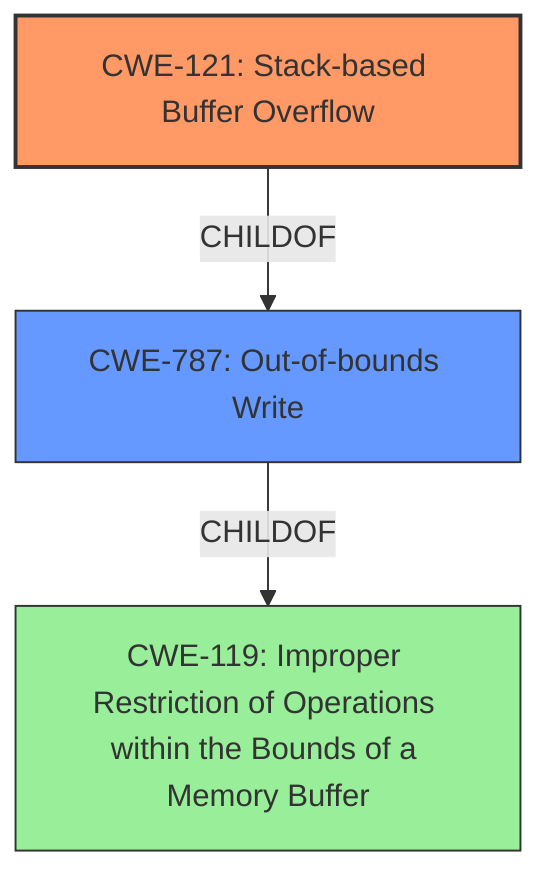

# Raw Analyzer Response for CVE-2024-52017

# Summary
| CWE ID | CWE Name | Confidence | CWE Abstraction Level | CWE Vulnerability Mapping Label | CWE-Vulnerability Mapping Notes |
|---|---|---|---|---|---|
| CWE-121 | Stack-based Buffer Overflow | 0.9 | Variant | Allowed | Primary CWE. The **stack overflow** occurs due to **improper** handling of the `passphrase` parameter. |
| CWE-787 | Out-of-bounds Write | 0.6 | Base | Allowed | Secondary CWE. Stack overflow leads to writing beyond the allocated buffer. |
| CWE-119 | Improper Restriction of Operations within the Bounds of a Memory Buffer | 0.4 | Class | Allowed | A more general class of error. |

## Evidence and Confidence

*   **Confidence Score:** 0.8
*   **Evidence Strength:** MEDIUM

## Relationship Analysis
The primary weakness is a stack-based buffer overflow (CWE-121). This is a specific type of out-of-bounds write (CWE-787), which in turn is a type of improper restriction of operations within the bounds of a memory buffer (CWE-119).

## Vulnerability Chain
The vulnerability chain starts with the **stack overflow** (CWE-121) due to a crafted POST request, which leads to an out-of-bounds write (CWE-787) and ultimately results in a denial of service (DoS). The root cause is the **improper** handling of the passphrase parameter.

## Summary of Analysis
The vulnerability description clearly indicates a **stack overflow** in the Netgear XR300 router due to **improper** handling of the `passphrase` parameter in the `bridge_wireless_main.cgi` script. This directly corresponds to CWE-121 (Stack-based Buffer Overflow). The crafted POST request overwrites data on the stack, leading to a denial of service.

The provided evidence includes the key phrase "stack overflow" and mentions the vulnerable component and parameter. The description aligns well with the definition of CWE-121. CWE-787 (Out-of-bounds Write) is a related CWE, as the stack overflow results in writing beyond the allocated buffer. I considered CWE-120 (Buffer Copy without Checking Size of Input), but CWE-121 is more specific as it explicitly mentions a stack-based buffer overflow.

The retriever results also support CWE-121 as the top match. Other CWEs like CWE-78 (Improper Neutralization of Special Elements used in an OS Command ('OS Command Injection')) were considered but deemed less relevant as the vulnerability is a buffer overflow rather than a command injection issue.

The selection of CWE-121 is at the Variant level of abstraction, which is a preferred level of abstraction for mapping to the root causes of vulnerabilities. The mapping guidance for CWE-121 allows its usage.