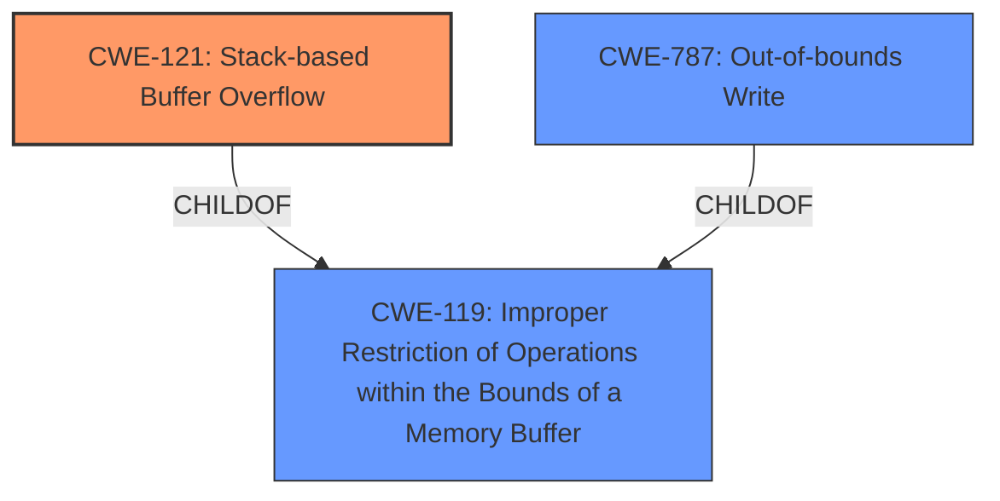

# Analysis Report for CVE-2024-52023

# Vulnerability Analysis Report: CVE-2024-52023

## Description

Netgear XR300 v1.0.3.78, R7000P v1.3.3.154, and R6400 v2 1.0.4.128 was discovered to contain a **stack overflow** via the pppoe_localip parameter at pppoe2.cgi. This vulnerability allows attackers to cause a Denial of Service (DoS) via a crafted POST request.

## Vulnerability Description Key Phrases

- **Weakness:** stack overflow
- **Impact:** Denial of Service (DoS)
- **Vector:** crafted POST request
- **Attacker:** attackers
- **Product:** ['Netgear XR300', 'R7000P', 'R6400 v2']
- **Version:** ['v1.0.3.78', 'v1.3.3.154', '1.0.4.128']
- **Component:** pppoe2.cgi

## Analysis (with Relationship Data)

# Summary
| CWE ID  | CWE Name                                                                      | Confidence | CWE Abstraction Level | CWE Vulnerability Mapping Label | CWE-Vulnerability Mapping Notes |
| :-------- | :---------------------------------------------------------------------------- | :----------- | :---------------------- | :------------------------------ | :-------------------------------- |
| CWE-121 | Stack-based Buffer Overflow                                                  | 0.85       | Variant                 | Primary CWE                    | Allowed                          |
| CWE-787 | Out-of-bounds Write                                                         | 0.60       | Base                    | Secondary Candidate             | Allowed                          |
| CWE-119 | Improper Restriction of Operations within the Bounds of a Memory Buffer | 0.50       | Class                    | Secondary Candidate             | Discouraged                      |

## Evidence and Confidence

*   **Confidence Score:** 0.75
*   **Evidence Strength:** MEDIUM

## Relationship Analysis
The primary relationship influencing the CWE selection is the parent-child relationship. CWE-121 is a variant of CWE-119 (Improper Restriction of Operations within the Bounds of a Memory Buffer), making it a more specific choice when a stack buffer is involved. CWE-787 (Out-of-bounds Write) is also a child of CWE-119 and represents a general case of writing beyond buffer boundaries. The vulnerability description specifically mentions a **stack overflow**, justifying the selection of CWE-121.



## Vulnerability Chain
The vulnerability chain starts with the **stack overflow** due to a crafted POST request to pppoe2.cgi, leading to a Denial of Service (DoS).

Root Cause: **Stack overflow** in pppoe2.cgi due to the pppoe_localip parameter.
Impact: Denial of Service (DoS).

## Summary of Analysis
The primary weakness is a **stack overflow**, specifically caused by a crafted POST request that overflows the `pppoe_localip` parameter in the `pppoe2.cgi` script. This leads to a denial-of-service condition.

The evidence from the vulnerability description states, "Netgear XR300 v1.0.3.78, R7000P v1.3.3.154, and R6400 v2 1.0.4.128 was discovered to contain a **stack overflow** via the pppoe_localip parameter at pppoe2.cgi. This vulnerability allows attackers to cause a Denial of Service (DoS) via a crafted POST request."

The selection of CWE-121 is based on the explicit mention of a **stack overflow**. While CWE-119 and CWE-787 are related and could be considered, CWE-121 provides a more specific classification, aligning with the principle of choosing the most detailed CWE when possible.

Relevant CWE Information:

# Enhanced Context (25 CWEs)
The following CWEs were identified as potentially relevant to this vulnerability:

## CWE-121: Stack-based Buffer Overflow
**Abstraction Level**: Variant
**Similarity Score**: 0.74
**Source**: dense

**Description**:
A stack-based buffer overflow condition is a condition where the buffer being overwritten is allocated on the stack (i.e., is a local variable or, rarely, a parameter to a function).

**Mapping Guidance**:
- Usage: Allowed
- Rationale: This CWE entry is at the Variant level of abstraction, which is a preferred level of abstraction for mapping to the root causes of vulnerabilities.

*Technical Explanation*: The vulnerability involves overflowing a buffer located on the stack, which aligns precisely with the definition of CWE-121. This can overwrite adjacent stack frames, potentially leading to control-flow hijacking or denial-of-service.
*Security Implications*: Allows attackers to execute arbitrary code or cause a denial-of-service condition.
*Relationship Explanation*: CWE-121 is a variant of CWE-119, providing a more specific classification for stack-based overflows.
*Mapping Guidance Influence*: The MITRE mapping guidance recommends using the most specific variant when available, which supports the choice of CWE-121 over its parent.

## CWE-787: Out-of-bounds Write
**Abstraction Level**: base
**Similarity Score**: 3.89
**Source**: graph

**Description**:
CWE-787: Out-of-bounds Write

**Mapping Guidance**:
- Usage: Allowed
- Rationale: This CWE entry is at the Base level of abstraction, which is a preferred level of abstraction for mapping to the root causes of vulnerabilities.

*Technical Explanation*: This CWE describes the general condition of writing data beyond the intended boundaries of a buffer. While the description indicates a **stack overflow**, using CWE-787 without further context would be less precise than CWE-121, as CWE-787 does not explicitly specify where the buffer is located.
*Security Implications*: Can lead to corruption of data, denial-of-service, or arbitrary code execution.
*Relationship Explanation*: CWE-787 is a parent of CWE-124 (Buffer Underwrite) and a child of CWE-119 (Improper Restriction of Operations within the Bounds of a Memory Buffer).
*Mapping Guidance Influence*: The mapping guidance allows for CWE-787, but favors more specific variants when applicable.

## CWE-119: Improper Restriction of Operations within the Bounds of a Memory Buffer
**Abstraction Level**: Class
**Similarity Score**: 0.69
**Source**: dense

**Description**:
The product performs operations on a memory buffer, but it reads from or writes to a memory location outside the buffer's intended boundary. This may result in read or write operations on unexpected memory locations that could be linked to other variables, data structures, or internal program data.

*Technical Explanation*: CWE-119 is a more general case of buffer overflows and underflows. While technically accurate, it lacks the specificity of CWE-121, which explicitly identifies the overflow as occurring on the stack.
*Security Implications*: Can lead to data corruption, denial-of-service, or arbitrary code execution.
*Relationship Explanation*: CWE-119 is a parent of both CWE-121 and CWE-787.
*Mapping Guidance Influence*: The mapping guidance discourages the use of CWE-119 when more specific CWEs are available.

## Alternative CWE Considerations and Justifications:

CWE-120 (Buffer Copy without Checking Size of Input ('Classic Buffer Overflow')): While listed as the Primary CWE Match for similar CVE Descriptions, it is less precise than CWE-121, because the description explicitly mentions a stack overflow. Furthermore, the "Allowed-with-Review" guidance suggests that it is only appropriate for "Buffer Copy" operations, which may not be fully representative of the vulnerability.

CWE-78 (Improper Neutralization of Special Elements used in an OS Command ('OS Command Injection')): While command injection could potentially be a consequence of a buffer overflow if an attacker overwrites a command string, there is no direct evidence of command injection in the provided description.

CWE-190 (Integer Overflow or Wraparound): Integer overflows are not explicitly mentioned in the vulnerability description, so it is not a suitable primary CWE.

The final decision to use CWE-121 is based on the direct evidence of a **stack overflow** in the vulnerability description. This decision aligns with the principle of selecting the most specific and accurate CWE based on the available information.


## CWE Relationship Analysis

Current CWEs represent these abstraction levels: .


### Vulnerability Chain Analysis

**Chain starting from CWE-121:**
- 121 (Stack-based Buffer Overflow) - ROOT


**Chain starting from CWE-787:**
- 787 (Out-of-bounds Write) - ROOT


### CWE Relationship Diagram

```mermaid
graph TD
    classDef primary fill:#f96,stroke:#333,stroke-width:2px
    classDef secondary fill:#69f,stroke:#333
    classDef tertiary fill:#9e9,stroke:#333
```


*Report generated on 2025-07-13 21:03:16*
