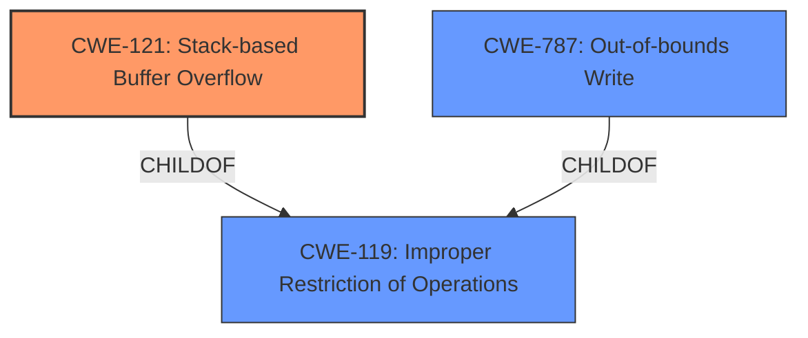

# Raw Analyzer Response for CVE-2024-52025

# Summary
| CWE ID | CWE Name | Confidence | CWE Abstraction Level | CWE Vulnerability Mapping Label | CWE-Vulnerability Mapping Notes |
|---|---|---|---|---|---|
| CWE-121 | Stack-based Buffer Overflow | 0.9 | Variant | Allowed | Primary CWE |
| CWE-787 | Out-of-bounds Write | 0.6 | Base | Allowed | Secondary Candidate |
| CWE-119 | Improper Restriction of Operations within the Bounds of a Memory Buffer | 0.5 | Class | Discouraged | Secondary Candidate |

## Evidence and Confidence

*   **Confidence Score:** 0.9
*   **Evidence Strength:** MEDIUM

## Relationship Analysis
The primary relationship influencing the decision is the hierarchical relationship between **CWE-119 (Improper Restriction of Operations within the Bounds of a Memory Buffer)**, which is a class, and **CWE-121 (Stack-based Buffer Overflow)** and **CWE-787 (Out-of-bounds Write)**. Since the vulnerability description specifically mentions a **stack overflow**, **CWE-121 (Stack-based Buffer Overflow)** is a more specific variant of **CWE-119 (Improper Restriction of Operations within the Bounds of a Memory Buffer)**. **CWE-787 (Out-of-bounds Write)** is included as a secondary candidate, as it describes the fundamental issue of writing beyond buffer boundaries, which a stack overflow achieves. The graph shows **CWE-787 (Out-of-bounds Write)** as parent of **CWE-124 (Buffer Underwrite ('Buffer Underflow'))** and child of **CWE-119 (Improper Restriction of Operations within the Bounds of a Memory Buffer)**

## Vulnerability Chain
The vulnerability chain starts with the **stack overflow** due to a crafted POST request, which leads to a denial-of-service (DoS).

*   Root Cause: **CWE-121 (Stack-based Buffer Overflow)**, caused by writing past the end of the buffer allocated on the stack.
*   Impact: Denial of Service (DoS).

## Summary of Analysis
The vulnerability description clearly states a **stack overflow** condition. The Retriever Results and CWE specifications strongly suggest **CWE-121 (Stack-based Buffer Overflow)** as the most appropriate primary CWE. This is further supported by the fact that **CWE-121 (Stack-based Buffer Overflow)** is a variant, which is a preferred level of abstraction. The vulnerability is triggered by a crafted POST request to geniepppoe.cgi, leading to a denial-of-service.

The primary evidence supporting this mapping is the phrase "**stack overflow** via the pppoe_localip parameter at geniepppoe.cgi".

**CWE-120 (Buffer Copy without Checking Size of Input ('Classic Buffer Overflow'))** was considered because it was the primary CWE match for similar CVE descriptions. However, **CWE-121 (Stack-based Buffer Overflow)** is a more specific variant and therefore a better fit.

**CWE-119 (Improper Restriction of Operations within the Bounds of a Memory Buffer)** was considered, but it is a more general class. Since a **stack overflow** is explicitly mentioned, **CWE-121 (Stack-based Buffer Overflow)** provides a more precise classification.

**CWE-787 (Out-of-bounds Write)** was considered because it represents the fundamental issue of writing outside the intended buffer, but the context indicates the buffer is on the stack, making **CWE-121 (Stack-based Buffer Overflow)** a better fit.