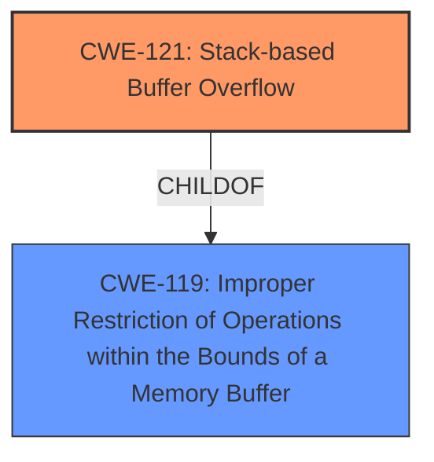

# Analysis for CVE-2024-52029

# Summary
| CWE ID | CWE Name | Confidence | CWE Abstraction Level | CWE Vulnerability Mapping Label | CWE-Vulnerability Mapping Notes |
|---|---|---|---|---|---|
| CWE-121 | Stack-based Buffer Overflow | 1.0 | Variant | Allowed | Primary CWE |

## Evidence and Confidence

*   **Confidence Score:** 1.0
*   **Evidence Strength:** HIGH

## Relationship Analysis
The primary relationship is that CWE-121 is a variant of buffer overflow, specifically occurring on the stack. This is a direct and well-defined relationship, making it easier to select. There aren't any significant chain relationships indicated in the provided data for this specific case. The selection of CWE-121 as a variant provides a more specific classification than a broader base class like CWE-119.

## Vulnerability Chain
The vulnerability chain starts with the **stack overflow** (CWE-121). The overflow leads to a Denial of Service (DoS). The chain is:
1.  **CWE-121: Stack-based Buffer Overflow**: The root cause due to **improper** handling of the pptp_user_netmask parameter.
2.  Denial of Service (DoS): The impact of the overflow.

## Summary of Analysis
The vulnerability description clearly states that the Netgear R7000P is vulnerable to a **stack overflow** via the pptp_user_netmask parameter in genie_pptp.cgi. This aligns directly with the definition of CWE-121 (Stack-based Buffer Overflow), which is a variant of a buffer overflow that occurs on the stack. The description notes that this can lead to a denial of service.

The **Vulnerability Description Key Phrases** also highlight the **stack overflow** as the **weakness**.

The retriever results identify CWE-121 as the top candidate.

CWE-120 (Buffer Copy without Checking Size of Input) was also considered because it was a primary CWE match for similar CVE descriptions. However, since the description specifically mentions a **stack overflow**, CWE-121 is the more precise and appropriate choice. The evidence points to a classic stack-based buffer overflow scenario, where a buffer on the stack is overwritten due to **improper** input validation.

Relevant CWE Information:

# Enhanced Context (25 CWEs)
The following CWEs were identified as potentially relevant to this vulnerability:

## CWE-121: Stack-based Buffer Overflow
**Abstraction Level**: Variant
**Similarity Score**: 0.73
**Source**: dense

**Description**:
A stack-based buffer overflow condition is a condition where the buffer being overwritten is allocated on the stack (i.e., is a local variable or, rarely, a parameter to a function).

**Mapping Guidance**:
- Usage: Allowed
- Rationale: This CWE entry is at the Variant level of abstraction, which is a preferred level of abstraction for mapping to the root causes of vulnerabilities.