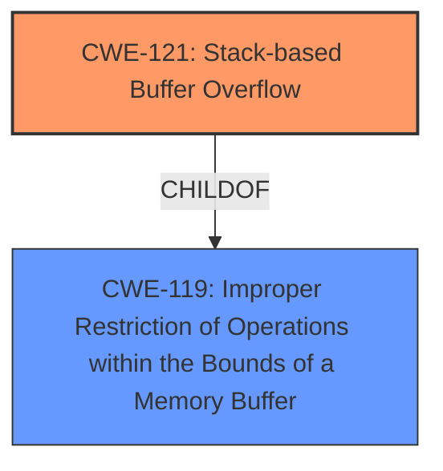

# Enhanced Analysis for CVE-2024-52030

# Summary
| CWE ID | CWE Name | Confidence | CWE Abstraction Level | CWE Vulnerability Mapping Label | CWE-Vulnerability Mapping Notes |
|---|---|---|---|---|---|
| CWE-121 | Stack-based Buffer Overflow | 1.0 | Variant | Allowed | Primary CWE |

## Evidence and Confidence

*   **Confidence Score:** 1.0
*   **Evidence Strength:** HIGH

## Relationship Analysis
The primary CWE identified is CWE-121 (Stack-based Buffer Overflow), which is a Variant-level CWE. This is a child of CWE-119 (Improper Restriction of Operations within the Bounds of a Memory Buffer). The analysis focuses on the root cause which is a buffer overflow occurring on the stack.



## Vulnerability Chain
The vulnerability chain begins with a **stack overflow** due to the `pptp_user_netmask` parameter. This leads to a Denial of Service (DoS). The chain consists of:

1.  **Root Cause:** Stack-based Buffer Overflow (CWE-121)
2.  **Impact:** Denial of Service (DoS)

## Summary of Analysis
The analysis is based on the provided vulnerability description, which clearly states a **stack overflow** vulnerability. The key phrase "**stack overflow**" strongly suggests CWE-121 (Stack-based Buffer Overflow) as the primary CWE.

The description states: "Netgear R7000P v1.3.3.154 was discovered to contain a **stack overflow** via the pptp_user_netmask parameter at ru_wan_flow.cgi. This vulnerability allows attackers to cause a Denial of Service (DoS) via a crafted POST request."

The Retriever Results also lists CWE-121 as the top combined result.

Therefore, CWE-121 is the most appropriate and specific CWE for this vulnerability.

Relevant CWE Information:

# Enhanced Context (25 CWEs)
The following CWEs were identified as potentially relevant to this vulnerability:

## CWE-121: Stack-based Buffer Overflow
**Abstraction Level**: Variant
**Similarity Score**: 0.73
**Source**: dense

**Description**:
A stack-based buffer overflow condition is a condition where the buffer being overwritten is allocated on the stack (i.e., is a local variable or, rarely, a parameter to a function).

**Mapping Guidance**:
- Usage: Allowed
- Rationale: This CWE entry is at the Variant level of abstraction, which is a preferred level of abstraction for mapping to the root causes of vulnerabilities.

### Other CWEs Considered:

*   **CWE-120 (Buffer Copy without Checking Size of Input):** While this was the primary CWE match from similar CVE descriptions, CWE-121 is more specific as it explicitly states the overflow occurs on the stack. The description mentions "stack overflow," providing direct evidence for CWE-121.
*   **CWE-78 (Improper Neutralization of Special Elements used in an OS Command):** This was a top CWE but doesn't align with the vulnerability description's focus on a **stack overflow**. The vulnerability description lacks any evidence of command injection.
*   **CWE-190 (Integer Overflow or Wraparound), CWE-1284 (Improper Validation of Specified Quantity in Input), CWE-130 (Improper Handling of Length Parameter Inconsistency), CWE-125 (Out-of-bounds Read), CWE-77 (Improper Neutralization of Special Elements used in a Command ('Command Injection')):** These CWEs were considered but are not directly related to the **stack overflow** described in the vulnerability. There is no evidence to suggest these weaknesses are present.
*   **CWE-755 (Improper Handling of Exceptional Conditions), CWE-288 (Authentication Bypass Using an Alternate Path or Channel), CWE-912 (Hidden Functionality), CWE-497 (Exposure of Sensitive System Information to an Unauthorized Control Sphere), CWE-134 (Use of Externally-Controlled Format String), CWE-824 (Access of Uninitialized Pointer):** These are not applicable to the vulnerability's root cause.


## CWE Relationship Analysis

Current CWEs represent these abstraction levels: .


### Vulnerability Chain Analysis

**Chain starting from CWE-288:**
- 288 (Authentication Bypass Using an Alternate Path or Channel) - ROOT


**Chain starting from CWE-121:**
- 121 (Stack-based Buffer Overflow) - ROOT


### CWE Relationship Diagram

```mermaid
graph TD
    classDef primary fill:#f96,stroke:#333,stroke-width:2px
    classDef secondary fill:#69f,stroke:#333
    classDef tertiary fill:#9e9,stroke:#333
```