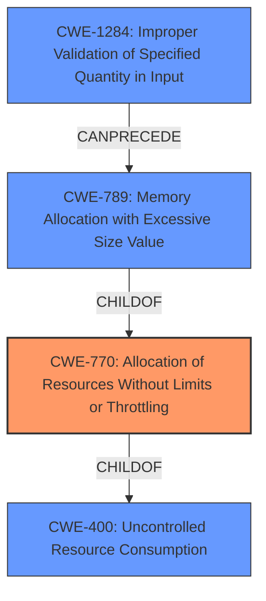

# Analysis Report for CVE-2024-5216

# Vulnerability Analysis Report: CVE-2024-5216

## Description

A vulnerability in mintplex-labs/anything-llm allows for a Denial of Service (DoS) condition due to uncontrolled resource consumption. Specifically, the issue arises from the applications failure to limit the size of usernames, enabling attackers to create users with excessively bulky texts in the username field. This exploit results in the user management panel becoming unresponsive, preventing administrators from performing critical user management actions such as editing, suspending, or deleting users. The impact of this vulnerability includes administrative paralysis, compromised security, and operational disruption, as it allows malicious users to perpetuate their presence within the system indefinitely, undermines the systems security posture, and degrades overall system performance.

## Vulnerability Description Key Phrases

- **Impact:** ['Denial of Service (DoS)', 'resource consumption']
- **Vector:** excessively bulky texts in the username field
- **Attacker:** attackers
- **Product:** mintplex-labs/anything-llm

## Analysis (with Relationship Data)

# Summary
| CWE ID | CWE Name | Confidence | CWE Abstraction Level | CWE Vulnerability Mapping Label | CWE-Vulnerability Mapping Notes |
|---|---|---|---|---|---|
| CWE-770 | Allocation of Resources Without Limits or Throttling | 0.9 | Base | Allowed | Primary CWE |
| CWE-1284 | Improper Validation of Specified Quantity in Input | 0.7 | Base | Allowed | Secondary Candidate |
| CWE-400 | Uncontrolled Resource Consumption | 0.6 | Class | Discouraged | Secondary Candidate |

## Evidence and Confidence

*   **Confidence Score:** 0.8
*   **Evidence Strength:** HIGH

## Relationship Analysis
The primary CWE is CWE-770, which describes the **allocation of resources without limits or throttling**. This is directly related to the vulnerability where the system **fails to limit the size of usernames**, leading to excessive resource consumption.

CWE-770 is a child of CWE-400 (Uncontrolled Resource Consumption), but CWE-770 is a more specific **Base** level weakness. CWE-789 (Memory Allocation with Excessive Size Value) is a variant of CWE-770, but the description does not indicate excessive memory allocation, so CWE-770 is a better fit. CWE-1284 (Improper Validation of Specified Quantity in Input) is also related, as the username length is a quantity, but CWE-770 captures the resource allocation aspect better.



## Vulnerability Chain
The vulnerability chain starts with the **lack of input validation on the username field** (CWE-1284). This leads to the ability to create users with excessively long usernames, resulting in the **allocation of resources without limits or throttling** (CWE-770). The final impact is **Denial of Service (DoS)** due to **uncontrolled resource consumption** (CWE-400).

CWE-1284 (Improper Validation of Specified Quantity in Input) -> CWE-770 (Allocation of Resources Without Limits or Throttling) -> CWE-400 (Uncontrolled Resource Consumption).

## Summary of Analysis
The vulnerability is primarily due to the application's failure to limit the size of usernames, which allows attackers to create users with excessively long usernames, leading to resource consumption and a denial-of-service condition.

The evidence from the "CVE Reference Links Content Summary" section supports this: "The vulnerability stems from a **lack of input validation** on the username field during user creation or updates. Specifically, there was **no enforcement of minimum or maximum length restrictions on usernames**." This clearly indicates **improper input validation** and **allocation of resources without limits.**

CWE-770 (Allocation of Resources Without Limits or Throttling) is the most appropriate because it accurately describes the root cause of the vulnerability. While CWE-400 (Uncontrolled Resource Consumption) is a related and broader category, CWE-770 provides a more specific description of the weakness, focusing on the allocation of resources. CWE-1284 (Improper Validation of Specified Quantity in Input) is a contributing factor, but not the primary cause of the DoS.

The selection is based on direct evidence from the provided text, the retriever results, and the CWE specifications. The graph relationships helped to understand the context of the vulnerability and select the most specific CWE.

Relevant CWE Information:

# Enhanced Context (25 CWEs)
The following CWEs were identified as potentially relevant to this vulnerability:

## CWE-472: External Control of Assumed-Immutable Web Parameter
**Abstraction Level**: Base
**Similarity Score**: 0.71
**Source**: dense

**Description**:
The web application does not sufficiently verify inputs that are assumed to be immutable but are actually externally controllable, such as hidden form fields.

**Mapping Guidance**:
- Usage: Allowed
- Rationale: This CWE entry is at the Base level of abstraction, which is a preferred level of abstraction for mapping to the root causes of vulnerabilities.

## CWE-130: Improper Handling of Length Parameter Inconsistency
**Abstraction Level**: Base
**Similarity Score**: 0.70
**Source**: dense

**Description**:
The product parses a formatted message or structure, but it does not handle or incorrectly handles a length field that is inconsistent with the actual length of the associated data.

**Mapping Guidance**:
- Usage: Allowed
- Rationale: This CWE entry is at the Base level of abstraction, which is a preferred level of abstraction for mapping to the root causes of vulnerabilities.

## CWE-639: Authorization Bypass Through User-Controlled Key
**Abstraction Level**: Base
**Similarity Score**: 0.70
**Source**: dense

**Description**:
The system's authorization functionality does not prevent one user from gaining access to another user's data or record by modifying the key value identifying the data.

**Mapping Guidance**:
- Usage: Allowed
- Rationale: This CWE entry is at the Base level of abstraction, which is a preferred level of abstraction for mapping to the root causes of vulnerabilities.

## CWE-303: Incorrect Implementation of Authentication Algorithm
**Abstraction Level**: Base
**Similarity Score**: 0.70
**Source**: dense

**Description**:
The requirements for the product dictate the use of an established authentication algorithm, but the implementation of the algorithm is incorrect.

**Mapping Guidance**:
- Usage: Allowed
- Rationale: This CWE entry is at the Base level of abstraction, which is a preferred level of abstraction for mapping to the root causes of vulnerabilities.

## CWE-204: Observable Response Discrepancy
**Abstraction Level**: Base
**Similarity Score**: 0.70
**Source**: dense

**Description**:
The product provides different responses to incoming requests in a way that reveals internal state information to an unauthorized actor outside of the intended control sphere.

**Mapping Guidance**:
- Usage: Allowed
- Rationale: This CWE entry is at the Base level of abstraction, which is a preferred level of abstraction for mapping to the root causes of vulnerabilities.

## CWE-1286: Improper Validation of Syntactic Correctness of Input
**Abstraction Level**: Base
**Similarity Score**: 0.70
**Source**: dense

**Description**:
The product receives input that is expected to be well-formed - i.e., to comply with a certain syntax - but it does not validate or incorrectly validates that the input complies with the syntax.

**Mapping Guidance**:
- Usage: Allowed
- Rationale: This CWE entry is at the Base level of abstraction, which is a preferred level of abstraction for mapping to the root causes of vulnerabilities.

## CWE-789: Memory Allocation with Excessive Size Value
**Abstraction Level**: Variant
**Similarity Score**: 0.70
**Source**: dense

**Description**:
The product allocates memory based on an untrusted, large size value, but it does not ensure that the size is within expected limits, allowing arbitrary amounts of memory to be allocated.

**Mapping Guidance**:
- Usage: Allowed
- Rationale: This CWE entry is at the Variant level of abstraction, which is a preferred level of abstraction for mapping to the root causes of vulnerabilities.

## CWE-799: Improper Control of Interaction Frequency
**Abstraction Level**: Class
**Similarity Score**: 0.70
**Source**: dense

**Description**:
The product does not properly limit the number or frequency of interactions that it has with an actor, such as the number of incoming requests.

**Mapping Guidance**:
- Usage: Allowed-with-Review
- Rationale: This CWE entry is a Class and might have Base-level children that would be more appropriate

## CWE-267: Privilege Defined With Unsafe Actions
**Abstraction Level**: Base
**Similarity Score**: 0.70
**Source**: dense

**Description**:
A particular privilege, role, capability, or right can be used to perform unsafe actions that were not intended, even when it is assigned to the correct entity.

**Mapping Guidance**:
- Usage: Allowed
- Rationale: This CWE entry is at the Base level of abstraction, which is a preferred level of abstraction for mapping to the root causes of vulnerabilities.

## CWE-346: Origin Validation Error
**Abstraction Level**: Class
**Similarity Score**: 0.69
**Source**: dense

**Description**:
The


## CWE Relationship Analysis

Current CWEs represent these abstraction levels: .


### Vulnerability Chain Analysis

**Chain starting from CWE-1284:**
- 1284 (Improper Validation of Specified Quantity in Input) - ROOT


**Chain starting from CWE-400:**
- 400 (Uncontrolled Resource Consumption) - ROOT


### CWE Relationship Diagram

```mermaid
graph TD
    classDef primary fill:#f96,stroke:#333,stroke-width:2px
    classDef secondary fill:#69f,stroke:#333
    classDef tertiary fill:#9e9,stroke:#333
```


*Report generated on 2025-07-13 21:07:14*
