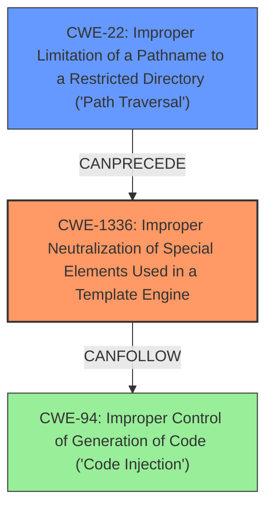

# Raw Analyzer Response for CVE-2024-52293

# Summary
| CWE ID | CWE Name | Confidence | CWE Abstraction Level | CWE Vulnerability Mapping Label | CWE-Vulnerability Mapping Notes |
|---|---|---|---|---|---|
| CWE-1336 | Improper Neutralization of Special Elements Used in a Template Engine | 1.0 | Base | Allowed | Primary CWE. This is the **rootcause** that led to the RCE. |
| CWE-22 | Improper Limitation of a Pathname to a Restricted Directory ('Path Traversal') | 0.9 | Base | Allowed | Secondary. This allowed the bypass of security checks. |

## Evidence and Confidence

*   **Confidence Score:** 0.95
*   **Evidence Strength:** HIGH

## Relationship Analysis
The primary CWE is CWE-1336 (Improper Neutralization of Special Elements Used in a Template Engine). The vulnerability description explicitly mentions that the missing path normalization in `FileHelperabsolutePath` leads to Remote Code Execution on the server via twig SSTI. This aligns with the description of CWE-1336, which involves the use of a template engine and the failure to neutralize special elements.

CWE-22 (Improper Limitation of a Pathname to a Restricted Directory ('Path Traversal')) is a secondary CWE. The path traversal allows the attacker to bypass security checks and create a local filesystem within the system directories, which is a prerequisite for the template injection.

## Vulnerability Chain
1.  **Missing Path Normalization (CWE-N/A - Custom)**: The `FileHelper::absolutePath` function **missing normalizePath**, which is the initial coding error.
2.  **Path Traversal (CWE-22)**: This allows bypassing `isSystemDir` checks by using directory traversal sequences like `../templates/poc`.
3.  **Template Injection (CWE-1336)**: The attacker can upload a file containing malicious Twig code due to the **incomplete Twig sandbox**.
4.  **Remote Code Execution (CWE-N/A - Impact)**: The attacker can execute the uploaded Twig file via a new route, achieving RCE.

The primary **rootcause** is the **missing normalizePath**, leading to CWE-22 and then CWE-1336, ultimately resulting in Remote Code Execution.

## Summary of Analysis

The vulnerability is primarily due to the **improper neutralization** of special elements used in a template engine (CWE-1336). The evidence for this is strong, as the description explicitly mentions the **missing normalizePath in the function FileHelperabsolutePath** leading to SSTI. The CVE Reference Links Content Summary confirms that the fix involves normalizing the path in `FileHelper::absolutePath`.

The path traversal (CWE-22) is a secondary weakness that facilitates the template injection by allowing the attacker to bypass security checks.

Other CWEs were considered but not selected:

*   CWE-94 (Improper Control of Generation of Code ('Code Injection')): While the vulnerability results in code execution, the **rootcause** is the template injection, making CWE-1336 more appropriate.
*   CWE-78 (Improper Neutralization of Special Elements used in an OS Command ('OS Command Injection')): The code execution is achieved through template injection, not directly through OS command injection.
*   CWE-434 (Unrestricted Upload of File with Dangerous Type): The vulnerability is not primarily about unrestricted file upload, but rather about the template engine processing the uploaded file.
*   CWE-862 (Missing Authorization): While administrative privileges are required, the core weakness is the template injection, not the missing authorization.

The selected CWEs are at the optimal level of specificity because they directly address the **rootcause** and contributing factors to the vulnerability.

# Enhanced Context (25 CWEs)
The following CWEs were identified as potentially relevant to this vulnerability:

## CWE-1336: Improper Neutralization of Special Elements Used in a Template Engine
**Abstraction Level**: Base
**Similarity Score**: 0.78
**Source**: dense

**Description**:
The product uses a template engine to insert or process externally-influenced input, but it does not neutralize or incorrectly neutralizes special elements or syntax that can be interpreted as template expressions or other code directives when processed by the engine.

**Mapping Guidance**:
- Usage: Allowed
- Rationale: This CWE entry is at the Base level of abstraction, which is a preferred level of abstraction for mapping to the root causes of vulnerabilities.

## CWE-425: Direct Request ('Forced Browsing')
**Abstraction Level**: Base
**Similarity Score**: 0.74
**Source**: dense

**Description**:
The web application does not adequately enforce appropriate authorization on all restricted URLs, scripts, or files.

**Mapping Guidance**:
- Usage: Allowed
- Rationale: This CWE entry is at the Base level of abstraction, which is a preferred level of abstraction for mapping to the root causes of vulnerabilities.

## CWE-434: Unrestricted Upload of File with Dangerous Type
**Abstraction Level**: Base
**Similarity Score**: 0.74
**Source**: dense

**Description**:
The product allows the upload or transfer of dangerous file types that are automatically processed within its environment.

**Mapping Guidance**:
- Usage: Allowed
- Rationale: This CWE entry is at the Base level of abstraction, which is a preferred level of abstraction for mapping to the root causes of vulnerabilities.

## CWE-88: Improper Neutralization of Argument Delimiters in a Command ('Argument Injection')
**Abstraction Level**: Base
**Similarity Score**: 0.73
**Source**: dense

**Description**:
The product constructs a string for a command to be executed by a separate component
in another control sphere, but it does not properly delimit the
intended arguments, options, or switches within that command string.

**Mapping Guidance**:
- Usage: Allowed
- Rationale: This CWE entry is at the Base level of abstraction, which is a preferred level of abstraction for mapping to the root causes of vulnerabilities.

## CWE-116: Improper Encoding or Escaping of Output
**Abstraction Level**: Class
**Similarity Score**: 0.73
**Source**: dense

**Description**:
The product prepares a structured message for communication with another component, but encoding or escaping of the data is either missing or done incorrectly. As a result, the intended structure of the message is not preserved.

**Mapping Guidance**:
- Usage: Allowed-with-Review
- Rationale: This CWE entry is a Class and might have Base-level children that would be more appropriate

## CWE-23: Relative Path Traversal
**Abstraction Level**: Base
**Similarity Score**: 0.73
**Source**: dense

**Description**:
The product uses external input to construct a pathname that should be within a restricted directory, but it does not properly neutralize sequences such as ".." that can resolve to a location that is outside of that directory.

**Mapping Guidance**:
- Usage: Allowed
- Rationale: This CWE entry is at the Base level of abstraction, which is a preferred level of abstraction for mapping to the root causes of vulnerabilities.

## CWE-138: Improper Neutralization of Special Elements
**Abstraction Level**: Class
**Similarity Score**: 0.73
**Source**: dense

**Description**:
The product receives input from an upstream component, but it does not neutralize or incorrectly neutralizes special elements that could be interpreted as control elements or syntactic markers when they are sent to a downstream component.

**Mapping Guidance**:
- Usage: Discouraged
- Rationale: This CWE entry is a level-1 Class (i.e., a child of a Pillar). It might have lower-level children that would be more appropriate

## CWE-74: Improper Neutralization of Special Elements in Output Used by a Downstream Component ('Injection')
**Abstraction Level**: Class
**Similarity Score**: 0.72
**Source**: dense

**Description**:
The product constructs all or part of a command, data structure, or record using externally-influenced input from an upstream component, but it does not neutralize or incorrectly neutralizes special elements that could modify how it is parsed or interpreted when it is sent to a downstream component.

**Mapping Guidance**:
- Usage: Discouraged
- Rationale: CWE-74 is high-level and often misused when lower-level weaknesses are more appropriate.

## CWE-212: Improper Removal of Sensitive Information Before Storage or Transfer
**Abstraction Level**: Base
**Similarity Score**: 0.72