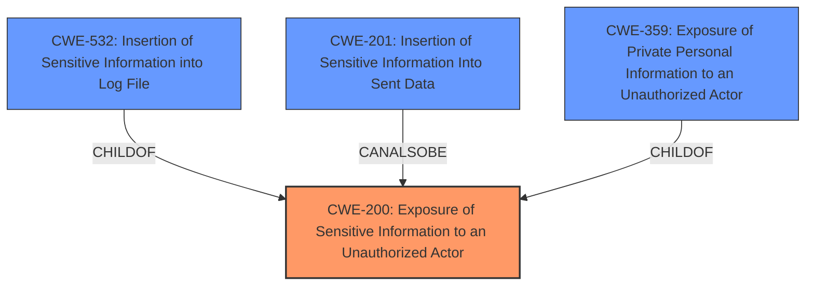

# Analysis for CVE-2024-52297

# Summary
| CWE ID | CWE Name | Confidence | CWE Abstraction Level | CWE Vulnerability Mapping Label | CWE-Vulnerability Mapping Notes |
|---|---|---|---|---|---|
| CWE-200 | Exposure of Sensitive Information to an Unauthorized Actor | 0.9 | Class | Allowed | Primary CWE |

## Evidence and Confidence

*   **Confidence Score:** 0.9
*   **Evidence Strength:** HIGH

## Relationship Analysis
The primary relationship that influenced the decision was the parent-child relationship between higher-level classes like CWE-200 and more specific base or variant level CWEs. Although some lower-level CWEs were considered, the evidence strongly pointed to the generalized exposure of sensitive information without specifying the exact mechanism.

## Vulnerability Chain
The vulnerability chain starts with the **rootcause** of including all configuration properties in `PublicConfiguratioDTO`. This leads directly to the exposure of sensitive information to unauthorized actors, resulting in a confidentiality breach.
  - **Root Cause:** **PublicConfiguratioDTO includes all configuration properties**
  - **Weakness:** Exposure of sensitive information
  - **Impact:** Confidentiality Breach

## Summary of Analysis
The initial analysis focused on identifying the most appropriate CWE based on the vulnerability description and the provided context. The key phrase "**PublicConfiguratioDTO includes all configuration properties**" was crucial in understanding the root cause. The CVE Reference Links Content Summary confirmed that the vulnerability involved the exposure of sensitive configuration data.

Several CWEs were considered, particularly those related to information exposure and sensitive data handling. However, the evidence pointed towards a general exposure of sensitive information rather than a specific type of exposure (e.g., logging, sending).

The final decision to select CWE-200 was based on the fact that it accurately captures the **weakness** of exposing sensitive information to unauthorized actors. While more specific CWEs like CWE-532 (Insertion of Sensitive Information into Log File) or CWE-201 (Insertion of Sensitive Information Into Sent Data) were considered, the provided information didn't specify how the information was exposed, only that it was exposed. Therefore, CWE-200, a Class-level CWE, was the most appropriate choice.

Relevant CWE Information:

# Enhanced Context (25 CWEs)
The following CWEs were identified as potentially relevant to this vulnerability:

## CWE-200: Exposure of Sensitive Information to an Unauthorized Actor
**Abstraction Level**: Class
**Similarity Score**: 803.79
**Source**: sparse

**Description**:
The product exposes sensitive information to an actor that is not explicitly authorized to have access to that information.

**Mapping Guidance**:
- Usage: Discouraged
- Rationale: CWE-200 is commonly misused to represent the loss of confidentiality in a vulnerability, but confidentiality loss is a technical impact - not a root cause error. As of CWE 4.9, over 400 CWE entries can lead to a loss of confidentiality. Other options are often available. [REF-1287].